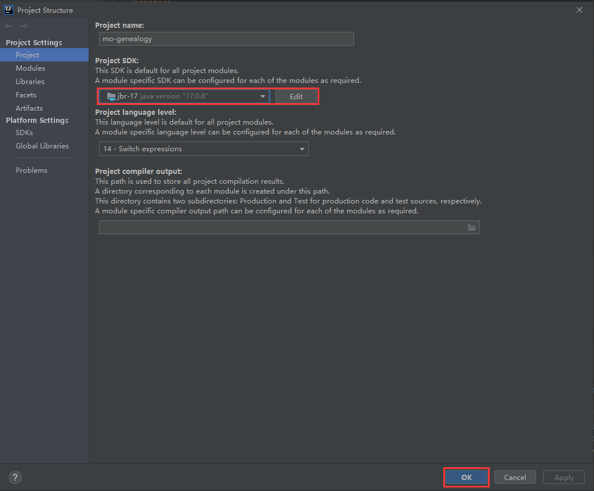
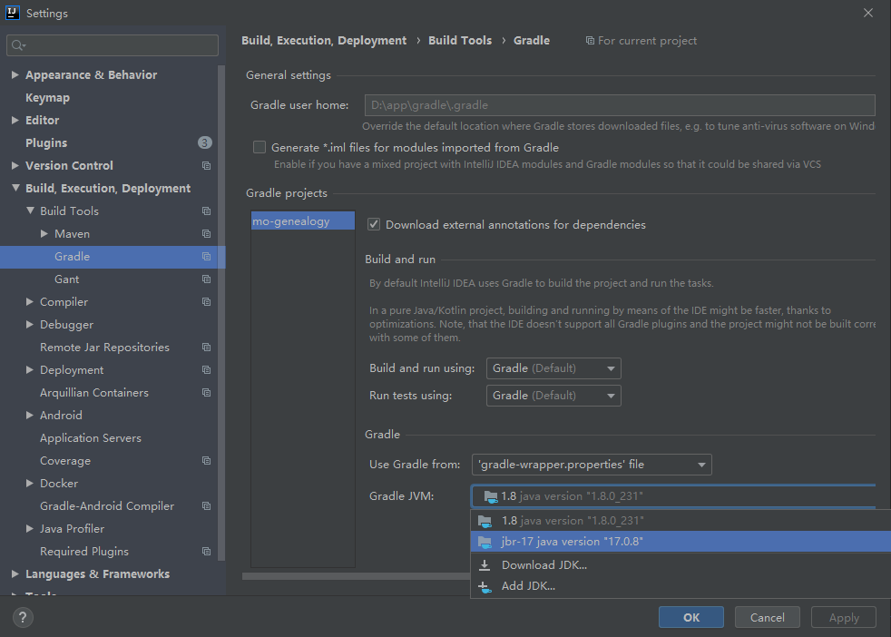

# SpringBoot3问题记录

## 一、问题概述

闲来无事，体验一下SpringBoot3，然而启动SpringBoot报错：`Unable to start the daemon process.`

## 二、版本说明

发生问题的机器及软件版本如下：

- Windows：10

- IDEA：2020.1

- Java：8

## 三、问题详情

闲来无事，打算体验一下SpringBoot3，使用`Spring Initializr`生成脚手架，具体配置如下：


将项目导入IDEA，却直接报错了，具体错误信息如下：

```bash
Unable to start the daemon process.
This problem might be caused by incorrect configuration of the daemon.
For example, an unrecognized jvm option is used.For more details on the daemon, please refer to https://docs.gradle.org/8.2.1/userguide/gradle_daemon.html in the Gradle documentation.
Process command line: D:\app\Java\jdk1.8.0_231\bin\java.exe --add-opens=java.base/java.util.concurrent.atomic=ALL-UNNAMED -XX:MaxMetaspaceSize=384m -XX:+HeapDumpOnOutOfMemoryError -Xms256m -Xmx512m -Dfile.encoding=GBK -Duser.country=CN -Duser.language=zh -Duser.variant -cp D:\app\gradle\.gradle\wrapper\dists\gradle-8.2.1-bin\5hap6b9n41hkg4jeh2au2pllh\gradle-8.2.1\lib\gradle-launcher-8.2.1.jar -javaagent:D:\app\gradle\.gradle\wrapper\dists\gradle-8.2.1-bin\5hap6b9n41hkg4jeh2au2pllh\gradle-8.2.1\lib\agents\gradle-instrumentation-agent-8.2.1.jar org.gradle.launcher.daemon.bootstrap.GradleDaemon 8.2.1
Please read the following process output to find out more:
-----------------------
Error: Could not create the Java Virtual Machine.
Error: A fatal exception has occurred. Program will exit.
Unrecognized option: --add-opens=java.base/java.util.concurrent.atomic=ALL-UNNAMED
```

出现问题不要怕，开始排查。

## 四、排除步骤

1. 分析错误日志，得知该问题与JVM有关。

   ```bash
   For example, an unrecognized jvm option is used.
   ...
   Error: Could not create the Java Virtual Machine.
   Error: A fatal exception has occurred. Program will exit.
   Unrecognized option: --add-opens=java.base/java.util.concurrent.atomic=ALL-UNNAMED
   
   ----------------------------------译文----------------------------------------------
   例如，使用未识别的JVM选项。
   ...
   错误：无法创建Java虚拟机。
   错误：发生了致命异常。 程序将退出。
   未识别的选项：-add-opens = java.base/java.util.concurrent.atomic = all-Unnumed
   ```

2. 通过查询 [SpringBoot官方文档](https://docs.spring.io/spring-boot/docs/current/reference/html/getting-started.html#getting-started.system-requirements)，得知`Spring Boot 3.1.2` 需要 Java版本不小于`Java 17`。

   > ##  2. System Requirements
   >
   > Spring Boot 3.1.2 requires [Java 17](https://www.java.com/) and is compatible up to and including Java 20. [Spring Framework 6.0.11](https://docs.spring.io/spring-framework/docs/6.0.11/reference/html/) or above is also required.
   >
   
我本地使用的是Java8，看来这就是原因所在了。
   
3. 升级Java版本，解决问题。

   若条件允许，你可以直接卸载Java8，重新安装Java17。

   由于我自己的老项目大部分是基于Java8的，为了一个体验Demo去卸载Java8，有点得不偿失，于是我采用了基于IDEA的兼容方案，使Java8和Java17共存。具体步骤如下：

   - 依次点击 `File → Project Structure → Project`进入项目设置界面，点击`Add SDK → Download JDK`

     

   - 选择`JetBrains Runtime`后，点击`Download`按钮，IDEA将自动下载`jbr-17`（其实就是Java17）

     

   - 下载完成后，切换Project SDK，选择我们刚下载好的`jbr-17`，点击`OK`，如下图所示：

     

   - 除此之外，你还需要更改`Gradle JVM`的版本。点击`File → Settings → Build,Execution,Deployment → Build Tools → Gradle`，将`Gradle JVM`同样设置为`jbr-17`，然后点击`OK`,如下图所示：

     

4. 刷新Gradle，构建成功

   
   
   问题成功解决，nice。

## 五、参考文档

[Getting Started (spring.io)](https://docs.spring.io/spring-boot/docs/current/reference/html/getting-started.html#getting-started.system-requirements)