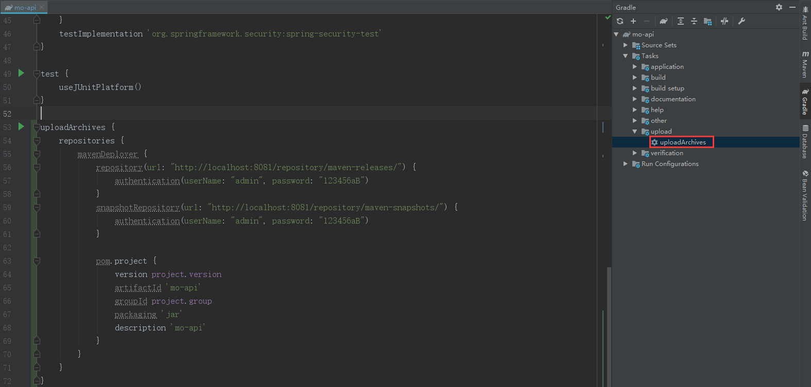

# Gradle使用私服

## 上传jar包

在项目的build.gradle中添加以下配置

```groovy
plugins {
    // 引入插件
    id 'maven'
}

group = 'com.moluo'
version = '0.0.1-SNAPSHOT'
sourceCompatibility = '1.8'

//Upload Task用于发布上传
uploadArchives {
    repositories {
        mavenDeployer {
            //正式发布仓库
            repository(url: "http://localhost:8081/repository/maven-releases/") {
                authentication(userName: "admin", password: "123456aB")
            }
            //快照版本的仓库
            snapshotRepository(url: "http://localhost:8081/repository/maven-snapshots/") {
                authentication(userName: "admin", password: "123456aB")
            }

            pom.project {
                //版本号，如果是快照版本，其版本号后面应该添加-SNAPSHOT，否则不能正常识别上传
                version project.version
                //一般写项目名称即可
                artifactId 'mo-api'
                //组别，类似包名，保证唯一性
                groupId project.group
                //打包格式
                packaging 'jar'
                //描述
                description 'mo后台项目'
            }
        }
    }
}
```

点击idea中Tasks→upload→uploadArchives命令即可



## 从私服下载jar包

在项目的build.gradle文件中添加以下配置

```groovy
repositories {
    // 私服
    maven {
        url "http://localhost:8081/repository/maven-public/"
    }
    // 其他仓库
    maven {
        url "http://maven.aliyun.com/nexus/content/groups/public"
    }
    // 中心仓库
    mavenCentral()
}
```

