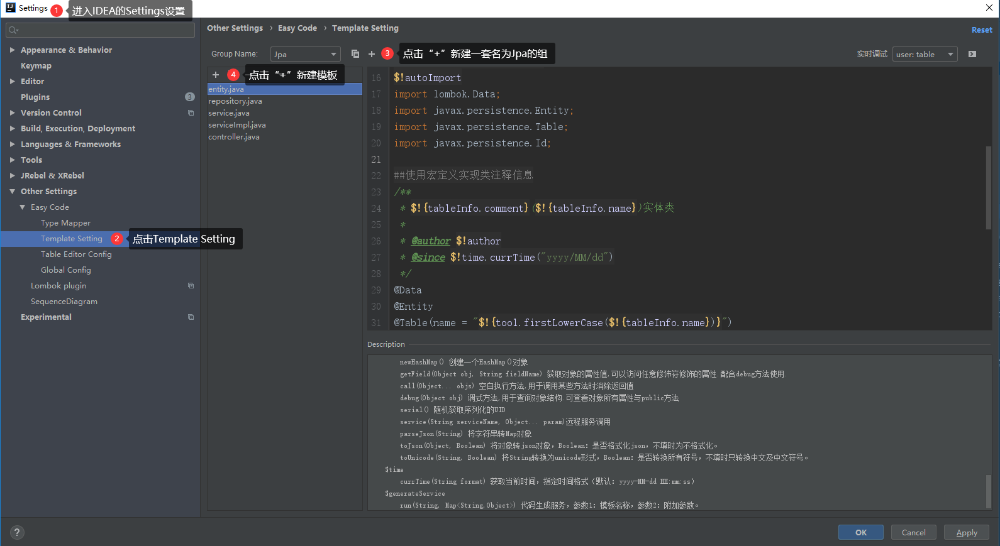

# IntelliJ IDEA插件-Easy Code

Easy Code是一款根据数据库结构`自动生成代码`的IDEA插件

插件使用可参考：[IntelliJ IDEA中插件EasyCode 的安装及使用过程](https://blog.csdn.net/suprezheng/article/details/84558689)

## Easy Code模板添加

Easy Code默认提供Default、MybatisPlus俩套模板，却没有关于JPA的模板，但是Easy Code支持模板添加，方式如下图：



## JPA模板

下面我们自定义一套JPA模板。使用如下Easy Code代码模板，将自动生成一套代码，集成jpa、swagger，具有对数据简单的`增删查改`功能。

### entity.java

```java
##引入宏定义
$!define

##使用宏定义设置回调（保存位置与文件后缀）
#save("/entity", ".java")

##使用宏定义设置包后缀
#setPackageSuffix("entity")

##拿到主键
#if(!$tableInfo.pkColumn.isEmpty())
    #set($pk = $tableInfo.pkColumn.get(0))
#end

##使用全局变量实现默认包导入
$!autoImport
import lombok.Data;
import javax.persistence.Entity;
import javax.persistence.Table;
import javax.persistence.Id;

##使用宏定义实现类注释信息
/**
 * $!{tableInfo.comment}($!{tableInfo.name})实体类
 *
 * @author $!author
 * @since $!time.currTime("yyyy/MM/dd")
 */
@Data
@Entity
@Table(name = "$!{tool.firstLowerCase($!{tableInfo.name})}")
public class $!{tableInfo.name} {
    /**
     * ${pk.comment}
     */
    @Id
    private $!{pk.shortType} $!{pk.name};
    
#foreach($column in $tableInfo.otherColumn)
    #if(${column.comment})/**
     * ${column.comment}
     */#end

    private $!{tool.getClsNameByFullName($column.type)} $!{column.name};
    
#end
}
```

### repository.java

```java
##定义初始变量
#set($tableName = $tool.append($tableInfo.name, "Repository"))
##设置回调
$!callback.setFileName($tool.append($tableName, ".java"))
$!callback.setSavePath($tool.append($tableInfo.savePath, "/repository"))

##拿到主键
#if(!$tableInfo.pkColumn.isEmpty())
    #set($pk = $tableInfo.pkColumn.get(0))
#end

#if($tableInfo.savePackageName)package $!{tableInfo.savePackageName}.#{end}repository;

import $!{tableInfo.savePackageName}.entity.$!{tableInfo.name};

import org.springframework.data.jpa.repository.JpaRepository;
import org.springframework.stereotype.Repository;
/**
 * $!{tableInfo.comment}($!{tableInfo.name})表数据库访问层
 *
 * @author $!author
 * @since $!time.currTime("yyyy/MM/dd")
 */
@Repository
public interface $!{tableName} extends JpaRepository<$!{tableInfo.name} ,$!pk.shortType>{

  
}
```

### service.java

```java
##定义初始变量
#set($tableName = $tool.append($tableInfo.name, "Service"))
##设置回调
$!callback.setFileName($tool.append($tableName, ".java"))
$!callback.setSavePath($tool.append($tableInfo.savePath, "/service"))

##拿到主键
#if(!$tableInfo.pkColumn.isEmpty())
    #set($pk = $tableInfo.pkColumn.get(0))
#end

#if($tableInfo.savePackageName)package $!{tableInfo.savePackageName}.#{end}service;

import $!{tableInfo.savePackageName}.entity.$!{tableInfo.name};
import java.util.List;

/**
 * $!{tableInfo.comment}($!{tableInfo.name})表服务接口
 *
 * @author $!author
 * @since $!time.currTime("yyyy/MM/dd")
 */
public interface $!{tableName} {
    /**
     * 创建$!{tableInfo.comment}
     *
     * @param $!tool.firstLowerCase($!{tableInfo.name}) $!{tableInfo.comment}
     * @return $!{tableInfo.comment}
     */
    $!{tableInfo.name} create$!{tableInfo.name}($!{tableInfo.name} $!tool.firstLowerCase($!{tableInfo.name}));

    /**
     * 删除$!{tableInfo.comment}
     *
     * @param $!pk.name $!{tableInfo.comment}的$!{pk.comment}
     */
    void delete$!{tableInfo.name}($!pk.shortType $!pk.name);

    /**
     * 获取$!{tableInfo.comment}列表
     *
     * @return $!{tableInfo.comment}列表
     */
    List<$!{tableInfo.name}> list$!{tableInfo.name}s();

    /**
     * 获取$!{tableInfo.comment}
     *
     * @param $!pk.name $!{tableInfo.comment}的$!{pk.comment}
     * @return $!{tableInfo.comment}
     */
    $!{tableInfo.name} get$!{tableInfo.name}($!pk.shortType $!pk.name);
    
    /**
     * 更新$!{tableInfo.comment}
     *
     * @param $!pk.name $!{tableInfo.comment}的$!{pk.comment}
     * @param $!tool.firstLowerCase($!{tableInfo.name}) $!{tableInfo.comment}
     * @return $!{tableInfo.comment}
     */
    $!{tableInfo.name} update$!{tableInfo.name}($!pk.shortType $!pk.name, $!{tableInfo.name} $!tool.firstLowerCase($!{tableInfo.name}));

}
```

### serviceImpl.java

```java
##定义初始变量
#set($tableName = $tool.append($tableInfo.name, "ServiceImpl"))
##设置回调
$!callback.setFileName($tool.append($tableName, ".java"))
$!callback.setSavePath($tool.append($tableInfo.savePath, "/service/impl"))

##拿到主键
#if(!$tableInfo.pkColumn.isEmpty())
    #set($pk = $tableInfo.pkColumn.get(0))
#end

#if($tableInfo.savePackageName)package $!{tableInfo.savePackageName}.#{end}service.impl;

import $!{tableInfo.savePackageName}.entity.$!{tableInfo.name};
import $!{tableInfo.savePackageName}.repository.$!{tableInfo.name}Repository;
import $!{tableInfo.savePackageName}.service.$!{tableInfo.name}Service;
import lombok.extern.slf4j.Slf4j;
import org.springframework.beans.factory.annotation.Autowired;
import org.springframework.stereotype.Service;

import java.util.List;
import java.util.Optional;

/**
 * $!{tableInfo.comment}($!{tableInfo.name})表服务实现类
 *
 * @author $!author
 * @since $!time.currTime("yyyy/MM/dd")
 */
@Slf4j
@Service("$!tool.firstLowerCase($!{tableInfo.name})Service")
public class $!{tableName} implements $!{tableInfo.name}Service {
    
    @Autowired
    private $!{tableInfo.name}Repository $!tool.firstLowerCase($!{tableInfo.name})Repository;
    
    @Override
    public $!{tableInfo.name} create$!{tableInfo.name}($!{tableInfo.name} $!tool.firstLowerCase($!{tableInfo.name})){
        return $!{tool.firstLowerCase($!{tableInfo.name})}Repository.save($!{tool.firstLowerCase($!{tableInfo.name})});
    }
    
    @Override
    public void delete$!{tableInfo.name}($!pk.shortType $!pk.name){
        $!{tool.firstLowerCase($!{tableInfo.name})}Repository.deleteBy$!{tool.firstUpperCase($!{pk.name})}($!{pk.name});
    }

    @Override
    public List<$!{tableInfo.name}> list$!{tableInfo.name}s(){
        return $!{tool.firstLowerCase($!{tableInfo.name})}Repository.findAll();
    }

    @Override
    public $!{tableInfo.name} get$!{tableInfo.name}($!pk.shortType $!pk.name){
        Optional<$!{tableInfo.name}> optional = $!tool.append($!tool.firstLowerCase($!{tableInfo.name}),"Repository.findBy","$!tool.firstUpperCase($!pk.name)($!pk.name)");
        if (!optional.isPresent()) {
            throw new RuntimeException();
        }
        return optional.get();
    }

    @Override
    public $!{tableInfo.name} update$!{tableInfo.name}($!pk.shortType $!pk.name, $!{tableInfo.name} $!tool.firstLowerCase($!{tableInfo.name})){
        return $!{tool.firstLowerCase($!{tableInfo.name})}Repository.save($!tool.firstLowerCase($!{tableInfo.name}));
    }

}
```

### controller.java

```java
##定义初始变量
#set($tableName = $tool.append($tableInfo.name, "Controller"))
##设置回调
$!callback.setFileName($tool.append($tableName, ".java"))
$!callback.setSavePath($tool.append($tableInfo.savePath, "/controller"))
##拿到主键
#if(!$tableInfo.pkColumn.isEmpty())
    #set($pk = $tableInfo.pkColumn.get(0))
#end

#if($tableInfo.savePackageName)package $!{tableInfo.savePackageName}.#{end}controller;

import $!{tableInfo.savePackageName}.entity.$!{tableInfo.name};
import $!{tableInfo.savePackageName}.service.$!{tableInfo.name}Service;
import io.swagger.annotations.Api;
import io.swagger.annotations.ApiImplicitParam;
import io.swagger.annotations.ApiImplicitParams;
import io.swagger.annotations.ApiOperation;
import org.springframework.beans.factory.annotation.Autowired;
import org.springframework.web.bind.annotation.*;

import java.util.List;

/**
 * $!{tableInfo.comment}($!{tableInfo.name})表控制层
 *
 * @author $!author
 * @since $!time.currTime("yyyy/MM/dd")
 */
@Api("$!{tableInfo.comment}($!{tableInfo.name})服务")
@RestController
@RequestMapping("$!tool.firstLowerCase($tableInfo.name)")
public class $!{tableName} {

    @Autowired
    private $!{tableInfo.name}Service $!tool.firstLowerCase($tableInfo.name)Service;
    
    @PostMapping("")
    @ApiOperation(value = "创建$!{tableInfo.comment}", notes = "创建$!{tableInfo.comment}")
    @ApiImplicitParam(name = "$!tool.firstLowerCase($!{tableInfo.name})", value = "$!{tableInfo.comment}", dataType = "$!{tableInfo.name}", required = true, paramType = "body" )
    public $!{tableInfo.name} create$!{tableInfo.name}(@RequestBody $!{tableInfo.name} $!tool.firstLowerCase($!{tableInfo.name})){
        return $!{tool.firstLowerCase($tableInfo.name)}Service.create$!{tableInfo.name}($!{tool.firstLowerCase($!{tableInfo.name})});
    }
    
    @DeleteMapping("/{$!pk.name}")
    @ApiOperation(value = "删除$!{tableInfo.comment}", notes = "删除$!{tableInfo.comment}")
    @ApiImplicitParams(value = {
            @ApiImplicitParam(name = "$!pk.name", value = "$!{tableInfo.comment}$!pk.name", dataType = "$!pk.shortType", required = true, paramType = "path")
    })
    public void delete$!{tableInfo.name}(@PathVariable $!pk.shortType $!pk.name){
        $!{tool.firstLowerCase($tableInfo.name)}Service.delete$!{tableInfo.name}($!{pk.name});
    }

    @GetMapping("")
    @ApiOperation(value = "获取$!{tableInfo.comment}列表", notes = "获取$!{tableInfo.comment}列表")
    public List<$!{tableInfo.name}> list$!{tableInfo.name}s(){
        return $!{tool.firstLowerCase($tableInfo.name)}Service.list$!{tableInfo.name}s();
    }

    @GetMapping("/{$!pk.name}")
    @ApiOperation(value = "获取$!{tableInfo.comment}", notes = "根据$!{pk.name}获取$!{tableInfo.comment}")
    @ApiImplicitParams(value = {
            @ApiImplicitParam(name = "$!pk.name", value = "$!{tableInfo.comment}$!pk.name", dataType = "$!pk.shortType", required = true, paramType = "path")
    })
    public $!{tableInfo.name} get$!{tableInfo.name}(@PathVariable $!pk.shortType $!pk.name){
        return $!{tool.firstLowerCase($tableInfo.name)}Service.get$!{tableInfo.name}($!pk.name);
    }

    @PutMapping("/{$!pk.name}")
    @ApiOperation(value = "更新$!{tableInfo.comment}", notes = "更新$!{tableInfo.comment}")
    @ApiImplicitParams(value = {
            @ApiImplicitParam(name = "$!pk.name", value = "$!{tableInfo.comment}$!pk.name", dataType = "$!pk.shortType", required = true, paramType = "path"),
            @ApiImplicitParam(name = "$!tool.firstLowerCase($!{tableInfo.name})", value = "$!{tableInfo.comment}", dataType = "$!{tableInfo.name}", required = true, paramType = "body")
    })
    public $!{tableInfo.name} update$!{tableInfo.name}(@PathVariable $!pk.shortType $!pk.name, @RequestBody $!{tableInfo.name} $!tool.firstLowerCase($!{tableInfo.name})){
        return $!{tool.firstLowerCase($tableInfo.name)}Service.update$!{tableInfo.name}($!pk.name, $!tool.firstLowerCase($!{tableInfo.name}));
    }

}
    
```

注意：由于每个人对代码模板的要求不同，以上内容仅作参考，请根据自身需求制定。

## 测试

若想要测试如上模板得可用性，记得在创建表时添加`表描述`和`字段描述`，可参考下面的sql语句：

```sql
CREATE TABLE `user`  (
  `id` bigint(20) NOT NULL COMMENT 'ID',
  `age` int(11) NOT NULL COMMENT '年龄',
  `name` varchar(255) CHARACTER SET utf8 COLLATE utf8_general_ci NULL DEFAULT NULL COMMENT '姓名',
  PRIMARY KEY (`id`) USING BTREE
) ENGINE = MyISAM CHARACTER SET = utf8 COLLATE = utf8_general_ci COMMENT = '用户' ROW_FORMAT = Dynamic;
```

