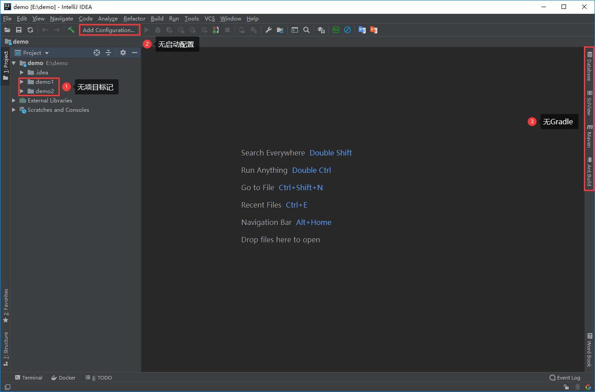
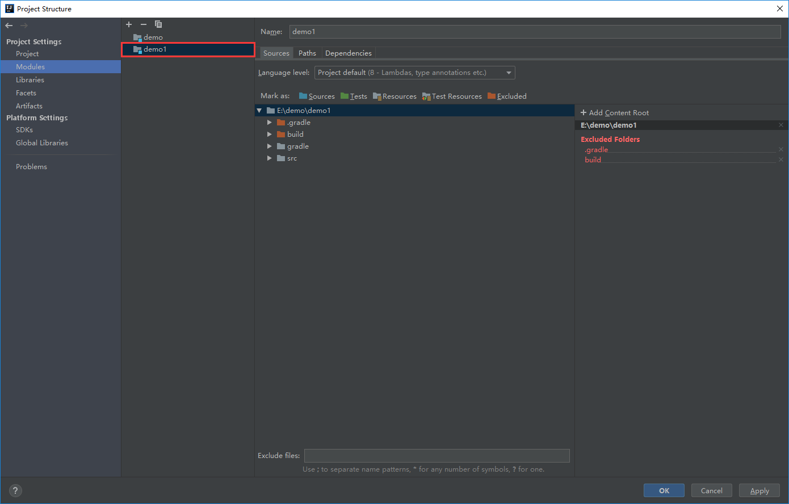

# IDEA如何一个窗口打开多个项目？

## 项目准备

1. 新建一个文件夹，将多个SpringBoot项目放置在该文件夹下

   

## 打开项目

### 1. 点击Open

### 2. 选择demo文件夹，点击OK打开

### 3. 项目打开后发现，IDEA并未将demo1和demo2当作项目对待。

## 配置项目结构

### 1. 点击`File`，选择`Project Structure`。

### 2. 保证`Project name`的值为文件夹名demo，正常情况，打开后默认便是该值。

### 3. 选择`Module`。

### 4. 点击`+`号，选择`Import Module`，对项目进行导入

### 5. 选择`demo1`项目中的`build.gradle`文件，点击`OK`

### 6. 选择`use gradle 'wrapper' task configuration`，点击`OK`

### 7. 可以发现demo1项目导入成功。

### 8. 同理导入demo2。

### 9. 点击OK

### 10. 等待项目同步完成

### 11. 可以发现demo1和demo2已被IDEA当作项目对待

效果细节如下：

# IDEA如何一个窗口创建多个项目？

## 前期准备

新建一个文件夹，名为demo，用于放置项目

## 打开文件夹

### 1. 点击Open

### 2. 选择demo文件夹，点击OK打开

### 3. 打开后发现，IDEA将demo文件夹当作项目对待。

## 创建Module,每一个Module对应一个项目

### 1. 在demo上右键，选择`New`→`Module`，

之后的行为和创建springBoot项目的方式一致，若你已熟悉，可跳过后续步骤。

### 2. 选择`Spring Initializr`

### 3. 填写项目信息

Type选择`Gradle Project`

### 4. 勾选Spring依赖

### 5. 输入Module名称和选择项目存放位置

### 6. 选择`use gradle 'wrapper' task configuration`，点击`OK`

### 7. 等待demo1项目导入成功。

### 8. 同理可创建demo2。