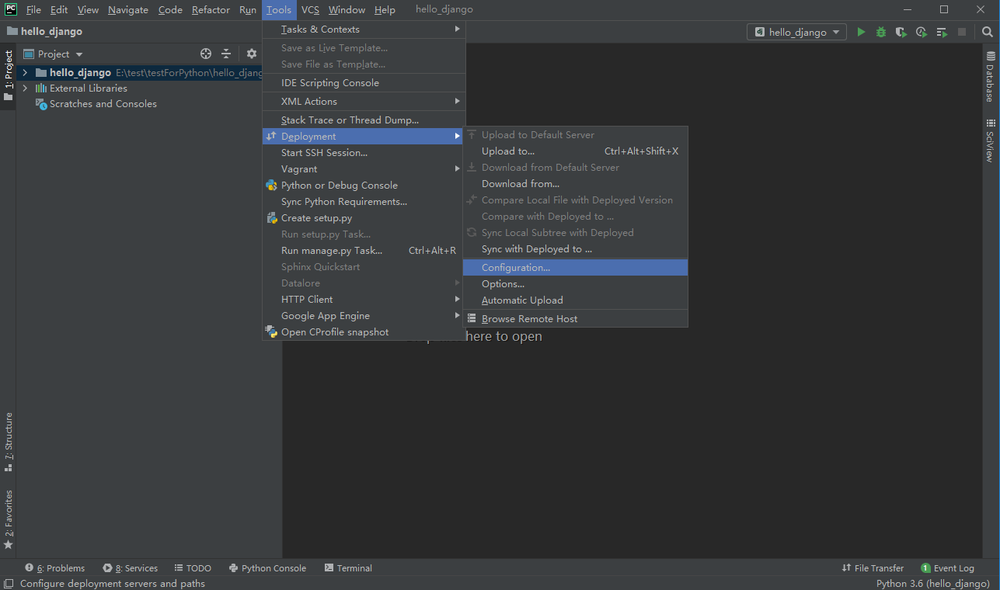
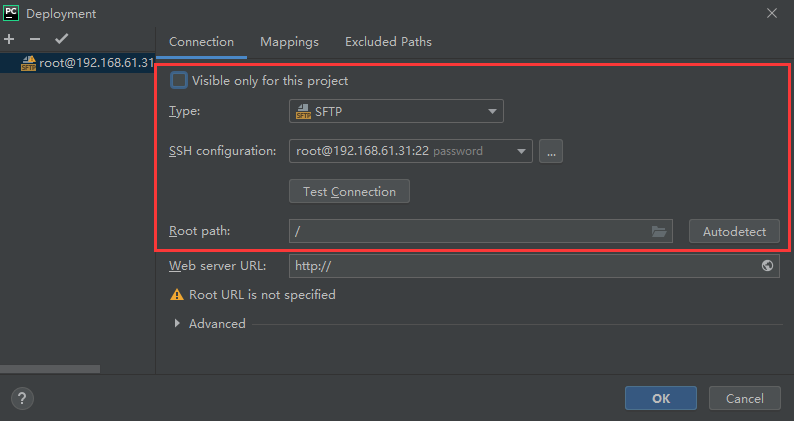
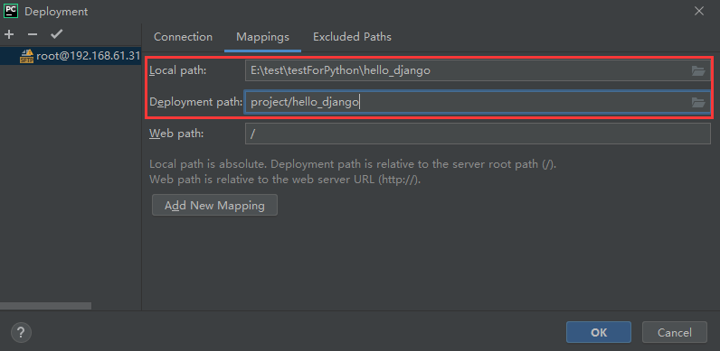
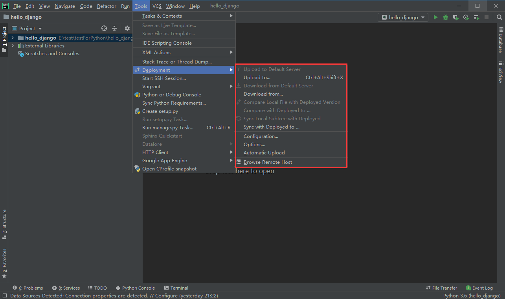
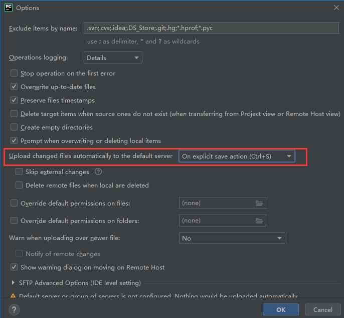
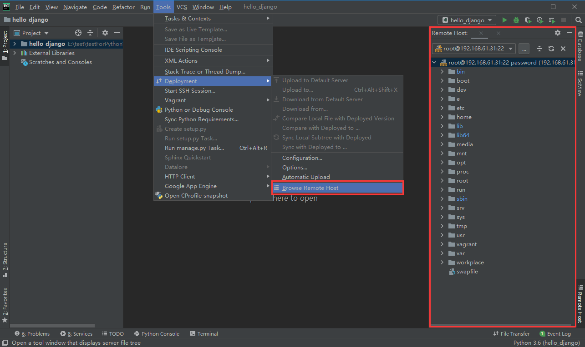
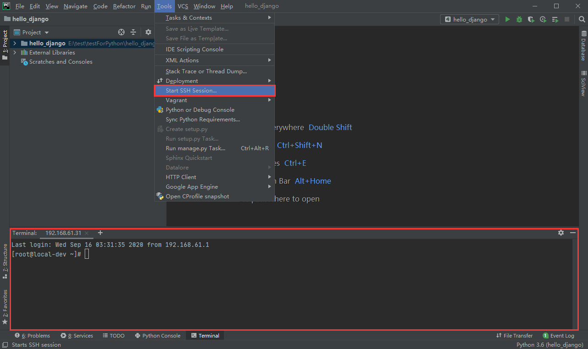

## 一、本地文件和远端文件的同步

在pycharm中，配置sftp工具用于连接远端，实现本地文件和远端文件的同步

### 设置步骤

1. 点击Tools > Deployment > Configuration进入sftp配置界面

   

2. 点击左侧+号，新建配置，按要求填写图中框出的部分

   

   > 提示：
   >
   > Root path：远端根路径，，一般直接设置为 / 。该路径+第3步中的`Deployment path on server`组成最终的远端路径。若需要设置其他路径，必须以 / 开头， 若 /tmp

3. 切换到Deployment的Mapping选项卡：将本地文件夹和远端文件夹关联
   

   > 提示：
   >
   > Local path：本地路径。
   >
   > Deployment path on server ：远端子路径。第2步中的Root path+该路径组成最终的远端路径。

   点击“0k”按钮保存设置。此时本地文件夹和远端文件夹已完成关联。`本地路径 = 远端根路径 + 远端子路径`
   
4. 现在即可通过Tools > Deployment 下的各选项，实现文件上传、下载、同步即自动上传等功能

   

到此，已可满足日常基本使用。若你想了解pycharm的deployment更多设置，可阅读扩展部分，扩展部分不是必须的，若不需要，可自行跳过。

### 扩展部分

- 设置每次Ctrl+s的时候，自动上传修改的代码到远端

  点击Tools > Deployment > Options，将`Upload changed files automatically to the default server`改为 `On explicit save action`  

   

   

- 点击`Browse Remote Host`可以在本地图形化显示远端文件夹，显示的文件夹为“设置步骤第3步”中设置的`Deployment path on server`文件夹，如下图

  

## 二、本地显示远端控制台

点击Tools > Start SSH Session，即可在本地显示远端控制台

## 参考文档

[搭建Pycharm远程调试功能](https://blog.csdn.net/lishanlu136/article/details/82683641)

[pycharm远程调试](https://www.jianshu.com/p/9424fbc76c2c)

