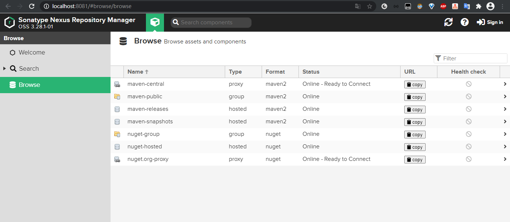

# maven私服搭建

详细资料请见：[官方文档](https://guides.sonatype.com/repo3/quick-start-guides/proxying-maven-and-npm/)

私服是架设在局域网的一种特殊的远程仓库。可以代理远程仓库以及部署第三方构件。

有了私服之后，当maven下载构件时，直接请求私服，私服上存在则下载到本地仓库。否则会请求外部的远程仓库，将构建下载到私服，再提供给本地仓库下载。

## 安装并启动

1. 下载指定操作系统的[Nexus Repository Manager 3](https://help.sonatype.com/display/NXRM3/Download?_ga=2.78477904.599292477.1606353225-1717499928.1604886860) 

2. 解压到指定文件夹

3. 执行以下脚本启动nexus，等待片刻，当日志打印出“Started Sonatype Nexus.”说明启动成功

   ```bash
   cd ../nexus-*
   bin/nexus.exe /run
   ```

4. 打开浏览器输入 http://localhost:8081/ 访问web界面

5. 点击**Sign In**登录，用户名admin，密码位于`../sonatype-work/nexus3/admin.password` 文件中

6. 根据提示变更密码

## 说明



maven-central：maven中央库，默认从https://repo1.maven.org/maven2/拉取jar

maven-releases：私库发行版jar

maven-snapshots：私库快照（调试版本）jar

maven-public：仓库分组，把上面三个仓库组合在一起对外提供服务，在本地maven基础配置settings.xml中使用。