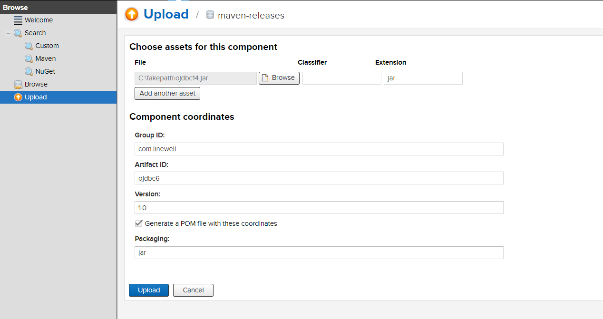
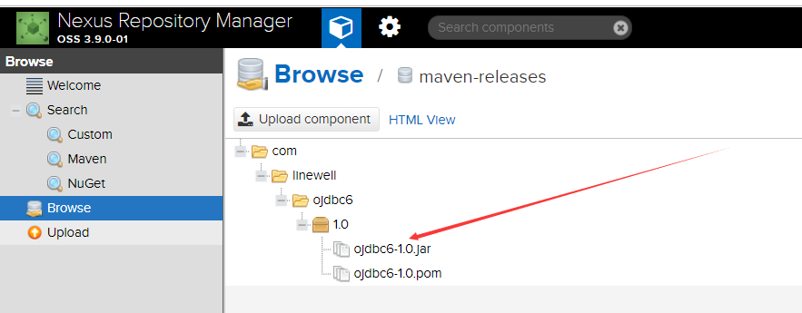

# maven私服基本使用

## 上传jar包(三种方式)

### 通过界面上传jar包

点击Upload → maven-release进入上传界面，填写上传信息



点击Browse→maven-releases查看上传结果



### 通过配置上传jar包

在maven的setting.xml文件中添加以下配置，setting.xml文件默认位置为

`C:\Users\{username}\.m2\settings.xml`

```xml
<servers>
    ...
	<!--   配置私服  -->
    <server> 
      <id>maven-public</id> 
      <username>admin</username> 
      <password>123456</password>
	</server>
	<server> 
      <id>maven-releases</id> 
      <username>admin</username> 
      <password>123456</password>
	</server>
	<server> 
      <id>maven-snapshots</id> 
      <username>admin</username> 
      <password>123456</password>
	</server> 
   	...
</servers>
```

> 提示：要分清是自己下载的maven还是idea的maven

在项目的pom文件中添加以下配置

```xml
<distributionManagement>
        <repository>
            <id>maven-releases</id>
            <name>Nexus Release Repository</name>
            <url>http://localhost:8081/repository/maven-releases/</url>
        </repository>
        <snapshotRepository>
            <id>maven-snapshots</id>
            <name>Nexus Snapshot Repository</name>
            <url>http://localhost:8081/repository/maven-snapshots/</url>
        </snapshotRepository>
</distributionManagement>
```

点击idea中deploy命令即可

### 使用命令行上传jar包

```ruby
mvn deploy:deploy-file 
-DgroupId=com.weepal.wp-common 
-DartifactId=wp-common 
-Dversion=1.3.0 
-Dpackaging=jar 
-DrepositoryId=nexus 
-Dfile=E:\Document\wp-common-1.3.0-RELEASE.jar
-Durl=http://localhost:8081/repository/maven-release/
```

命令行参数说明：

-DgroupId：pom中的groupId
-DartifactId：pom中的artifactId
-Dversion：pom中的version

同时在maven中要添加权限

```xml
<server>
    <id>nexus</id>
    <username>admin</username>
    <password>123456</password>
</server>

 <repository>
    <id>nexus</id>
    <url>http://localhost:8081/repository/maven-release/</url>
    <releases>
     <enabled>true</enabled>
    </releases>
    <snapshots>
     <enabled>true</enabled>
    </snapshots>
 </repository>
```

## 从私服下载jar包

### jar包下载顺序

1. 首先访问本地仓库
2. 本地仓库没有，则访问私服仓库
3. 私服仓库也没有，则访问中心仓库

### 私服配置

1、在pom文件中配置

```xml
     <!--下载jar配置开始-->
    <repositories>
        <repository>
            <id>nexus</id>
            <name>Nexus Repository</name>
            <url>http://localhoot:8081/repository/maven-public/</url>
        </repository>
    </repositories>

    <pluginRepositories>
        <pluginRepository>
            <id>nexus</id>
            <name>Nexus Plugin Repository</name>
            <url>http://localhoot:8081/repository/maven-public/</url>
        </pluginRepository>
    </pluginRepositories>
    <!--下载jar包配置结束-->
```

## 参考文档

[建立maven私服](https://www.jianshu.com/p/93fac0ac2202)

