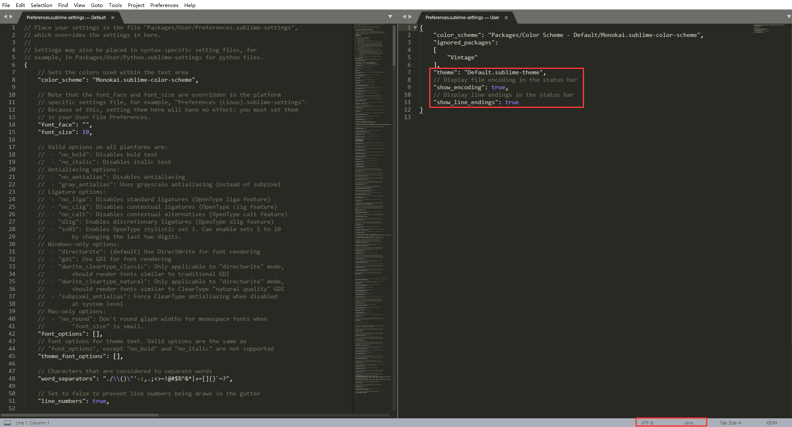
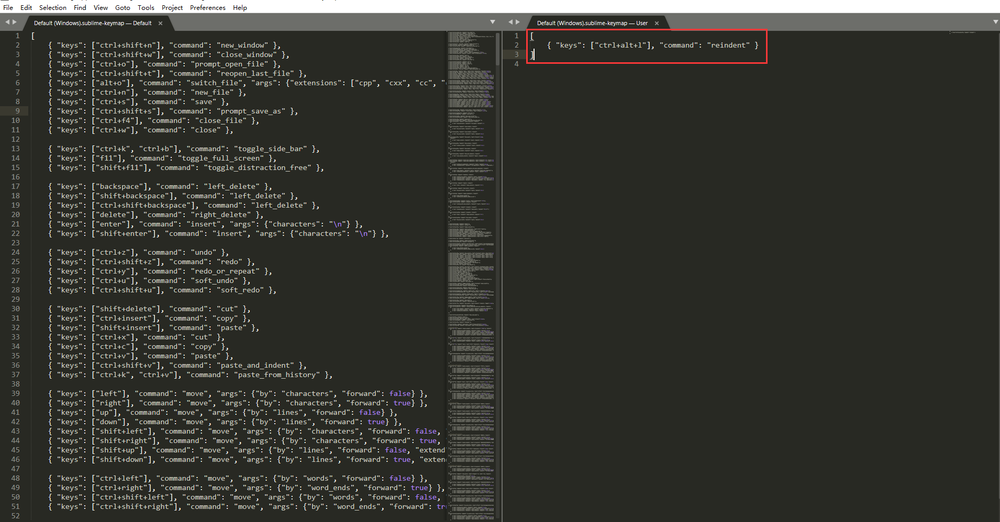

## 安装插件

使用Ctrl + Shift + P打开命令板，输入PCIC应出现Package Control：Install Package，点击回车；

在新出现的窗口中搜索“插件”，点击回车下载

> 注意：sublime下载提示不明显，常被误以为没下载。在ide的左下角，可查看是否下载安装中。

## 在编辑器底部显示编码设置

Sublime Text的默认设置是不开启显示编码的，如果想开启，可通过

点击“Perferences”→ “Settings” – “User”，在右侧框中添加如下内容

```bash
// Display file encoding in the status bar
"show_encoding": true,
// Display line endings in the status bar
"show_line_endings": true,
```



> 注意：若在Sublime Text编写VBscript，请把文件编码改成UTF-16 LE以解决中文编码问题

## 自定义格式化代码快捷键

点击“Perferences”→“Key Bindings”，在右侧框中添加如下内容

```bash
[
	{ "keys": ["ctrl+alt+l"], "command": "reindent" }
]
```



## 参考文档

[Sublime Text 全程指南](https://www.jianshu.com/p/5f73df9f1cb5)