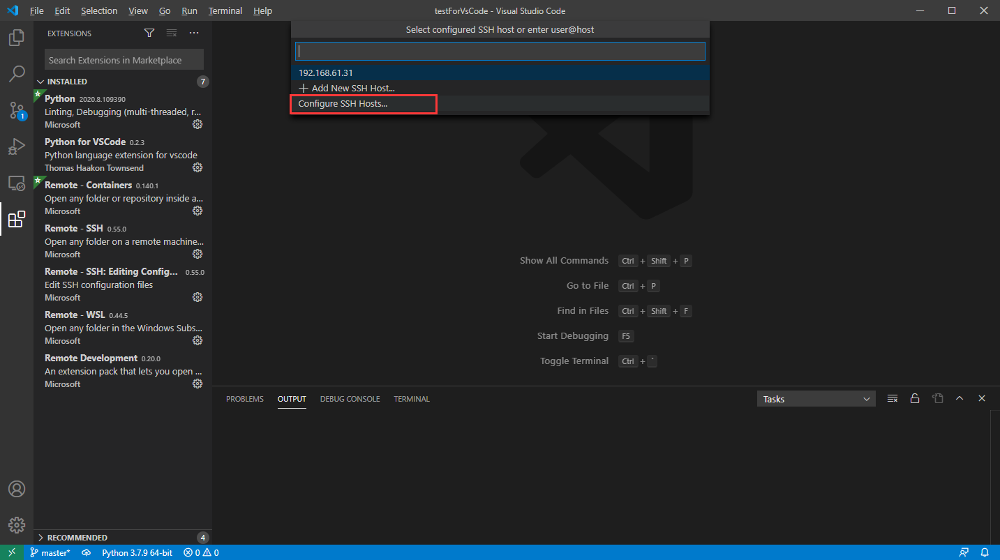

## 一、启动vscode


## 二、安装插件

打开商店，搜索python，安装图示中框选的python插件


打开商店，搜索Remote Development，安装图示中框选的Remote Development插件


安装后Remote Development插件后发现，多出几个插件

- Remote-SSH：用于连接linux

- Remote-WSL：用于连接windows子系统

- Remote-Containers：用于连接容器

本次我们主要用到Remote-SSH插件


## 三、配置SSH

点击右下角的绿色小箭头，然后点击Remote-SSH：Connect to Host


配置SSH主机信息



直接选择第一个


按如下格式填写配置，并保存


参数说明

```yaml
Host {主机别名}
    HostName {远端主机IP}
    User {远端主机用户名}
    Port {远端主机SSH的端口}
    PreferredAuthentications {认证方式}
    IdentityFile {私钥路径}
```

## 四、连接远端

尝试连接


vscode第一次连接远端会自动在远端安装vscode-server，等待安装完成


连接成功后，如下图所示


## 五、打开项目

File > Open Folder 即可打开远端的文件夹


如下图


Terminal打开远端的命令行


## 参考文档

[VsCode使用教程](https://www.jianshu.com/p/11554732b323)


