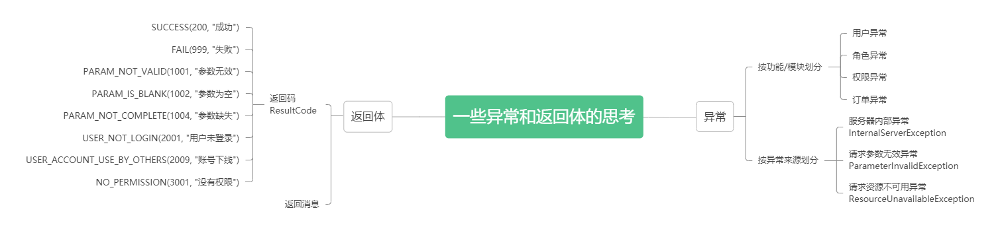
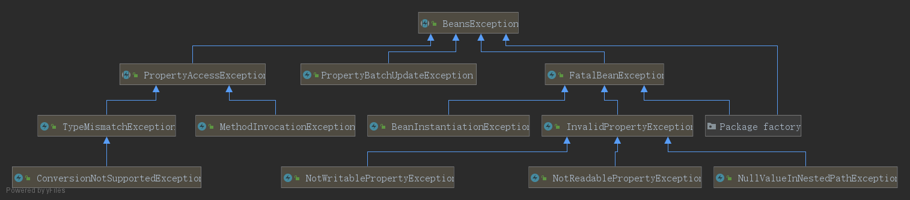
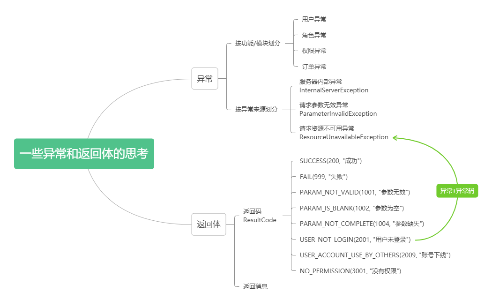

# 一些异常和返回体的思考



## spring中的异常



异常使用示例

```java
new BeansException("bean not exist")
new BeansException("bean不存在")
```

## 返回码与返回体

请参加：https://blog.csdn.net/i_am_hutengfei/article/details/100561564/

### 1、统一错误码枚举

```java
/**
 * @Author: Hutengfei
 * @Description: 返回码定义
 * 规定:
 * #1表示成功
 * #1001～1999 区间表示参数错误
 * #2001～2999 区间表示用户错误
 * #3001～3999 区间表示接口异常
 * @Date Create in 2019/7/22 19:28
 */
public enum ResultCode {
    /* 成功 */
    SUCCESS(200, "成功"),

    /* 默认失败 */
    COMMON_FAIL(999, "失败"),

    /* 参数错误：1000～1999 */
    PARAM_NOT_VALID(1001, "参数无效"),
    PARAM_IS_BLANK(1002, "参数为空"),
    PARAM_TYPE_ERROR(1003, "参数类型错误"),
    PARAM_NOT_COMPLETE(1004, "参数缺失"),

    /* 用户错误 */
    USER_NOT_LOGIN(2001, "用户未登录"),
    USER_ACCOUNT_EXPIRED(2002, "账号已过期"),
    USER_CREDENTIALS_ERROR(2003, "密码错误"),
    USER_CREDENTIALS_EXPIRED(2004, "密码过期"),
    USER_ACCOUNT_DISABLE(2005, "账号不可用"),
    USER_ACCOUNT_LOCKED(2006, "账号被锁定"),
    USER_ACCOUNT_NOT_EXIST(2007, "账号不存在"),
    USER_ACCOUNT_ALREADY_EXIST(2008, "账号已存在"),
    USER_ACCOUNT_USE_BY_OTHERS(2009, "账号下线"),

    /* 业务错误 */
    NO_PERMISSION(3001, "没有权限");
    private Integer code;
    private String message;

    ResultCode(Integer code, String message) {
        this.code = code;
        this.message = message;
    }

    public Integer getCode() {
        return code;
    }

    public void setCode(Integer code) {
        this.code = code;
    }

    public String getMessage() {
        return message;
    }

    public void setMessage(String message) {
        this.message = message;
    }

    /**
     * 根据code获取message
     *
     * @param code
     * @return
     */
    public static String getMessageByCode(Integer code) {
        for (ResultCode ele : values()) {
            if (ele.getCode().equals(code)) {
                return ele.getMessage();
            }
        }
        return null;
    }
}
```

### 2、统一json返回体

```java
/**
 * @Author: Hutengfei
 * @Description: 统一返回实体
 * @Date Create in 2019/7/22 19:20
 */
public class JsonResult<T> implements Serializable {
    private Boolean success;
    private Integer errorCode;
    private String errorMsg;
    private T data;

    public JsonResult() {
    }

    public JsonResult(boolean success) {
        this.success = success;
        this.errorCode = success ? ResultCode.SUCCESS.getCode() : ResultCode.COMMON_FAIL.getCode();
        this.errorMsg = success ? ResultCode.SUCCESS.getMessage() : ResultCode.COMMON_FAIL.getMessage();
    }

    public JsonResult(boolean success, ResultCode resultEnum) {
        this.success = success;
        this.errorCode = success ? ResultCode.SUCCESS.getCode() : (resultEnum == null ? ResultCode.COMMON_FAIL.getCode() : resultEnum.getCode());
        this.errorMsg = success ? ResultCode.SUCCESS.getMessage() : (resultEnum == null ? ResultCode.COMMON_FAIL.getMessage() : resultEnum.getMessage());
    }

    public JsonResult(boolean success, T data) {
        this.success = success;
        this.errorCode = success ? ResultCode.SUCCESS.getCode() : ResultCode.COMMON_FAIL.getCode();
        this.errorMsg = success ? ResultCode.SUCCESS.getMessage() : ResultCode.COMMON_FAIL.getMessage();
        this.data = data;
    }

    public JsonResult(boolean success, ResultCode resultEnum, T data) {
        this.success = success;
        this.errorCode = success ? ResultCode.SUCCESS.getCode() : (resultEnum == null ? ResultCode.COMMON_FAIL.getCode() : resultEnum.getCode());
        this.errorMsg = success ? ResultCode.SUCCESS.getMessage() : (resultEnum == null ? ResultCode.COMMON_FAIL.getMessage() : resultEnum.getMessage());
        this.data = data;
    }

    public Boolean getSuccess() {
        return success;
    }

    public void setSuccess(Boolean success) {
        this.success = success;
    }

    public Integer getErrorCode() {
        return errorCode;
    }

    public void setErrorCode(Integer errorCode) {
        this.errorCode = errorCode;
    }

    public String getErrorMsg() {
        return errorMsg;
    }

    public void setErrorMsg(String errorMsg) {
        this.errorMsg = errorMsg;
    }

    public T getData() {
        return data;
    }

    public void setData(T data) {
        this.data = data;
    }
}
```

### 3、返回体构造工具

```java
/**
 * @Author: Hutengfei
 * @Description:
 * @Date Create in 2019/7/22 19:52
 */
public class ResultTool {
    public static JsonResult success() {
        return new JsonResult(true);
    }

    public static <T> JsonResult<T> success(T data) {
        return new JsonResult(true, data);
    }

    public static JsonResult fail() {
        return new JsonResult(false);
    }

    public static JsonResult fail(ResultCode resultEnum) {
        return new JsonResult(false, resultEnum);
    }
}
```

### 4、使用

```java
JsonResult result = ResultTool.fail(ResultCode.USER_NOT_LOGIN);
JsonResult result = ResultTool.success();
```

## 思考

- 自定义异常是一个好习惯，再对异常的message规范一下就更好了

- 返回体的返回码也很好，对其进行扩展可实现国际化，支持中英文

那何不强强联合、改造异常，基于返回码的思想规范异常的message，支持国际化？

异常+异常码（ExceptionCode）

异常码

```java
public enum ExceptionCode {
    /* 默认失败 */
    COMMON_FAIL(999, "失败"),

    /* 参数错误：1000～1999 */
    PARAM_NOT_VALID(1001, "参数无效"),
    
    ...
}
```

使用

```java
new Exception(ExceptionCode.USER_ACCOUNT_NOT_EXIST)
```


