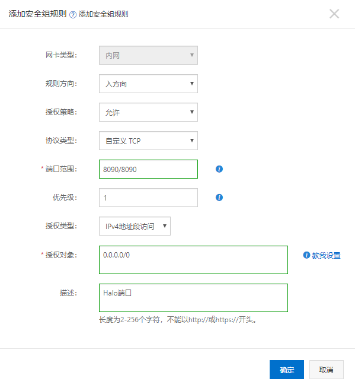

## 检查是否有可疑之处

### 检查是否存在可疑用户

```bash
[root@iZbp17c2vs286rjb0q9z31Z etc]# cat /etc/passwd
root:x:0:0:root:/root:/bin/bash
bin:x:1:1:bin:/bin:/sbin/nologin
daemon:x:2:2:daemon:/sbin:/sbin/nologin
adm:x:3:4:adm:/var/adm:/sbin/nologin
lp:x:4:7:lp:/var/spool/lpd:/sbin/nologin
sync:x:5:0:sync:/sbin:/bin/sync
shutdown:x:6:0:shutdown:/sbin:/sbin/shutdown
halt:x:7:0:halt:/sbin:/sbin/halt
mail:x:8:12:mail:/var/spool/mail:/sbin/nologin
operator:x:11:0:operator:/root:/sbin/nologin
games:x:12:100:games:/usr/games:/sbin/nologin
ftp:x:14:50:FTP User:/var/ftp:/sbin/nologin
nobody:x:99:99:Nobody:/:/sbin/nologin
systemd-network:x:192:192:systemd Network Management:/:/sbin/nologin
dbus:x:81:81:System message bus:/:/sbin/nologin
polkitd:x:999:998:User for polkitd:/:/sbin/nologin
sshd:x:74:74:Privilege-separated SSH:/var/empty/sshd:/sbin/nologin
postfix:x:89:89::/var/spool/postfix:/sbin/nologin
chrony:x:998:996::/var/lib/chrony:/sbin/nologin
ntp:x:38:38::/etc/ntp:/sbin/nologin
tcpdump:x:72:72::/:/sbin/nologin
nscd:x:28:28:NSCD Daemon:/:/sbin/nologin
```

统计一共22个用户

```bash
[root@iZbp17c2vs286rjb0q9z31Z etc]# cat /etc/passwd | wc -l
22
```

### 查看是否存在可疑密码

```bash
[root@iZbp17c2vs286rjb0q9z31Z etc]# cat /etc/shadow
root:$6$604a1/F6YF/p.$2gwrwOkszrceocPc/26l.LypkBOKkktHRkRixGffrvXzEPEXI8BEXnEq5i9k.VI6cNcsmVgQxjcKS3fUmsHYq.:18237:0:99999:7:::
bin:*:17834:0:99999:7:::
daemon:*:17834:0:99999:7:::
adm:*:17834:0:99999:7:::
lp:*:17834:0:99999:7:::
sync:*:17834:0:99999:7:::
shutdown:*:17834:0:99999:7:::
halt:*:17834:0:99999:7:::
mail:*:17834:0:99999:7:::
operator:*:17834:0:99999:7:::
games:*:17834:0:99999:7:::
ftp:*:17834:0:99999:7:::
nobody:*:17834:0:99999:7:::
systemd-network:!!:18177::::::
dbus:!!:18177::::::
polkitd:!!:18177::::::
sshd:!!:18177::::::
postfix:!!:18177::::::
chrony:!!:18177::::::
ntp:!!:18177::::::
tcpdump:!!:18177::::::
nscd:!!:18177::::::
```

统计用户密码数

```bash
[root@iZbp17c2vs286rjb0q9z31Z etc]# cat /etc/shadow | wc -l
22
```

### 查看用户组

```bash
[root@iZbp17c2vs286rjb0q9z31Z etc]# cat /etc/group
root:x:0:
bin:x:1:
daemon:x:2:
sys:x:3:
adm:x:4:
tty:x:5:
disk:x:6:
lp:x:7:
mem:x:8:
kmem:x:9:
wheel:x:10:
cdrom:x:11:
mail:x:12:postfix
man:x:15:
dialout:x:18:
floppy:x:19:
games:x:20:
tape:x:33:
video:x:39:
ftp:x:50:
lock:x:54:
audio:x:63:
nobody:x:99:
users:x:100:
utmp:x:22:
utempter:x:35:
input:x:999:
systemd-journal:x:190:
systemd-network:x:192:
dbus:x:81:
polkitd:x:998:
ssh_keys:x:997:
sshd:x:74:
postdrop:x:90:
postfix:x:89:
chrony:x:996:
ntp:x:38:
tcpdump:x:72:
nscd:x:28:
```

统计用户组数

```bash
[root@iZbp17c2vs286rjb0q9z31Z etc]# cat /etc/group | wc -l
39
```

### 查看登陆记录

```bash
[root@iZbp17c2vs286rjb0q9z31Z etc]# who
root     pts/0        2019-12-07 22:02 (223.98.162.152)
[root@iZbp17c2vs286rjb0q9z31Z etc]# last
root     pts/0        223.98.162.152   Sat Dec  7 22:02   still logged in   
root     tty1                          Sat Dec  7 21:56 - 22:40  (00:44)    
reboot   system boot  3.10.0-1062.1.2. Sun Dec  8 05:54 - 22:45  (-7:-9)    
reboot   system boot  3.10.0-1062.1.2. Thu Nov 28 18:10 - 21:54 (9+03:43)   

wtmp begins Tue Oct  8 17:26:24 2019
```

### 查看当前连接用户

```bash
[root@iZbp17c2vs286rjb0q9z31Z etc]# uptime
 22:41:11 up 46 min,  1 user,  load average: 0.16, 0.05, 0.06
```

### 查看历史行为

```bash
[root@iZbp17c2vs286rjb0q9z31Z etc]# history
    1  ls
    2  who
    3  cd .etc
    4  cd /etc
    5  history
[root@iZbp17c2vs286rjb0q9z31Z etc]# cat ~/.bash_history 
ls
who
cd .etc
cd /etc
history
```

> 清除历史记录可使用如下命令
>
> ```bash
> [root@iZbp17c2vs286rjb0q9z31Z etc]# history -c
> ```

### 查看是否有可疑进程

```bash
[root@iZbp17c2vs286rjb0q9z31Z etc]# ps -aux
USER       PID %CPU %MEM    VSZ   RSS TTY      STAT START   TIME COMMAND
root         1  0.0  0.1  43268  3728 ?        Ss   21:54   0:00 /usr/lib/systemd/systemd --switched-root --system --deserialize 22
root         2  0.0  0.0      0     0 ?        S    21:54   0:00 [kthreadd]
root         4  0.0  0.0      0     0 ?        S<   21:54   0:00 [kworker/0:0H]
root         6  0.0  0.0      0     0 ?        S    21:54   0:00 [ksoftirqd/0]
root         7  0.0  0.0      0     0 ?        S    21:54   0:00 [migration/0]
root         8  0.0  0.0      0     0 ?        S    21:54   0:00 [rcu_bh]
root         9  0.0  0.0      0     0 ?        R    21:54   0:00 [rcu_sched]
root        10  0.0  0.0      0     0 ?        S<   21:54   0:00 [lru-add-drain]
root        11  0.0  0.0      0     0 ?        S    21:54   0:00 [watchdog/0]
root        13  0.0  0.0      0     0 ?        S    21:54   0:00 [kdevtmpfs]
root        14  0.0  0.0      0     0 ?        S<   21:54   0:00 [netns]
root        15  0.0  0.0      0     0 ?        S    21:54   0:00 [khungtaskd]
root        16  0.0  0.0      0     0 ?        S<   21:54   0:00 [writeback]
root        17  0.0  0.0      0     0 ?        S<   21:54   0:00 [kintegrityd]
root        18  0.0  0.0      0     0 ?        S<   21:54   0:00 [bioset]
root        19  0.0  0.0      0     0 ?        S<   21:54   0:00 [bioset]
root        20  0.0  0.0      0     0 ?        S<   21:54   0:00 [bioset]
root        21  0.0  0.0      0     0 ?        S<   21:54   0:00 [kblockd]
root        22  0.0  0.0      0     0 ?        S<   21:54   0:00 [md]
root        23  0.0  0.0      0     0 ?        S<   21:54   0:00 [edac-poller]
root        24  0.0  0.0      0     0 ?        S<   21:54   0:00 [watchdogd]
root        30  0.0  0.0      0     0 ?        S    21:54   0:00 [kswapd0]
root        31  0.0  0.0      0     0 ?        SN   21:54   0:00 [ksmd]
root        32  0.0  0.0      0     0 ?        SN   21:54   0:00 [khugepaged]
root        33  0.0  0.0      0     0 ?        S<   21:54   0:00 [crypto]
root        41  0.0  0.0      0     0 ?        S<   21:54   0:00 [kthrotld]
root        42  0.0  0.0      0     0 ?        S    21:54   0:00 [kworker/u2:1]
root        43  0.0  0.0      0     0 ?        S<   21:54   0:00 [kmpath_rdacd]
root        44  0.0  0.0      0     0 ?        S<   21:54   0:00 [kaluad]
root        45  0.0  0.0      0     0 ?        S<   21:54   0:00 [kpsmoused]
root        46  0.0  0.0      0     0 ?        S<   21:54   0:00 [ipv6_addrconf]
root        59  0.0  0.0      0     0 ?        S<   21:54   0:00 [deferwq]
root        95  0.0  0.0      0     0 ?        S    21:54   0:00 [kauditd]
root       258  0.0  0.0      0     0 ?        S<   21:54   0:00 [ata_sff]
root       264  0.0  0.0      0     0 ?        S    21:54   0:00 [scsi_eh_0]
root       265  0.0  0.0      0     0 ?        S<   21:54   0:00 [scsi_tmf_0]
root       267  0.0  0.0      0     0 ?        S    21:54   0:00 [scsi_eh_1]
root       268  0.0  0.0      0     0 ?        S<   21:54   0:00 [scsi_tmf_1]
root       272  0.0  0.0      0     0 ?        S    21:54   0:00 [kworker/u2:3]
root       273  0.0  0.0      0     0 ?        S<   21:54   0:00 [ttm_swap]
root       279  0.0  0.0      0     0 ?        S<   21:54   0:00 [kworker/0:1H]
root       288  0.0  0.0      0     0 ?        S    21:54   0:00 [jbd2/vda1-8]
root       289  0.0  0.0      0     0 ?        S<   21:54   0:00 [ext4-rsv-conver]
root       367  0.0  0.3  47272  6896 ?        Ss   21:54   0:00 /usr/lib/systemd/systemd-journald
root       397  0.0  0.1  45220  2308 ?        Ss   21:54   0:00 /usr/lib/systemd/systemd-udevd
root       504  0.0  0.0      0     0 ?        S<   21:54   0:00 [nfit]
root       506  0.0  0.0  55528   888 ?        S<sl 21:54   0:00 /sbin/auditd
polkitd    529  0.0  0.7 612244 14164 ?        Ssl  21:54   0:00 /usr/lib/polkit-1/polkitd --no-debug
root       531  0.0  0.0  26380  1768 ?        Ss   21:54   0:00 /usr/lib/systemd/systemd-logind
dbus       532  0.0  0.1  58116  2340 ?        Ss   21:54   0:00 /usr/bin/dbus-daemon --system --address=systemd: --nofork --nopidfile --systemd-activation
root       566  0.0  0.0 126292  1604 ?        Ss   21:54   0:00 /usr/sbin/crond -n
root       568  0.0  0.0  25908   936 ?        Ss   21:54   0:00 /usr/sbin/atd -f
root       577  0.0  0.0 110108   860 ttyS0    Ss+  21:54   0:00 /sbin/agetty --keep-baud 115200,38400,9600 ttyS0 vt220
chrony     578  0.0  0.0 117928  1876 ?        S    21:54   0:00 /usr/sbin/chronyd
root       769  0.0  0.1 102896  2364 ?        Ss   21:54   0:00 /sbin/dhclient -1 -q -lf /var/lib/dhclient/dhclient--eth0.lease -pf /var/run/dhclient-eth0.pid -H iZbp17c2vs286rjb0q9z31Z e
root       836  0.0  0.2 234932  5064 ?        Ssl  21:54   0:00 /usr/sbin/rsyslogd -n
root       837  0.0  0.3  41072  5676 ?        Ssl  21:54   0:01 /usr/sbin/aliyun-service
root       838  0.0  1.0 574200 19408 ?        Ssl  21:54   0:00 /usr/bin/python2 -Es /usr/sbin/tuned -l -P
root       880  0.0  0.2  32532  3972 ?        Ssl  21:54   0:01 /usr/local/aegis/aegis_update/AliYunDunUpdate
root       946  1.6  0.5 127592 11152 ?        S<sl 21:54   1:15 /usr/local/aegis/aegis_client/aegis_10_75/AliYunDun
root      1025  0.0  0.2 112920  4312 ?        Ss   21:54   0:00 /usr/sbin/sshd -D
root      1092  0.0  0.0      0     0 ?        R    22:01   0:00 [kworker/0:0]
root      1095  0.0  0.3 157320  5916 ?        Ss   22:02   0:00 sshd: root@pts/0
root      1097  0.0  0.1 115448  2100 pts/0    Ss   22:02   0:00 -bash
root      1179  0.0  0.0      0     0 ?        S    22:40   0:00 [kworker/0:1]
root      1180  0.0  0.0 110108   852 tty1     Ss+  22:40   0:00 /sbin/agetty --noclear tty1 linux
root      1246  0.0  0.0 155372  1872 pts/0    R+   23:11   0:00 ps -aux
[root@iZbp17c2vs286rjb0q9z31Z etc]# ps -aux | wc -l
69
```

## 检查主机基本信息

### 查看系统内核版本

```bash
[root@iZbp17c2vs286rjb0q9z31Z etc]# uname -a 
Linux iZbp17c2vs286rjb0q9z31Z 3.10.0-1062.1.2.el7.x86_64 #1 SMP Mon Sep 30 14:19:46 UTC 2019 x86_64 x86_64 x86_64 GNU/Linux
[root@iZbp17c2vs286rjb0q9z31Z etc]# cat /etc/redhat-release 
CentOS Linux release 7.7.1908 (Core)
[root@iZbp17c2vs286rjb0q9z31Z etc]# cat /etc/centos-release
CentOS Linux release 7.7.1908 (Core)
```

### 查看内存使用情况

```bash
[root@iZbp17c2vs286rjb0q9z31Z etc]# free -mh
              total        used        free      shared  buff/cache   available
Mem:           1.8G         79M        1.6G        420K        145M        1.6G
Swap:            0B          0B          0B
```

> 若内存比较小，可以考虑设置虚拟内存
>
> [CentOs增加虚拟内存，解决云端内存不足问题](https://zhuanlan.zhihu.com/p/370900840)
>
> [CentOS如何增加虚拟内存_虚拟机修改内存后如何生效](https://blog.csdn.net/xiaoye319/article/details/118017085)

### 查看所有已挂载的挂载信息与硬盘使用情况

```bash
[root@iZbp17c2vs286rjb0q9z31Z dev]# df -h 
Filesystem      Size  Used Avail Use% Mounted on
devtmpfs        909M     0  909M   0% /dev
tmpfs           919M     0  919M   0% /dev/shm
tmpfs           919M  420K  919M   1% /run
tmpfs           919M     0  919M   0% /sys/fs/cgroup
/dev/vda1        40G  1.8G   36G   5% /
tmpfs           184M     0  184M   0% /run/user/0
```

### 查看网络配置

```bash
[root@iZbp17c2vs286rjb0q9z31Z etc]# ifconfig 
eth0: flags=4163<UP,BROADCAST,RUNNING,MULTICAST>  mtu 1500
        inet 172.16.83.206  netmask 255.255.240.0  broadcast 172.16.95.255
        ether 00:16:3e:0b:65:88  txqueuelen 1000  (Ethernet)
        RX packets 2092  bytes 346374 (338.2 KiB)
        RX errors 0  dropped 0  overruns 0  frame 0
        TX packets 1973  bytes 339831 (331.8 KiB)
        TX errors 0  dropped 0 overruns 0  carrier 0  collisions 0

lo: flags=73<UP,LOOPBACK,RUNNING>  mtu 65536
        inet 127.0.0.1  netmask 255.0.0.0
        loop  txqueuelen 1000  (Local Loopback)
        RX packets 0  bytes 0 (0.0 B)
        RX errors 0  dropped 0  overruns 0  frame 0
        TX packets 0  bytes 0 (0.0 B)
        TX errors 0  dropped 0 overruns 0  carrier 0  collisions 0
```


### 查看源

```bash
[root@iZbp17c2vs286rjb0q9z31Z ~]# cat /etc/yum.repos.d/CentOS-Base.repo 
[base]
name=CentOS-$releasever
enabled=1
failovermethod=priority
baseurl=http://mirrors.cloud.aliyuncs.com/centos/$releasever/os/$basearch/
gpgcheck=1
gpgkey=http://mirrors.cloud.aliyuncs.com/centos/RPM-GPG-KEY-CentOS-7

[updates]
name=CentOS-$releasever
enabled=1
failovermethod=priority
baseurl=http://mirrors.cloud.aliyuncs.com/centos/$releasever/updates/$basearch/
gpgcheck=1
gpgkey=http://mirrors.cloud.aliyuncs.com/centos/RPM-GPG-KEY-CentOS-7

[extras]
name=CentOS-$releasever
enabled=1
failovermethod=priority
baseurl=http://mirrors.cloud.aliyuncs.com/centos/$releasever/extras/$basearch/
gpgcheck=1
gpgkey=http://mirrors.cloud.aliyuncs.com/centos/RPM-GPG-KEY-CentOS-7[root@iZbp17c2vs286rjb0q9z31Z ~]# cat /etc/yum.repos.d/epel.repo 
[epel]
name=Extra Packages for Enterprise Linux 7 - $basearch
enabled=1
failovermethod=priority
baseurl=http://mirrors.cloud.aliyuncs.com/epel/7/$basearch
gpgcheck=0
gpgkey=http://mirrors.cloud.aliyuncs.com/epel/RPM-GPG-KEY-EPEL-7
```

### 查看端口使用情况

```bash
# yum -y install net-tools
# netstat -tunlp | grep 端口号
$ netstat -tunlp | grep 8000
tcp        0      0 0.0.0.0:8000       0.0.0.0:*       LISTEN      26993/nodejs   
```

在查到端口占用的进程后，如果你要杀掉对应的进程可以使用 kill 命令：

```bash
# kill -9 PID
$ kill -9 26993
```

## 基本设置

### 修改主机名为linux

```bash
$ hostnamectl set-hostname linux
$ reboot
```

### 新建用户

```bash
# useradd zhangsan
# passwd zhangsan
Changing password for user zhangsan.
New password:             # 输入密码
Retype new password:      # 再次输入密码
passwd: all authentication tokens updated successfully.
```

### 公钥登录

在客户机上生成密钥对

```bash
$ ssh-keygen
```

公钥传送到远程主机host上面

```bash
　$ ssh-copy-id zhangsan@10.65.98.48
```

### 使用证书登录，禁止密码登录，禁止root远程登录

```bash
$ vim /etc/ssh/sshd_config

# 使用证书登录, 将以下三项配置开启
RSAAuthentication yes
PubkeyAuthentication yes
AuthorizedKeysFile .ssh/authorized_keys

# 禁止密码登录,将PasswordAuthentication yes改为no,如下：
PasswordAuthentication no

# 禁止root远程登录，将默认的`#PermitRootLogin yes`去注释,并将yes改为no，如下：
PermitRootLogin no

$ service sshd restart # 重启sshd服务
```

### 定时同步时间

#### 1.安装ntp

```bash
yum install -y ntp
```

#### 2.手动同步

```
ntpdate ntp4.aliyun.com
```

#### 3.确定服务器是否开启定时任务计划服务

```
service crond status
```

```bash
service crond start 	开启服务
service crond stop 		关闭服务
service crond restart 	重启服务
service crond reload 	重新载入配置 
```

#### 4.创建定时任务

```
crontab -e
```

```bash
# 每天0点同步一次
0 0 * * * /usr/sbin/ntpdate ntp4.aliyun.com
# 每10分钟同步一次
*/10 * * * * /usr/sbin/ntpdate ntp4.aliyun.com
```

参考：[Linux定时同步时间](https://blog.csdn.net/qq_37279783/article/details/118215677)

## 应用安装

### 安装docker

文档： https://help.aliyun.com/document_detail/60742.html?spm=a2c4g.11186623.6.549.695111beTCXFgE 

开机自启dockers

```bash
[root@iZbp17c2vs286rjb0q9z31Z ~]# systemctl enable docker
```

允许用户moluo运行docker

```bash
[root@iZbp17c2vs286rjb0q9z31Z ~]$ which docker 
/usr/bin/docker
[root@iZbp17c2vs286rjb0q9z31Z moluo]# visudo
```

在`root ALL=(ALL) ALL`下面添加`moluo   ALL=(root)      /usr/bin/docker`

```bash
## Allow root to run any commands anywhere
root    ALL=(ALL)       ALL
moluo   ALL=(root)      /usr/bin/docker
```

### 安装mysql

```bash
[moluo@iZbp17c2vs286rjb0q9z31Z ~]$ sudo docker search mysql
NAME                              DESCRIPTION                                     STARS               OFFICIAL            AUTOMATED
mysql                             MySQL is a widely used, open-source relation…   8910                [OK]                
mariadb                           MariaDB is a community-developed fork of MyS…   3133                [OK]                
mysql/mysql-server                Optimized MySQL Server Docker images. Create…   658                                     [OK]
percona                           Percona Server is a fork of the MySQL relati…   462                 [OK]                
centos/mysql-57-centos7           MySQL 5.7 SQL database server                   64                                      
mysql/mysql-cluster               Experimental MySQL Cluster Docker images. Cr…   58 
...

[moluo@iZbp17c2vs286rjb0q9z31Z ~]$ sudo docker pull mysql
Using default tag: latest
latest: Pulling from library/mysql
d599a449871e: Pull complete 
f287049d3170: Pull complete 
08947732a1b0: Pull complete 
96f3056887f2: Pull complete 
871f7f65f017: Pull complete 
1dd50c4b99cb: Pull complete 
5bcbdf508448: Pull complete 
a59dcbc3daa2: Pull complete 
13e6809ab808: Pull complete 
2148d51b084d: Pull complete 
93982f7293d7: Pull complete 
e736330a6d9c: Pull complete 
Digest: sha256:c93ba1bafd65888947f5cd8bd45deb7b996885ec2a16c574c530c389335e9169
Status: Downloaded newer image for mysql:latest
docker.io/library/mysql:latest

[moluo@iZbp17c2vs286rjb0q9z31Z ~]$ sudo docker run --name mysql --restart=always -p 3306:3306 -e MYSQL_ROOT_PASSWORD=123456 -d mysql
14d37d9abad1ebeb726d5dfa958adcdffb5436f4f98ca19e20e8f954c7e9a091

[moluo@iZbp17c2vs286rjb0q9z31Z ~]$ sudo docker ps
CONTAINER ID        IMAGE               COMMAND                  CREATED             STATUS              PORTS                                NAMES
14d37d9abad1        mysql               "docker-entrypoint.s…"   19 seconds ago      Up 18 seconds       33060/tcp, 0.0.0.0:3306->3306/tcp   mysql
```

> 注意：如果希望把mysql配置文件挂载挂载到主机请使用
>
> ```bash
> $ docker run --name mysql \
>     --restart=always \
>     -p 3306:3306 \
>     -v /opt/docker-mysql/conf.d:/etc/mysql/conf.d \
>     -v /opt/docker-mysql/var/lib/mysql:/var/lib/mysql \
>     -e MYSQL_ROOT_PASSWORD=123456 \
>     -d mysql
> ```

开放安全组规则


### 安装redis

```bash
[root@centos ~]# docker pull redis
Using default tag: latest
latest: Pulling from library/redis
6ec7b7d162b2: Pull complete 
1f81a70aa4c8: Pull complete 
968aa38ff012: Pull complete 
884c313d5b0b: Pull complete 
6e858785fea5: Pull complete 
78bcc34f027b: Pull complete 
Digest: sha256:0f724af268d0d3f5fb1d6b33fc22127ba5cbca2d58523b286ed3122db0dc5381
Status: Downloaded newer image for redis:latest
docker.io/library/redis:latest

[root@centos ~]# docker run --name redis --restart=always -p 6379:6379 -d redis --requirepass 123456
1b9f646bc3893987907eb828b4312ce6f9b229aafc32ebd8cdafdd9171bd76ed

root@1b9f646bc389:/data# redis-cli -h localhost -p 6379 -a 123456
Warning: Using a password with '-a' or '-u' option on the command line interface may not be safe.
localhost:6379> keys *
(empty array)
```

### 安装halo

```bash
$ pwd
/home/moluo

$ curl -o ~/.halo/application.yaml --create-dirs http://halo.ryanc.cc/config/application-template.yaml
  % Total    % Received % Xferd  Average Speed   Time    Time     Time  Current
                                 Dload  Upload   Total   Spent    Left  Speed
100   887  100   887    0     0    559      0  0:00:01  0:00:01 --:--:--   559

$ vim ~/.halo/application.yaml

# 编辑完的配置文件如下
$ cat  ~/.halo/application.yaml
server:
  port: 8090
spring:
  datasource:
    type: com.zaxxer.hikari.HikariDataSource

    # H2 Database 配置，如果你需要使用 MySQL，请注释掉该配置并取消注释 MySQL 的配置。
    #driver-class-name: org.h2.Driver
    #url: jdbc:h2:file:~/.halo/db/halo
    #username: admin
    #password: 123456

    # MySQL 配置，如果你需要使用 H2Database，请注释掉该配置并取消注释上方 H2Database 的配置。
    driver-class-name: com.mysql.jdbc.Driver
    url: jdbc:mysql://127.0.0.1:3306/halodb?characterEncoding=utf8&useSSL=false&serverTimezone=Asia/Shanghai&allowPublicKeyRetrieval=true
    username: root
    password: 123456
  jpa:
    database-platform: org.hibernate.dialect.MySQL5Dialect

#  # H2 Database 的控制台相关配置，如果你使用的是 MySQL ，请注释掉下方内容。
#  h2:
#    console:
#      settings:
#        web-allow-others: false
#      path: /h2-console
#      enabled: false

$ docker run -d --name halo -p 8090:8090  -v ~/.halo:/root/.halo ruibaby/halo
```

修改安全组规则



### 安装nginx

通过docker安装nginx

```bash
docker pull nginx
docker run --name nginx -d -p 80:80 -v /etc/nginx/conf.d:/etc/nginx/conf.d nginx:latest
```

通过`vi /etc/nginx/conf.d/default.conf`添加nginx配置

```bash
server {
    listen 80;

    location /blog/ {
        proxy_pass http://172.17.0.1:8090/;
        proxy_set_header X-Real-IP $remote_addr;
        proxy_set_header Host $host;
        proxy_set_header X-Forwarded-For $proxy_add_x_forwarded_for;
    }

    location / {
        root   /usr/share/nginx/html;
        index  index.html index.html;
    }
    
    error_page   500 502 503 504  /50x.html;
    location = /50x.html {
        root   /usr/share/nginx/html;
    }
}
```

设置http转https，设置限流

vi /etc/nginx/nginx.conf

```bash
# For more information on configuration, see:
#   * Official English Documentation: http://nginx.org/en/docs/
#   * Official Russian Documentation: http://nginx.org/ru/docs/

user nginx;
worker_processes auto;
error_log /var/log/nginx/error.log;
pid /run/nginx.pid;

# Load dynamic modules. See /usr/share/doc/nginx/README.dynamic.
include /usr/share/nginx/modules/*.conf;

events {
    worker_connections 1024;
}

http {
    log_format  main  '$remote_addr - $remote_user [$time_local] "$request" '
                      '$status $body_bytes_sent "$http_referer" '
                      '"$http_user_agent" "$http_x_forwarded_for"';

    access_log  /var/log/nginx/access.log  main;

    sendfile            on;
    tcp_nopush          on;
    tcp_nodelay         on;
    keepalive_timeout   65;
    types_hash_max_size 2048;

    include             /etc/nginx/mime.types;
    default_type        application/octet-stream;

    # Load modular configuration files from the /etc/nginx/conf.d directory.
    # See http://nginx.org/en/docs/ngx_core_module.html#include
    # for more information.
    include /etc/nginx/conf.d/*.conf;

    limit_req_zone  $binary_remote_addr zone=contentRateLimit:10m rate=10r/s;
    limit_conn_zone $binary_remote_addr zone=perip:10m;
    limit_conn_zone $server_name        zone=perserver:10m;

    server {
        listen       80 default_server;
        listen       [::]:80 default_server;
        server_name  motribe.cn;
        root         /usr/share/nginx/html;

        # Load configuration files for the default server block.
        include /etc/nginx/default.d/*.conf;

        rewrite      ^(.*)$ https://$host$1 permanent;
        location / {
            limit_req  zone=contentRateLimit burst=20 nodelay;
            limit_conn perip 10;
            limit_conn perserver 100;

            index index.html;
        }

        error_page 404 /404.html;
        location = /404.html {
        }

        error_page 500 502 503 504 /50x.html;
        location = /50x.html {
        }
    }

# Settings for a TLS enabled server.

    server {
        listen       443 ssl http2 default_server;
        listen       [::]:443 ssl http2 default_server;
        server_name  motribe.cn;
        root         /usr/share/nginx/html;

        ssl_certificate "/etc/nginx/cert/server.pem";
        ssl_certificate_key "/etc/nginx/cert/private/server.key";
        ssl_session_cache shared:SSL:1m;
        ssl_session_timeout  10m;
        ssl_ciphers ECDHE-RSA-AES128-GCM-SHA256:ECDHE:ECDH:AES:HIGH:!NULL:!aNULL:!MD5:!ADH:!RC4;
        ssl_protocols TLSv1 TLSv1.1 TLSv1.2;
        ssl_prefer_server_ciphers on;

        # Load configuration files for the default server block.
        include /etc/nginx/default.d/*.conf;

        location / {
            limit_req  zone=contentRateLimit burst=20 nodelay;
            limit_conn perip 10;
            limit_conn perserver 100;

            index index.html;
        }

        error_page 404 /404.html;
        location = /404.html {
        }

        error_page 500 502 503 504 /50x.html;
        location = /50x.html {
        }
    }

}

```

重启nginx

```bash
docker exec -it nginx nginx -t
docker exec -it nginx nginx -s reload
```

### 安装nexus

```bash
docker run -d -p 8081:8081 --name nexus sonatype/nexus3
```

当停止的时候，为了完全关闭请确保留有足够的时间

``` bash
docker stop --time=120 <CONTAINER_NAME>
```

测试

```
$ curl http://localhost:8081/
```

## ssh登录云服务器

```bash
yun check-update
yum update yum
yum install npm nginx php php-fpm php-mysql mysql-server -y
```


## 