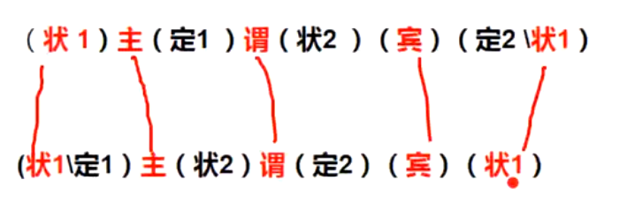
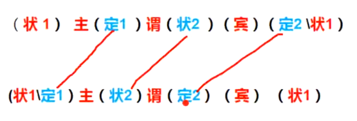

## 如何通过英语写日记

## 在开始直接，我们需要准备：

英语文章批改软件，用于发现英语文章中的错误点。推荐网站 [微软爱写作](http://aimwriting.mtutor.engkoo.com/)


## 常用单词

月份

星期


## 常用词组


## 一个公式破解天下句子

中文<==>英文


### 外语的本质

两门语言的区别不是单词、音、形的不同，而是逻辑不同，排序不同

### 陈述句公式

英文陈述逻辑： (状1) 主 (定1) 谓（状2)（宾)  (定2\状1)

中文陈述逻辑： (状1\定1) 主 (状2）谓（定2)（宾)（状1)


主干一致



其他颠倒




|      | 中文   | 英语   |
| ---- | ------ | ------ |
| 定1  | 在主前 | 在主后 |
| 状2  | 在谓前 | 在谓后 |
| 定2  | 在宾前 | 在宾后 |


复杂句

当括号内变长后，如何实现中英文转换

规则一：内部倒叙

```bash
If 123
So 321
```


规则二：并列不变序

简单并列公式

```bash
If 123
2 and 3
So 231
```

复杂并列公式

```bash
If 12345
(23) and (45)
 x         y
 x         y   1
 32        54  1
```

常见并列词

- 并列：and
- 转折 ：but
- 选择：or
- 传递：from ... to ...


### 实战

#### 陈述句实战

##### 实战一：

中文陈述顺序：在北京, 没有钱的 年轻人 以这种方式 也能实现 他们心中的 梦想。

英文陈述顺序：在北京, 年轻人 没有钱的 能实现 以这种方式 梦想 他们心中的。

英文陈述语句：In Beijing，the young without money can realize in this way the dreams in their hearts.

##### 实战二：

中文陈述顺序：其实, 那些听起来很有道理的 话 在实际操作中 往往是 没啥实际作用的 废话。

英文陈述顺序：其实,话  那些听起来很有道理的 往往是 在实际操作中 废话 没啥实际作用的。

英文陈述语句：In fact, those words that sound so reasonable often are in practice the rubbish that is almost useless.


#### 复杂陈述句实战-倒叙规则

复杂句

当括号内变长后，如何实现中英文转换

规则一：倒叙


在北京,没有钱没有老婆没有工作没有房子没有文凭也没有车,但是有个好爸爸的年轻人以这种方式也能实现他们心中的梦想。


##### 实战一

I know the man who is singing.
I know the man who is singing in the car.
I know the man who is singing in the car that i bought last week.

英文陈述顺序：I know the man who is singing in the car that i bought last week.

中文陈述顺序：I know   last week.  that i bought   in the car  who is singing  the man 

中文陈述语句：我 认识 上周 我买的 车里 在唱歌的 人 

中文陈述语句：我 认识 在上周 我买的 车里 唱歌的 人 


##### 实战二

英文陈述顺序：A woman in jeans stood at the window of an expensive shop.  --新概念第二册57课

中文陈述顺序：in jeans A woman of an expensive shop  at the window  stood 

中文陈述语句：在牛仔库里的女人一个昂贵商店窗口站着

中文陈述语句：穿着牛仔库的女人在一个昂贵商店的窗口站着


##### 实战三

高中写作
中文陈述顺序：去年,我们学校修建了一个在上体育课的时候可以让同学们用来提高肌肉力量的攀岩墙

英文陈述顺序：去年, 我们学校 修建了 一个攀岩墙 可以用来提高肌肉力量的 让同学们 在上体育课的时候

英文陈述语句：Last year, our school built a climbing wall to raise the muscle power of the students in PE lessons.


##### 实战四-很特殊，有两个动词

国内新闻:
中文陈述顺序：在习主席计划的九月访美之前,赖斯 来到中国讨论 一些将在未来十年影响两国关系发展的关于能源和安全的问题。

英文陈述顺序：在习主席计划的九月访美之前,赖斯 来到中国讨论  一些问题 关于能源和安全的 影响两国关系发展的 将在未来十年。

英文陈述语句：Before the visit of America by President Xi, Rice comes to China to talk about issues of energy and security that may influence the relation of the two countries next decade.


##### 实战五

大学英语六级翻译

中文陈述顺序：不久以前,中国获得了在印度尼西亚建造一条高铁的合同。

英文陈述顺序：不久以前, 中国 获得了 合同 建造一条高铁的 在印度尼西亚。

英文陈述语句：Not long ago, China obtained a contract to build a high-speed railway in Indonesia.


中文陈述顺序：中国政府在上周与马来西亚签署了为马来西亚国家交通提供高速列车的合同。

英文陈述顺序：中国政府  签署了 与马来西亚 在上周 合同 提供高速列车的 交通 为马来西亚国家。

英文陈述语句：The Chinese government signed with Malaysia last week a contract to provide high-speed trains for the national transportation of Malaysia.

##### 实战六

考研英语阅读
英文陈述顺序：A German town mourned 16 teenagers killed in a plane crash in the French Alps Tuesday as they returned from a school exchange in Spain.

中文陈述顺序：A German town mourned  in Spain from a school exchange as they returned  Tuesday  in the French Alps in a plane crash killed  16 teenagers 

中文陈述直译：一个德国小镇悼念在西班牙从一个学校交换活动中返回在星期二在法国阿尔卑斯山在飞机碰撞中死去的16名青少年


##### 实战七

英文陈述顺序：Social science is that branch of intellectual enquiry which seeks to study humans and their endeavors in the same reasoned, orderly, systematic, and dispassioned manner that natural scientists use for the study of natural phenomena.

中文陈述顺序：Social science is  of natural phenomena for the study  that natural scientists use in the same reasoned, orderly, systematic, and dispassioned manner  which seeks to study humans and their endeavors  of intellectual enquiry  that branch 

中文陈述直译：社会科学是为了自然现象研究 自然科学家所使用的 以相同的有逻辑、有条理、有体系，有理性的方式 尝试研究人类和他们追求的智力探索的分支

社会科学是在自然现象的研究中，自然科学家所使用到的 以相同的有逻辑、有条理、有体系，有理性的方式去尝试研究人类和他们追求的智力探索的分支

知道语序也翻译不出来


##### 实战八

在充满激烈竞争的媒体行业，一个对中国文化的基本特征没有清晰理解的记者不能写出有关目前中国改革和变化的意义的好文章。

In the media industry full of fierce competition，a reporter without clear understanding of the basic features about Chinese culture can not write good articles of the significance about the reform and change in china today.


##### 其他实战

Although not so world widely accepted, people who are emotionally weak in daily business are often losers who are not able to fulfill any fruitful achievements in their lifetime that they endure .


The method of scientific investigation is basically nothing but the expression of the necessary mode of working of the human mind in practice.


Studies of both animals and humans in his recent research have shown the impact of sex hormones on stress response under the same conditions.


在帮助国际社会于2030年前消除极端贫困过程中，中国正扮演着越来越重要的角色。自20世纪70年代末实施改革开放以来，中国已使多达四亿人摆脱了贫困。

In the process of ending extreme poverty before 2030 for the world, China is playing a role that is more and more important. Since applying the open and reform policy from late 1970s,China has helped as many as 400 million people get rid of poverty.


#### 复杂陈述句实战-并列规则

##### 实战一

在工作中没有激情也没有想法的人不会有进步。

A man without passion and without ideas at work will not make any progress.

##### 实战二

在一生当中，当你有困难的时候帮助你和当你成功的时候离开你的人才是真的朋友。

In your life, a man who helps you when you are in trouble and who leaves you when you are successful is a real friend.

##### 实战三

Science, in practice, depends less on the experiment it prepares than on the preparedness of the minds of the men who watch the experiments.

在实践中，科学较少依赖于它准备的实验本身，而更多依赖于观看实验的人的思想准备。

##### 实战四-听不懂系列

,an element in national economic life representing the irresponsible wealth detached from the land and the duties of the land owners and almost equally detached from the responsible corporate management of commercial business conduct.

，是国民经济生活中的一种元素，它代表与土地和土地所有者的职责分离开来的不负责任的财富，与商业行为的负责任的公司管理几乎相同的分离。


单词、语法（介词）、时态写错


参考文档

[逻辑英语万能公式入门](https://www.cnblogs.com/evan-liang/p/12250954.html)

