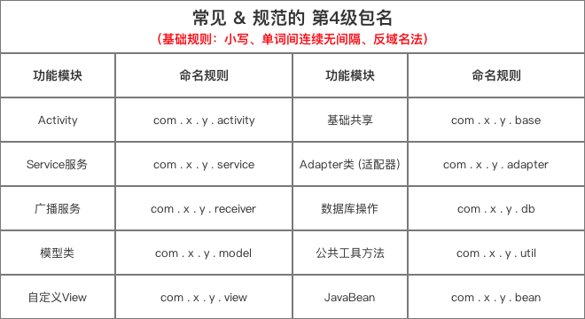
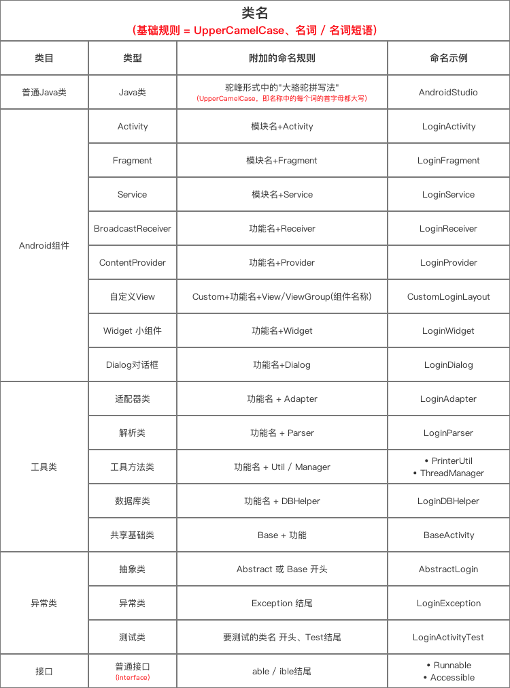
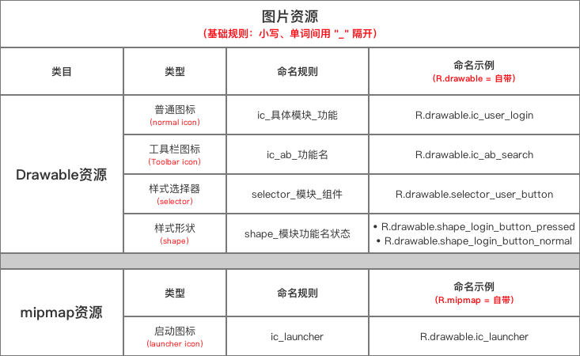
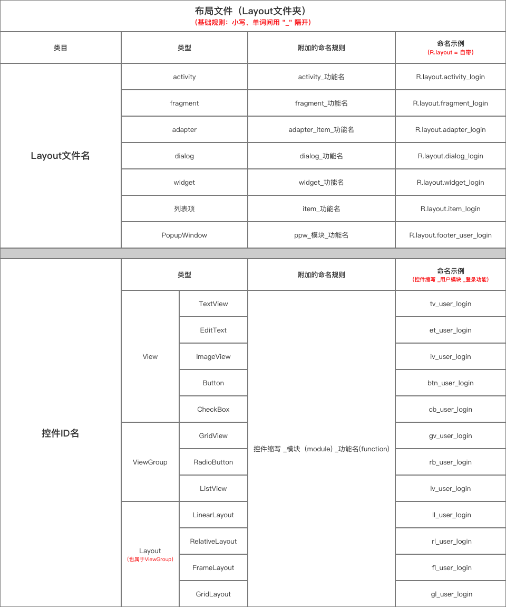
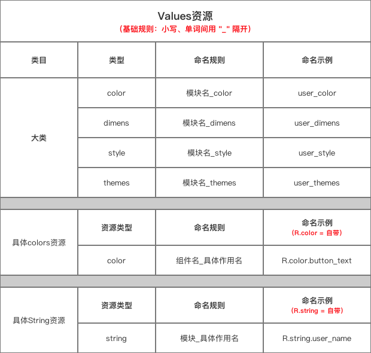
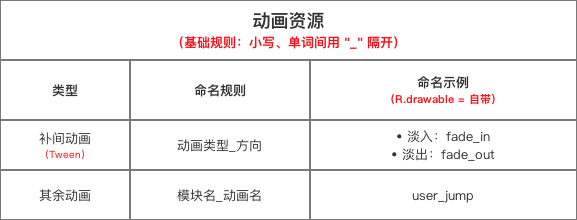

# Android命名方式

## 源码文件相关命名

### 包名

#### 格式

#### 示例

- 基础规则：小写、单词间连续无间隔、反域名法（分为4级，具体如下图）

- **第4级包名会随着功能的不同而不同**。下面我列举出一些常见 & 需要规范的4级功能包名

### 类名

#### 格式

`模块＋类型`**大骆驼拼写法**（`UpperCamelCase`）

类型可选值：activity | fragment | view | item | layout

#### 示例

- HomeActivity
- MessageFragment
- MineFragment
- HomeActivity

### 变量名

#### 格式

#### 示例

### 方法名

#### 格式

#### 示例

### 参数名

#### 格式

#### 示例

## 资源文件相关命名

### 绘制资源（Drawable）

#### 格式

`模块_功能_尺寸`

#### 示例

- home_background
- all_infoicon_small
- set_updateicon_30dp

#### 图例

### 布局（Layout）

#### 文件名

##### 格式

`类型_模块`

类型可选值：activity | fragment | view | item | layout

##### 示例

- activity_home
- fragment_home
- item_countrylist
- layout_actionbar_backbutton

#### 控件ID

##### 格式

`控件缩写_模块_功能`

##### 示例

- ll_home_echat
- btn_user_submit

#### 图例

### 值资源（Values）

#### 颜色(color)

##### 格式

##### 示例

#### 尺寸（Dimens）

##### 格式

`类型_模块_功能_尺寸`

类型可选值：width | height | size | margin | padding | elevation | keyline | textsize

##### 示例

- width_all_tips_normal
- margin_home_profileimage

#### 字符串（String）

#####　格式

`模块_功能`

##### 示例

- feedback_info
- home_searchhint

#### 样式（Style）

#####　格式

##### 示例

#### 主题（themes）

#####　格式

##### 示例

#### 图例

### 动画（anim）资源

#### 格式

#### 示例

## 参考文档

请一定要看看：https://cloud.tencent.com/developer/article/1408620