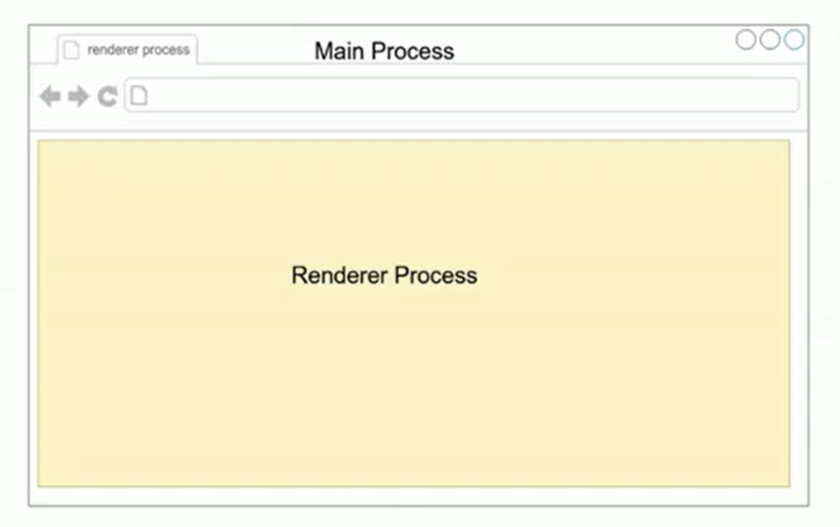
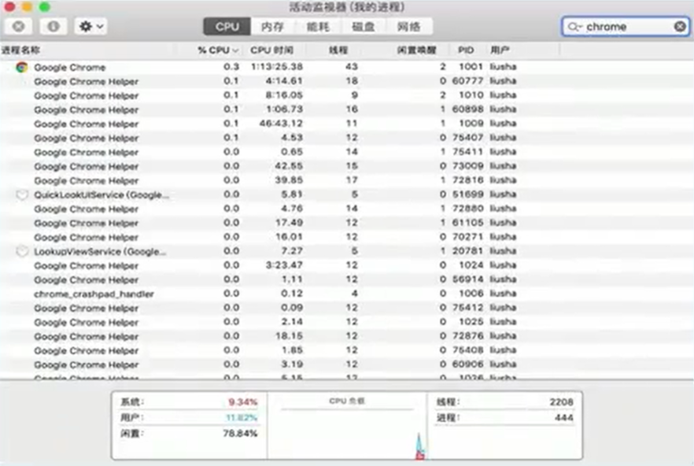
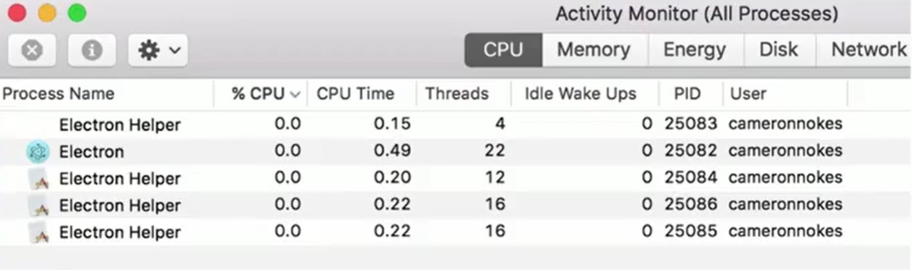

chrome是多进程的

chrome的进程情况

electron的进程情况

## 主进程–Main Process

- 可以使用和系统对接的 Electron API - 创建菜单，上传文件等等
- 创建渲染进程 - Renderer Prccess
- 全面支持 Node.js
- 只有一个，作为整个程序的入口点

## 渲染进程- Renderer Process

- 可以有多个，每个对应一个窗口
- 每个都是一个单独的进程
- 全面支持 Node.js 和 DOM API
- 可以使用一部分的Electron提供的API