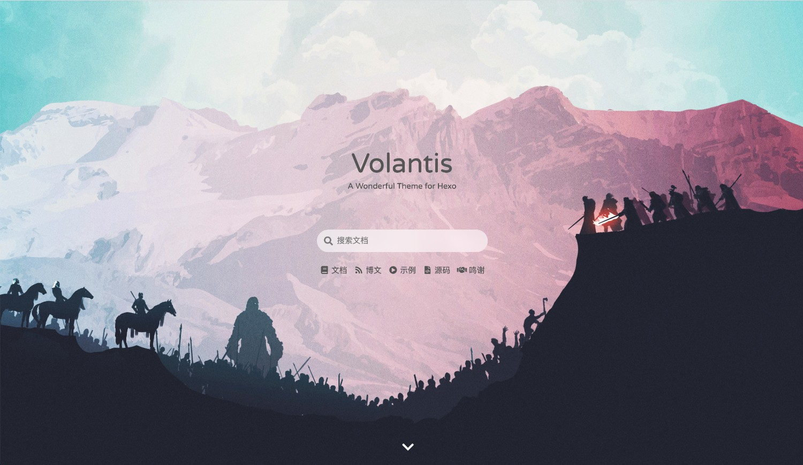
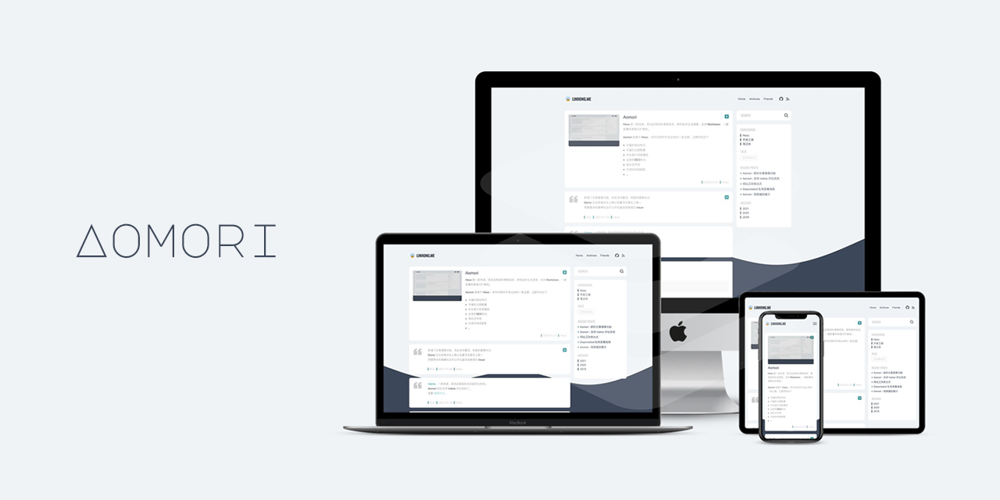
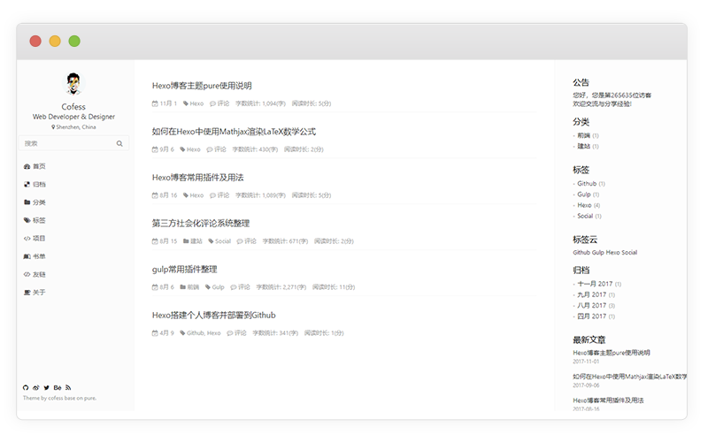

## NexT

快速入门可参考如下地址

[5分钟 搭建免费个人博客](https://www.jianshu.com/p/4eaddcbe4d12)

[官方文档](https://hexo.io/zh-cn/docs/)

## 主题模板推荐

### [hexo-theme-volantis](https://github.com/volantis-x/hexo-theme-volantis)

有种几近完美的感觉

### [hexo-theme-aomori](https://github.com/lh1me/hexo-theme-aomori)

简约好看

### [hexo-theme-pure](https://github.com/cofess/hexo-theme-pure)

### [hexo-theme-skapp](https://github.com/Mrminfive/hexo-theme-skapp)

A simple & beautiful & fast theme

### 其他

https://hexo.io/themes/

## 问题

在 Hexo 博客中，我使用的 Next 5.1 主题中默认集成了第三方统计服务 Busuanzi 来统计网站数据，但是实际并没有生效。

问题原因是由于 busuanzi(不蒜子) 的域名更新，导致了使用 Hexo Next 主题时统计数据失效。

不蒜子的域名由原来的 dn-lbstatics.qbox.me 更换为了 busuanzi.ibruce.info。

解决方法:
到 hexo 的 themes 文件夹下, 进入 \themes\next\layout_third-party\analytics 目录
打开 busuanzi-counter.swig
将 src="https://dn-lbstatics.qbox.me/busuanzi/2.3/busuanzi.pure.mini.js" 修改为 src="https://busuanzi.ibruce.info/busuanzi/2.3/busuanzi.pure.mini.js"
然后使用 hexo g 、hexo d 命令重启服务器即可生效。

## 参考文档

[NexT官网](http://theme-next.iissnan.com/)

[Hexo-Next-主题优化(一)](https://www.jianshu.com/p/3ff20be8574c)

[Hexo-Next-主题优化(二)](https://www.jianshu.com/p/428244cd2caa)

[Hexo-Next-主题优化(三)](https://www.jianshu.com/p/d23d67d318c7)

[Hexo-Next-主题优化(四)](https://www.jianshu.com/p/4ef35521fee9)

[5分钟 搭建免费个人博客](https://www.jianshu.com/p/4eaddcbe4d12)

[肯定会-wistbean的博客](https://wistbean.github.io)

[Felix的博客](https://yfzhou.coding.me/) 