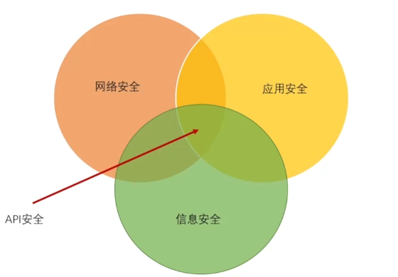
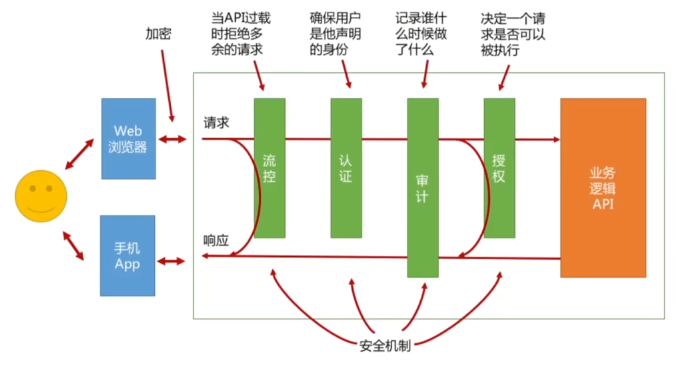
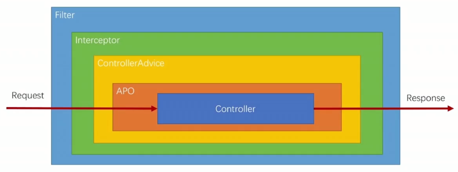

# API安全

## API安全范围

## API安全目标CIA

- 机密性(confidentiality)。确保信息只被预期的读者访问
- 完整性(integrity)。防止未授权的创建，修改和删除
- 可用性(availability)。当用户需要访问API时，API总是可用的

## 常见的API风险:STRIDE

- Spoofing：欺骗。伪装成某人。
- Tampering：干预。将不希望被修改的数据、消息或设置改掉。（示例：通过非法手段将100元订单篡改为1元订单）
- Repudiation：否认。拒绝承认做过的事。
- Information disclosure：信息泄露。将你希望保密的信息披露出来。
- Denial of service：拒绝服务。阻止用户访问信息和服务。（示例：DDoS攻击）
- Elevation of privilege：越权。做了你不希望他能做的事。

## 风险与安全机制的对应关系

- 认证︰（欺骗)。确保你的用户或客户端真的是他(它)们自己
- 授权︰（信息泄漏)/(干预)/(越权)。确保每个针对API的访问都是经过授权的
- 审计︰（否认)。确保所有的操作都被记录，以便追溯和监控
- 流控︰（拒绝服务)。防止用户请求淹没你的API。
- 加密︰（信息泄漏)。确保出入API的数据是私密的。

## 安全机制的触发时机图

安全机制常见织入点：

Filter、Interceptor 、ControllerAdvice、AOP，其生效时间如下图所示：

