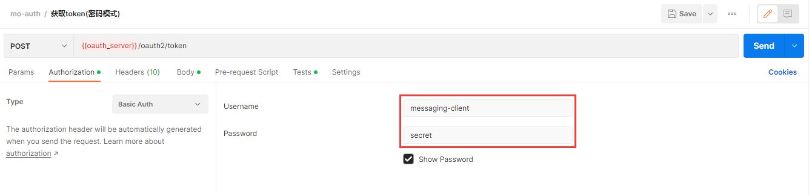
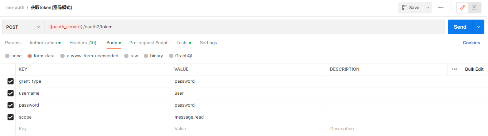
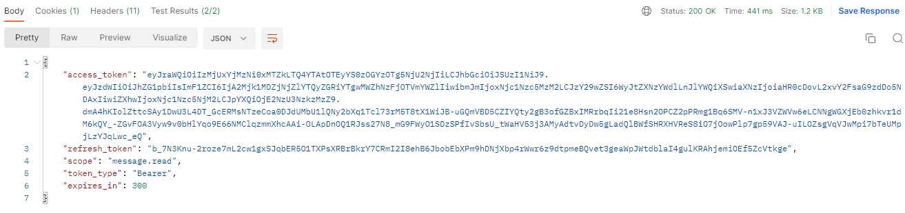

# Spring Authorization Server 自定义授权模式

在本小节中，我们将自定义 [Spring Authorization Server](https://spring.io/projects/spring-authorization-server) 授权模式 - 密码模式（password）

## 背景

Spring Security团队停止维护 [Spring Security OAuth](https://spring.io/projects/spring-security-oauth)，推荐使用 [Spring Authorization Server](https://spring.io/projects/spring-authorization-server) 。然而基于OAuth 2.1的 [Spring Authorization Server](https://spring.io/projects/spring-authorization-server) 将不再对以下两种授权模式提供支持：

- 密码模式（password）
- 简化模式（implicit）

对于已经依赖了这两种授权模式的项目，出于这样那样的各种原因，来不及或无法迁移至新的授权模式，该如何处理？

或许我们可以考虑自行实现授权模式，比如：**密码模式（password）**

## 版本说明

- Spring Boot：2.7.2
- Spring Authorization Server：0.4.0

## 实现

在开始之前，需要着重说明一点：由于自定义授权模式所依赖的某些 `Spring Authorization Server` 类只能在同 `package` 下访问，请大家在自己项目的`src`目录下先创建 **同名的 package 路径**，拷贝代码时也 **请勿改变 package ** 。

### 1. 自定义AuthenticationToken

`AuthenticationToken`用于存放 `密码模式（password）`所需的各种信息，包括 username、password、scopes 等。

OAuth2ResourceOwnerPasswordCredentialsAuthenticationToken

```java
package org.springframework.security.oauth2.server.authorization.authentication;

import java.util.Collections;
import java.util.HashSet;
import java.util.Map;
import java.util.Set;

import org.springframework.lang.Nullable;
import org.springframework.security.core.Authentication;
import org.springframework.security.oauth2.core.AuthorizationGrantType;
import org.springframework.util.Assert;

/**
 * An {@link Authentication} implementation used for the OAuth 2.0 Resource Owner Password Credentials Grant.
 *
 * @author Moluo
 * @since 0.0.1
 * @see OAuth2AuthorizationGrantAuthenticationToken
 * @see OAuth2ResourceOwnerPasswordCredentialsAuthenticationProvider
 */
public class OAuth2ResourceOwnerPasswordCredentialsAuthenticationToken extends OAuth2AuthorizationGrantAuthenticationToken {
	private final String username;
	private final String password;
	private final Set<String> scopes;

	/**
	 * Constructs an {@code OAuth2ResourceOwnerPasswordCredentialsAuthenticationToken} using the provided parameters.
	 * @param username the username
	 * @param password the password
	 * @param clientPrincipal the authenticated client principal
	 * @param scopes the requested scope(s)
	 * @param additionalParameters the additional parameters
	 */
	public OAuth2ResourceOwnerPasswordCredentialsAuthenticationToken(String username, String password, Authentication clientPrincipal,
																	 @Nullable Set<String> scopes, @Nullable Map<String, Object> additionalParameters) {
		super(AuthorizationGrantType.PASSWORD, clientPrincipal, additionalParameters);
		Assert.hasText(username, "username cannot be empty");
		Assert.hasText(username, "password cannot be empty");
		this.username = username;
		this.password = password;
		this.scopes = Collections.unmodifiableSet(
				scopes != null ? new HashSet<>(scopes) : Collections.emptySet());
	}

	/**
	 * Returns the username.
	 *
	 * @return the username
	 */
	public String getUsername() {
		return this.username;
	}

	/**
	 * Returns the password.
	 *
	 * @return the password
	 */
	@Nullable
	public String getPassword() {
		return this.password;
	}

	/**
	 * Returns the requested scope(s).
	 *
	 * @return the requested scope(s), or an empty {@code Set} if not available
	 */
	public Set<String> getScopes() {
		return this.scopes;
	}
}
```

### 2. 自定义AuthenticationConverter

`AuthenticationConverter`用于从`HttpServletRequest`中提取 `密码模式（password）` 所需的各种信息，包括username、password、scopes等。并转换为步骤1中的`AuthenticationToken`

OAuth2ResourceOwnerPasswordCredentialsAuthenticationConverter

```java
package org.springframework.security.oauth2.server.authorization.web.authentication;

import java.util.*;

import javax.servlet.http.HttpServletRequest;

import org.springframework.lang.Nullable;
import org.springframework.security.core.Authentication;
import org.springframework.security.core.context.SecurityContextHolder;
import org.springframework.security.oauth2.core.AuthorizationGrantType;
import org.springframework.security.oauth2.core.OAuth2ErrorCodes;
import org.springframework.security.oauth2.core.endpoint.OAuth2ParameterNames;
import org.springframework.security.oauth2.server.authorization.authentication.OAuth2ResourceOwnerPasswordCredentialsAuthenticationToken;
import org.springframework.security.oauth2.server.authorization.web.OAuth2TokenEndpointFilter;
import org.springframework.security.web.authentication.AuthenticationConverter;
import org.springframework.util.MultiValueMap;
import org.springframework.util.StringUtils;

/**
 * Attempts to extract an Access Token Request from {@link HttpServletRequest} for the OAuth 2.0 Resource Owner Password Credentials Grant
 * and then converts it to an {@link OAuth2ResourceOwnerPasswordCredentialsAuthenticationConverter} used for authenticating the authorization grant.
 *
 * @author Moluo
 * @since 0.1.2
 * @see AuthenticationConverter
 * @see OAuth2ResourceOwnerPasswordCredentialsAuthenticationToken
 * @see OAuth2TokenEndpointFilter
 */
public final class OAuth2ResourceOwnerPasswordCredentialsAuthenticationConverter implements AuthenticationConverter {

	@Nullable
	@Override
	public Authentication convert(HttpServletRequest request) {
		// grant_type (REQUIRED)
		String grantType = request.getParameter(OAuth2ParameterNames.GRANT_TYPE);
		if (!AuthorizationGrantType.PASSWORD.getValue().equals(grantType)) {
			return null;
		}

		Authentication clientPrincipal = SecurityContextHolder.getContext().getAuthentication();

		MultiValueMap<String, String> parameters = OAuth2EndpointUtils.getParameters(request);

		// username (REQUIRED)
		String username = parameters.getFirst(OAuth2ParameterNames.USERNAME);
		if (!StringUtils.hasText(username) ||
				parameters.get(OAuth2ParameterNames.USERNAME).size() != 1) {
			OAuth2EndpointUtils.throwError(
					OAuth2ErrorCodes.INVALID_REQUEST,
					OAuth2ParameterNames.USERNAME,
					OAuth2EndpointUtils.ACCESS_TOKEN_REQUEST_ERROR_URI);
		}

		// password (REQUIRED)
		String password = parameters.getFirst(OAuth2ParameterNames.PASSWORD);
		if (StringUtils.hasText(password) &&
				parameters.get(OAuth2ParameterNames.PASSWORD).size() != 1) {
			OAuth2EndpointUtils.throwError(
					OAuth2ErrorCodes.INVALID_REQUEST,
					OAuth2ParameterNames.PASSWORD,
					OAuth2EndpointUtils.ACCESS_TOKEN_REQUEST_ERROR_URI);
		}

		// scope (OPTIONAL)
		String scope = parameters.getFirst(OAuth2ParameterNames.SCOPE);
		if (StringUtils.hasText(scope) &&
				parameters.get(OAuth2ParameterNames.SCOPE).size() != 1) {
			OAuth2EndpointUtils.throwError(
					OAuth2ErrorCodes.INVALID_REQUEST,
					OAuth2ParameterNames.SCOPE,
					OAuth2EndpointUtils.ACCESS_TOKEN_REQUEST_ERROR_URI);
		}
		Set<String> requestedScopes = null;
		if (StringUtils.hasText(scope)) {
			requestedScopes = new HashSet<>(
					Arrays.asList(StringUtils.delimitedListToStringArray(scope, " ")));
		}

		Map<String, Object> additionalParameters = new HashMap<>();
		parameters.forEach((key, value) -> {
			if (!key.equals(OAuth2ParameterNames.GRANT_TYPE) &&
					!key.equals(OAuth2ParameterNames.USERNAME) &&
					!key.equals(OAuth2ParameterNames.PASSWORD) &&
					!key.equals(OAuth2ParameterNames.SCOPE)) {
				additionalParameters.put(key, value.get(0));
			}
		});

		return new OAuth2ResourceOwnerPasswordCredentialsAuthenticationToken(
				username, password, clientPrincipal, requestedScopes, additionalParameters);
	}

}
```

### 3. 自定义AuthenticationProvider

`AuthenticationProvider` 是自定义 `密码模式（password）` 的核心逻辑，其功能主要如下：

- 检验 `密码模式（password）` 所需信息的正确性，包括 username、password、scopes 等
- 检验通过后，生成并返回 Access token、Refresh token、ID token 等信息

OAuth2ResourceOwnerPasswordCredentialsAuthenticationProvider

```java
package org.springframework.security.oauth2.server.authorization.authentication;

import org.apache.commons.logging.Log;
import org.apache.commons.logging.LogFactory;
import org.springframework.security.authentication.AuthenticationProvider;
import org.springframework.security.authentication.UsernamePasswordAuthenticationToken;
import org.springframework.security.core.Authentication;
import org.springframework.security.core.AuthenticationException;
import org.springframework.security.core.userdetails.UserDetails;
import org.springframework.security.core.userdetails.UserDetailsService;
import org.springframework.security.core.userdetails.UsernameNotFoundException;
import org.springframework.security.crypto.password.PasswordEncoder;
import org.springframework.security.oauth2.core.*;
import org.springframework.security.oauth2.core.oidc.OidcIdToken;
import org.springframework.security.oauth2.core.oidc.OidcScopes;
import org.springframework.security.oauth2.core.oidc.endpoint.OidcParameterNames;
import org.springframework.security.oauth2.jwt.Jwt;
import org.springframework.security.oauth2.server.authorization.OAuth2Authorization;
import org.springframework.security.oauth2.server.authorization.OAuth2AuthorizationService;
import org.springframework.security.oauth2.server.authorization.OAuth2TokenType;
import org.springframework.security.oauth2.server.authorization.client.RegisteredClient;
import org.springframework.security.oauth2.server.authorization.context.AuthorizationServerContextHolder;
import org.springframework.security.oauth2.server.authorization.token.DefaultOAuth2TokenContext;
import org.springframework.security.oauth2.server.authorization.token.OAuth2TokenContext;
import org.springframework.security.oauth2.server.authorization.token.OAuth2TokenGenerator;
import org.springframework.util.Assert;
import org.springframework.util.CollectionUtils;

import java.security.Principal;
import java.util.*;

import static org.springframework.security.oauth2.server.authorization.authentication.OAuth2AuthenticationProviderUtils.getAuthenticatedClientElseThrowInvalidClient;

/**
 * An {@link AuthenticationProvider} implementation for the OAuth 2.0 Resource Owner Password Credentials Grant.
 *
 * @author Moluo
 * @since 0.0.1
 * @see OAuth2ResourceOwnerPasswordCredentialsAuthenticationToken
 * @see OAuth2AccessTokenAuthenticationToken
 * @see OAuth2AuthorizationService
 * @see OAuth2TokenGenerator
 * @see <a target="_blank" href="https://datatracker.ietf.org/doc/html/rfc6749#section-4.3">Section 4.3 Resource Owner Password Credentials Grant</a>
 */
public final class OAuth2ResourceOwnerPasswordCredentialsAuthenticationProvider implements AuthenticationProvider {
	private static final String ERROR_URI = "https://datatracker.ietf.org/doc/html/rfc6749#section-4.3";
	private static final OAuth2TokenType ID_TOKEN_TOKEN_TYPE = new OAuth2TokenType(OidcParameterNames.ID_TOKEN);
	private final Log logger = LogFactory.getLog(getClass());
	private final OAuth2AuthorizationService authorizationService;
	private final OAuth2TokenGenerator<? extends OAuth2Token> tokenGenerator;
	private final UserDetailsService userDetailsService;
	private final PasswordEncoder passwordEncoder;

	/**
	 * Constructs an {@code OAuth2ResourceOwnerPasswordCredentialsAuthenticationProvider} using the provided parameters.
	 *
	 * @param authorizationService the authorization service
	 * @param tokenGenerator the token generator
	 * @param userDetailsService the user details service
	 * @param passwordEncoder the password encoder
	 * @since 0.2.3
	 */
	public OAuth2ResourceOwnerPasswordCredentialsAuthenticationProvider(OAuth2AuthorizationService authorizationService,
																		OAuth2TokenGenerator<? extends OAuth2Token> tokenGenerator,
																		UserDetailsService userDetailsService,
																		PasswordEncoder passwordEncoder) {
		Assert.notNull(authorizationService, "authorizationService cannot be null");
		Assert.notNull(tokenGenerator, "tokenGenerator cannot be null");
		Assert.notNull(userDetailsService, "userDetailsService cannot be null");
		Assert.notNull(passwordEncoder, "passwordEncoder cannot be null");
		this.authorizationService = authorizationService;
		this.tokenGenerator = tokenGenerator;
		this.userDetailsService = userDetailsService;
		this.passwordEncoder = passwordEncoder;
	}

	@Override
	public Authentication authenticate(Authentication authentication) throws AuthenticationException {
		OAuth2ResourceOwnerPasswordCredentialsAuthenticationToken resourceOwnerPasswordCredentialsAuthentication =
				(OAuth2ResourceOwnerPasswordCredentialsAuthenticationToken) authentication;

		OAuth2ClientAuthenticationToken clientPrincipal =
				getAuthenticatedClientElseThrowInvalidClient(resourceOwnerPasswordCredentialsAuthentication);
		RegisteredClient registeredClient = clientPrincipal.getRegisteredClient();

		if (this.logger.isTraceEnabled()) {
			this.logger.trace("Retrieved registered client");
		}

		if (!registeredClient.getAuthorizationGrantTypes().contains(AuthorizationGrantType.PASSWORD)) {
			throw new OAuth2AuthenticationException(OAuth2ErrorCodes.UNAUTHORIZED_CLIENT);
		}

		Set<String> authorizedScopes = Collections.emptySet();
		if (!CollectionUtils.isEmpty(resourceOwnerPasswordCredentialsAuthentication.getScopes())) {
			for (String requestedScope : resourceOwnerPasswordCredentialsAuthentication.getScopes()) {
				if (!registeredClient.getScopes().contains(requestedScope)) {
					throw new OAuth2AuthenticationException(OAuth2ErrorCodes.INVALID_SCOPE);
				}
			}
			authorizedScopes = new LinkedHashSet<>(resourceOwnerPasswordCredentialsAuthentication.getScopes());
		}

		UserDetails userDetails;
		try {
			userDetails = this.userDetailsService.loadUserByUsername(resourceOwnerPasswordCredentialsAuthentication.getUsername());
		} catch (UsernameNotFoundException e) {
			throw new OAuth2AuthenticationException(OAuth2ErrorCodes.INVALID_GRANT);
		}
		if (userDetails == null) {
			throw new OAuth2AuthenticationException(OAuth2ErrorCodes.INVALID_GRANT);
		}

		if (!this.passwordEncoder.matches(resourceOwnerPasswordCredentialsAuthentication.getPassword(), userDetails.getPassword())) {
			if (this.logger.isDebugEnabled()) {
				this.logger.debug("Failed to authenticate since password does not match stored value");
			}
			throw new OAuth2AuthenticationException(OAuth2ErrorCodes.INVALID_GRANT);
		}

		if (this.logger.isTraceEnabled()) {
			this.logger.trace("Validated token request parameters");
		}

        Authentication principal = new UsernamePasswordAuthenticationToken(userDetails.getUsername(), userDetails.getPassword(), userDetails.getAuthorities());

		// @formatter:off
		DefaultOAuth2TokenContext.Builder tokenContextBuilder = DefaultOAuth2TokenContext.builder()
				.registeredClient(registeredClient)
				.principal(principal)
				.authorizationServerContext(AuthorizationServerContextHolder.getContext())
				.authorizedScopes(authorizedScopes)
				.authorizationGrantType(AuthorizationGrantType.PASSWORD)
				.authorizationGrant(resourceOwnerPasswordCredentialsAuthentication);
		// @formatter:on

		OAuth2Authorization.Builder authorizationBuilder = OAuth2Authorization.withRegisteredClient(registeredClient)
				.principalName(principal.getName())
				.attribute(Principal.class.getName(), principal)
				.authorizationGrantType(AuthorizationGrantType.PASSWORD)
				.authorizedScopes(authorizedScopes);

		// ----- Access token -----
		OAuth2TokenContext tokenContext = tokenContextBuilder.tokenType(OAuth2TokenType.ACCESS_TOKEN).build();
		OAuth2Token generatedAccessToken = this.tokenGenerator.generate(tokenContext);
		if (generatedAccessToken == null) {
			OAuth2Error error = new OAuth2Error(OAuth2ErrorCodes.SERVER_ERROR,
					"The token generator failed to generate the access token.", ERROR_URI);
			throw new OAuth2AuthenticationException(error);
		}

		if (this.logger.isTraceEnabled()) {
			this.logger.trace("Generated access token");
		}

		OAuth2AccessToken accessToken = new OAuth2AccessToken(OAuth2AccessToken.TokenType.BEARER,
				generatedAccessToken.getTokenValue(), generatedAccessToken.getIssuedAt(),
				generatedAccessToken.getExpiresAt(), tokenContext.getAuthorizedScopes());
		if (generatedAccessToken instanceof ClaimAccessor) {
			authorizationBuilder.token(accessToken, (metadata) ->
					metadata.put(OAuth2Authorization.Token.CLAIMS_METADATA_NAME, ((ClaimAccessor) generatedAccessToken).getClaims()));
		} else {
			authorizationBuilder.accessToken(accessToken);
		}

		// ----- Refresh token -----
		OAuth2RefreshToken refreshToken = null;
		if (registeredClient.getAuthorizationGrantTypes().contains(AuthorizationGrantType.REFRESH_TOKEN) &&
				// Do not issue refresh token to public client
				!clientPrincipal.getClientAuthenticationMethod().equals(ClientAuthenticationMethod.NONE)) {

			tokenContext = tokenContextBuilder.tokenType(OAuth2TokenType.REFRESH_TOKEN).build();
			OAuth2Token generatedRefreshToken = this.tokenGenerator.generate(tokenContext);
			if (!(generatedRefreshToken instanceof OAuth2RefreshToken)) {
				OAuth2Error error = new OAuth2Error(OAuth2ErrorCodes.SERVER_ERROR,
						"The token generator failed to generate the refresh token.", ERROR_URI);
				throw new OAuth2AuthenticationException(error);
			}

			if (this.logger.isTraceEnabled()) {
				this.logger.trace("Generated refresh token");
			}

			refreshToken = (OAuth2RefreshToken) generatedRefreshToken;
			authorizationBuilder.refreshToken(refreshToken);
		}

		// ----- ID token -----
		OidcIdToken idToken;
		if (authorizedScopes.contains(OidcScopes.OPENID)) {
			// @formatter:off
			tokenContext = tokenContextBuilder
					.tokenType(ID_TOKEN_TOKEN_TYPE)
					.authorization(authorizationBuilder.build())	// ID token customizer may need access to the access token and/or refresh token
					.build();
			// @formatter:on
			OAuth2Token generatedIdToken = this.tokenGenerator.generate(tokenContext);
			if (!(generatedIdToken instanceof Jwt)) {
				OAuth2Error error = new OAuth2Error(OAuth2ErrorCodes.SERVER_ERROR,
						"The token generator failed to generate the ID token.", ERROR_URI);
				throw new OAuth2AuthenticationException(error);
			}

			if (this.logger.isTraceEnabled()) {
				this.logger.trace("Generated id token");
			}

			idToken = new OidcIdToken(generatedIdToken.getTokenValue(), generatedIdToken.getIssuedAt(),
					generatedIdToken.getExpiresAt(), ((Jwt) generatedIdToken).getClaims());
			authorizationBuilder.token(idToken, (metadata) ->
					metadata.put(OAuth2Authorization.Token.CLAIMS_METADATA_NAME, idToken.getClaims()));
		} else {
			idToken = null;
		}

		OAuth2Authorization authorization = authorizationBuilder.build();

		this.authorizationService.save(authorization);

		if (this.logger.isTraceEnabled()) {
			this.logger.trace("Saved authorization");
		}

		Map<String, Object> additionalParameters = Collections.emptyMap();
		if (idToken != null) {
			additionalParameters = new HashMap<>();
			additionalParameters.put(OidcParameterNames.ID_TOKEN, idToken.getTokenValue());
		}

		if (this.logger.isTraceEnabled()) {
			this.logger.trace("Authenticated token request");
		}

		return new OAuth2AccessTokenAuthenticationToken(
				registeredClient, clientPrincipal, accessToken, refreshToken, additionalParameters);
	}

	@Override
	public boolean supports(Class<?> authentication) {
		return OAuth2ResourceOwnerPasswordCredentialsAuthenticationToken.class.isAssignableFrom(authentication);
	}

}
```

### 4. 自定义AuthenticationProviderBuilder

`AuthenticationProviderBuilder `仅仅是小编为了方便构建出 `AuthenticationProvider` 所编写的工具类，并非 `Spring Authorization Server` 所要求。所以不强制要求实现，观众老爷们可自行决定是否使用该类。

OAuth2ResourceOwnerPasswordCredentialsAuthenticationProviderBuilder

```java
package org.springframework.security.oauth2.server.authorization.config.annotation.web.configurers;

import org.springframework.security.config.annotation.web.builders.HttpSecurity;
import org.springframework.security.core.userdetails.UserDetailsService;
import org.springframework.security.crypto.password.PasswordEncoder;
import org.springframework.security.oauth2.core.OAuth2Token;
import org.springframework.security.oauth2.server.authorization.OAuth2AuthorizationService;
import org.springframework.security.oauth2.server.authorization.authentication.OAuth2ResourceOwnerPasswordCredentialsAuthenticationProvider;
import org.springframework.security.oauth2.server.authorization.token.OAuth2TokenGenerator;

/**
 * An Builder for {@link OAuth2ResourceOwnerPasswordCredentialsAuthenticationProvider}.
 *
 * @author Moluo
 * @see OAuth2ResourceOwnerPasswordCredentialsAuthenticationProvider
 * @see OAuth2AuthorizationService
 * @see OAuth2TokenGenerator
 * @since 0.0.1
 */
public final class OAuth2ResourceOwnerPasswordCredentialsAuthenticationProviderBuilder {

    private HttpSecurity httpSecurity;
    private UserDetailsService userDetailsService;
    private PasswordEncoder passwordEncoder;

    public OAuth2ResourceOwnerPasswordCredentialsAuthenticationProviderBuilder(
            HttpSecurity httpSecurity, UserDetailsService userDetailsService, PasswordEncoder passwordEncoder) {
        this.httpSecurity = httpSecurity;
        this.userDetailsService = userDetailsService;
        this.passwordEncoder = passwordEncoder;
    }


    public OAuth2ResourceOwnerPasswordCredentialsAuthenticationProvider build() {
        OAuth2AuthorizationService authorizationService = OAuth2ConfigurerUtils.getAuthorizationService(httpSecurity);
        OAuth2TokenGenerator<? extends OAuth2Token> tokenGenerator = OAuth2ConfigurerUtils.getTokenGenerator(httpSecurity);

        OAuth2ResourceOwnerPasswordCredentialsAuthenticationProvider resourceOwnerPasswordCredentialsAuthenticationProvider =
                new OAuth2ResourceOwnerPasswordCredentialsAuthenticationProvider(authorizationService, tokenGenerator,
                        userDetailsService, passwordEncoder);
        return resourceOwnerPasswordCredentialsAuthenticationProvider;
    }
}
```

### 5. 添加密码模式（password）配置

配置tokenEndpoint，添加我们自定义的 `AuthenticationProvider` 和 `AuthenticationConverter`

```java
@Configuration
public class SecurityConfig {
    ...

    @Autowired
    private UserDetailsService userDetailsService;

    @Autowired
    private PasswordEncoder passwordEncoder;

    @Bean
    @Order(1)
    public SecurityFilterChain authorizationServerSecurityFilterChain(HttpSecurity http)
            throws Exception {
        OAuth2AuthorizationServerConfiguration.applyDefaultSecurity(http);
        http.getConfigurer(OAuth2AuthorizationServerConfigurer.class)
                .tokenEndpoint(oAuth2TokenEndpointConfigurer -> oAuth2TokenEndpointConfigurer
                         // 配置 Provider和 RequestConverter
                        .authenticationProvider(new OAuth2ResourceOwnerPasswordCredentialsAuthenticationProviderBuilder(
                                http, userDetailsService, passwordEncoder).build())
                        .accessTokenRequestConverter(new OAuth2ResourceOwnerPasswordCredentialsAuthenticationConverter())
                )

        return http.build();
    }
    
    ...
}
```

## 测试

1. 添加client信息

   

2. 添加用户信息

   

3. 发送请求，正常返回token信息

   

4. 依次测试：使用token访问资源、使用refresh_token刷新token等均正常

## 小结

到此，授权模式自定义已完成。说句实话，为了自定义授权模式 - `密码模式（password）`，小编头都秃了，反复分析 [Spring Authorization Server](https://spring.io/projects/spring-authorization-server) 中的其他2种授权模式：

- 授权码模式（authorization-code）
- 客户端模式（client credentials）

有兴趣的小伙伴也可以尝试分析试试，关键类如下：

TokenEndpoint的入口类：`OAuth2TokenEndpointFilter`

授权码模式相关类：`OAuth2AuthorizationCodeAuthenticationToken`、`OAuth2AuthorizationCodeRequestAuthenticationProvider`、`OAuth2AuthorizationCodeAuthenticationProvider`、`OAuth2AuthorizationCodeAuthenticationConverter`、`OAuth2AuthorizationCodeRequestAuthenticationConverter`

客户端模式相关类：`OAuth2ClientCredentialsAuthenticationToken`、`OAuth2ClientCredentialsAuthenticationProvider`、`OAuth2ClientCredentialsAuthenticationConverter`