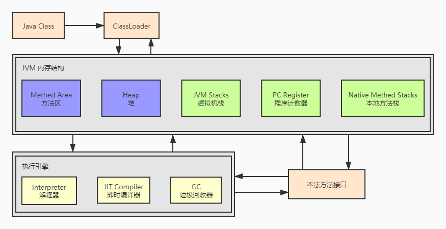

JVM组成部分主要分为以下三大块：类加载器、内存结构、执行引擎

JVM组成部分图

## Java代码执行流程

- Java Class是java的二进制字节码
- Java字节码将由ClassLoader加载到JVM中去运行
- 类放在Methed Area中
- 类将来创建的实例对象放在堆中
- 堆里的对象在调用方法时会使用到虚拟机栈、程序计数器、本地方法栈
- 方法执行时，每行代码使用执行引擎中的解释器逐行进行执行
- 方法中的热点代码，也就是被频繁调用的代码，会由即时编译器优化编译执行
- 垃圾回收器对堆中不在被引用的对象进行垃圾回收
- java中不方便实现的功能，必须调用底层操作系统的功能，就需要借助本地方法接口调用操作系统提供的功能方法

## 讲解顺序

本文中将不会安装java代码执行流程顺序进行讲解,而采用以下讲解顺序:

1.内存结构

2.GC垃圾回收

3.类的字节码结构

4.类加载器

5.运行期优化，即时编译器