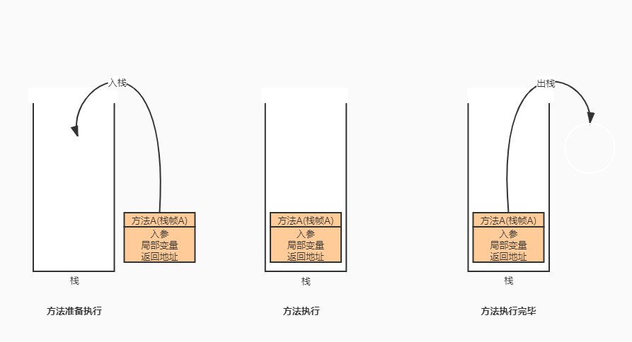
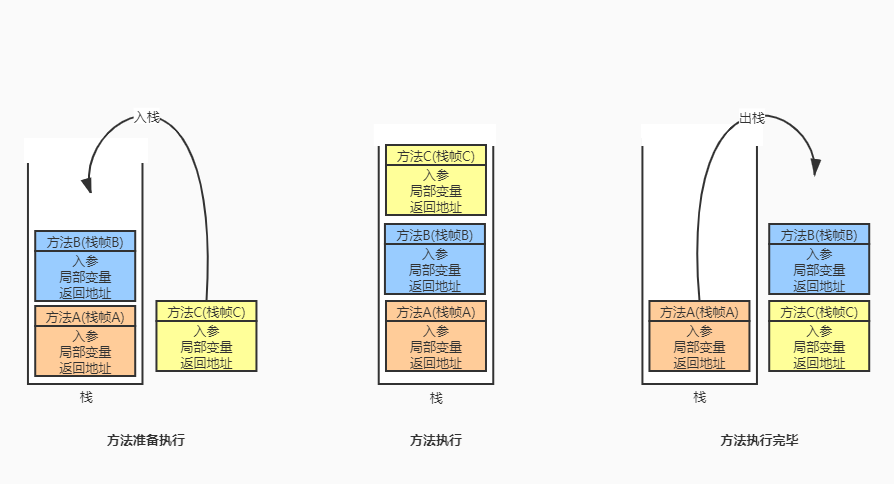
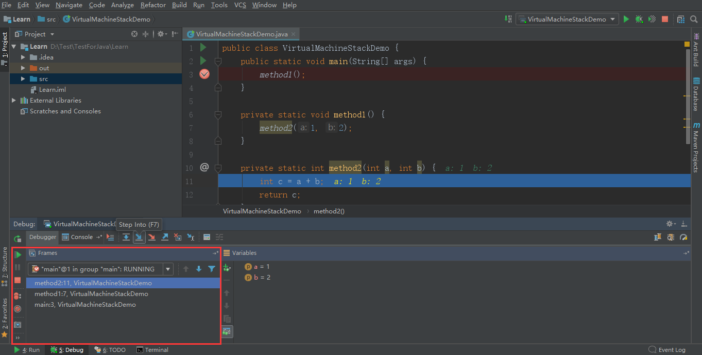
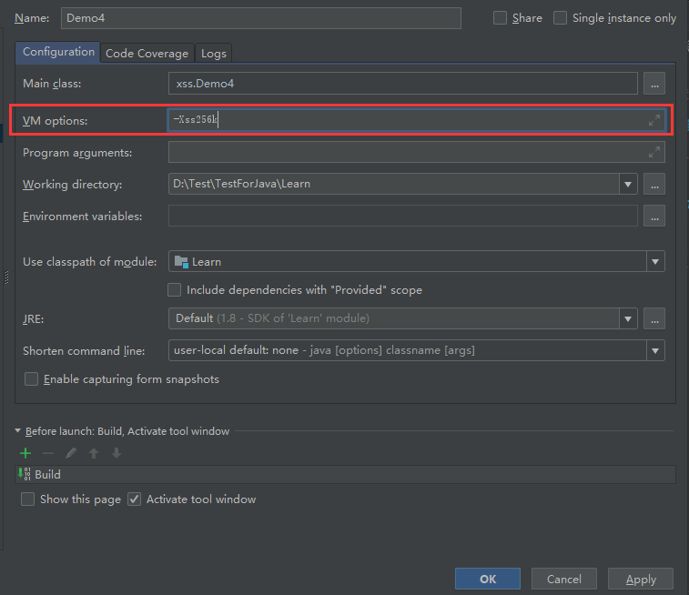

##　JVM内存结构组成

方法区、堆、虚拟机栈、程序计数器、本地方法栈

## Program Counter Register程序计数器（寄存器）

作用：记住下一条JVM指令（即二进制字节码）的执行地址

特点：

- 线程私有
- 不会存在内存溢出

> 程序计数器是JVM规范中唯一一个不会存在内存溢出的区，其他的堆、栈、方法区都会出现内存溢出


二进制字节码（JVM指令）	机器码	cpu

## 虚拟机栈

栈：线程运行需要的内存空间

栈帧：每个方法运行需要的内存

栈由栈帧组成，一个栈帧就对应着一个方法的调用，栈帧中需要存储方法入参、局部变量、返回地址



<center>方法A从执行到结束栈行为图</center>


<center>方法A调用方法B，方法B调用方法C的栈行为图</center>


Java Virtual Machine Stacks（Java虚拟机栈）

- 每个线程运行时所需要的内存，称为虚拟机栈

- 每个栈由多个栈帧（Frame）组成，对应着每次方法调用时所占用的内存

- 每个线程只能有一个活动栈帧，对应着当前正在执行的那个方法

栈帧的查看：使用IDEA调试时，窗口中的Frames即代表栈帧，Frames中的自上而下第一条栈帧即为活动栈帧，演示代码如下：

```java
public class VirtualMachineStackDemo {
    public static void main(String[] args) {
        method1();
    }

    private static void method1() {
        method2(1, 2);
    }

    private static int method2(int a, int b) {
        int c = a + b;
        return c;
    }
}

```



问题辨析

1.垃圾回收是否涉及栈内存？

不涉及。栈内存实际就是一次次方法调用产生的栈帧内存，而栈帧内存随着方法调用结束便会弹出栈，即自动的被回收掉，故不需要垃圾回收来管理栈内存。

2.栈内存分配越大越好么？

不是。物理内存是一定的，栈内存划分得越大，反而线程数越少，例如物理内存为500M的机器，若每个栈内存为1M，理论上可以同时有500个线程同时运行；若每个栈内存为2M，则最多有250个线程同时运行。栈划分得大了，通常只是能够进行更多次递归方法调用，而不会增强代码运行的效率，一般我们使用系统默认的栈内存大小即可。栈内存设置参数及默认的栈内存可参考[Extra Options for Java]( https://docs.oracle.com/en/java/javase/13/docs/specs/man/java.html )

> `-Xss` *size*
>
> Sets the thread stack size (in bytes). Append the letter `k` or `K` to indicate KB, `m` or `M` to indicate MB, or `g` or `G` to indicate GB. The default value depends on the platform:
>
> - Linux/x64 (64-bit): 1024 KB
> - macOS (64-bit): 1024 KB
> - Oracle Solaris (64-bit): 1024 KB
> - Windows: The default value depends on virtual memory
>
> The following examples set the thread stack size to 1024 KB in different units:
>
> ```
> -Xss1m
> -Xss1024k
> -Xss1048576
> ```
>
> This option is similar to `-XX:ThreadStackSize`.

3.方法内的局部变量是否线程安全？

若变量是每个线程私有的，则不用考虑线程安全。如下例中的x

```java
public class VirtualMachineStackDemo {

    static void m1() {
        int x = 0;
        for (int i = 0; i < 1000; i++) {
            x++;
        }
        System.out.println(x);
    }

}
```

若变量是共享的，如使用static关键字修饰的变量，则需要考虑线程安全。如下例中的x

```java
public class VirtualMachineStackDemo {

    private static int x = 0;

    static void m1() {
        for (int i = 0; i < 1000; i++) {
            x++;
        }
        System.out.println(x);
    }

}
```

如果方法内局部变量没有逃离方法的作用范围，它是线程安全的

如果局部变量逃离了方法的作用范围，却局部变量引用了对象，需要考虑线程安全，不过若局部变量为基本类型（如int，long），则不需要考虑线程安全问题。

局部变量逃离方法的作用范围是指，局部变量为方法入参，或局部变量为方法返回值。

```java
package xss;

public class Demo3 {
    
    // 局部变量不存在逃离，线程安全
    public static void m1() {
        StringBuilder sb = new StringBuilder();
        sb.append(1);
        sb.append(2);
        sb.append(3);
        System.out.println("m1: " + sb.toString());
    }

    // 局部变量为入参，存在逃离，需要考虑线程安全
    public static void m2(StringBuilder sb) {
        sb.append(1);
        sb.append(2);
        sb.append(3);
        System.out.println("m2: " + sb.toString());
    }
    
    // 局部变量为方法返回值，存在逃离，需要考虑线程安全
    public static StringBuilder m3() {
        StringBuilder sb = new StringBuilder();
        sb.append(1);
        sb.append(2);
        sb.append(3);
        return sb;
    }
}
```

## 栈内存溢出

栈内存溢出可能原因

- 栈帧过多导致栈内存溢出。如无限递归调用
- 栈帧过大导致栈内存溢出


栈内存溢出模拟代码

栈帧过多导致栈内存溢出

```java
/**
 * 演示栈内存溢出 java.lang.StackOverflowError
 * -Xss256k
 */
public class Demo4 {
    private static int count;

    public static void main(String[] args) {
        try {
            method1();
        } catch (Throwable e) {
            e.printStackTrace();
            System.out.println(count);
        }
    }

    private static void method1() {
        count++;
        method1();
    }
}
```

> 注意：可以使用-Xss参数调节
>
> 

栈帧过大导致栈内存溢出

