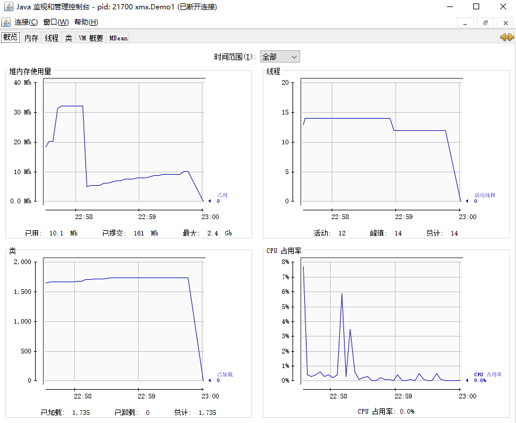

jps工具

- 查看当前系统中有哪些java进程

jmap工具

- 查看堆内存占用情况

jconsole工具

- 图形化界面，多功能的监测工具，可以连续监测

实验代码

```java
public class Demo1 {
    public static void main(String[] args) throws InterruptedException {
        System.out.println("1...");
        Thread.sleep(30000);
        byte[] array = new byte[1024 * 1024 * 10];
        System.out.println("2...");
        Thread.sleep(30000);
        array = null;
        System.gc();
        System.out.println("3...");
        Thread.sleep(100000L);
    }
}
```

jps 查看java进程

```bash
D:\Test\TestForJava\Learn>jps
15456 Launcher
16452 Jps
7588 Demo1
18760
```


jmap -heap {PID}

起始Eden Space使用量为used     = 2520608 (2.403839111328125MB)

```bash
D:\Test\TestForJava\Learn>jmap -heap 7588
Attaching to process ID 7588, please wait...
Debugger attached successfully.
Server compiler detected.
JVM version is 25.231-b11

using thread-local object allocation.
Parallel GC with 4 thread(s)

Heap Configuration:
   MinHeapFreeRatio         = 0
   MaxHeapFreeRatio         = 100
   MaxHeapSize              = 2654994432 (2532.0MB)
   NewSize                  = 55574528 (53.0MB)
   MaxNewSize               = 884998144 (844.0MB)
   OldSize                  = 112197632 (107.0MB)
   NewRatio                 = 2
   SurvivorRatio            = 8
   MetaspaceSize            = 21807104 (20.796875MB)
   CompressedClassSpaceSize = 1073741824 (1024.0MB)
   MaxMetaspaceSize         = 17592186044415 MB
   G1HeapRegionSize         = 0 (0.0MB)

Heap Usage:
PS Young Generation
Eden Space:
   capacity = 41943040 (40.0MB)
   used     = 2520608 (2.403839111328125MB)
   free     = 39422432 (37.596160888671875MB)
   6.0095977783203125% used
From Space:
   capacity = 6815744 (6.5MB)
   used     = 0 (0.0MB)
   free     = 6815744 (6.5MB)
   0.0% used
To Space:
   capacity = 6815744 (6.5MB)
   used     = 0 (0.0MB)
   free     = 6815744 (6.5MB)
   0.0% used
PS Old Generation
   capacity = 112197632 (107.0MB)
   used     = 0 (0.0MB)
   free     = 112197632 (107.0MB)
   0.0% used

1758 interned Strings occupying 157640 bytes.
```
创建一个10M的对象后，Eden Space使用量为used     = 13006384 (12.403854370117188MB)

```bash
D:\Test\TestForJava\Learn>jmap -heap 7588
Attaching to process ID 7588, please wait...
Debugger attached successfully.
Server compiler detected.
JVM version is 25.231-b11

using thread-local object allocation.
Parallel GC with 4 thread(s)

Heap Configuration:
   MinHeapFreeRatio         = 0
   MaxHeapFreeRatio         = 100
   MaxHeapSize              = 2654994432 (2532.0MB)
   NewSize                  = 55574528 (53.0MB)
   MaxNewSize               = 884998144 (844.0MB)
   OldSize                  = 112197632 (107.0MB)
   NewRatio                 = 2
   SurvivorRatio            = 8
   MetaspaceSize            = 21807104 (20.796875MB)
   CompressedClassSpaceSize = 1073741824 (1024.0MB)
   MaxMetaspaceSize         = 17592186044415 MB
   G1HeapRegionSize         = 0 (0.0MB)

Heap Usage:
PS Young Generation
Eden Space:
   capacity = 41943040 (40.0MB)
   used     = 13006384 (12.403854370117188MB)
   free     = 28936656 (27.596145629882812MB)
   31.00963592529297% used
From Space:
   capacity = 6815744 (6.5MB)
   used     = 0 (0.0MB)
   free     = 6815744 (6.5MB)
   0.0% used
To Space:
   capacity = 6815744 (6.5MB)
   used     = 0 (0.0MB)
   free     = 6815744 (6.5MB)
   0.0% used
PS Old Generation
   capacity = 112197632 (107.0MB)
   used     = 0 (0.0MB)
   free     = 112197632 (107.0MB)
   0.0% used

1759 interned Strings occupying 157688 bytes.
```
垃圾回收后，Eden Space使用量为used     = 838880 (0.800018310546875MB)

```bash
D:\Test\TestForJava\Learn>jmap -heap 7588
Attaching to process ID 7588, please wait...
Debugger attached successfully.
Server compiler detected.
JVM version is 25.231-b11

using thread-local object allocation.
Parallel GC with 4 thread(s)

Heap Configuration:
   MinHeapFreeRatio         = 0
   MaxHeapFreeRatio         = 100
   MaxHeapSize              = 2654994432 (2532.0MB)
   NewSize                  = 55574528 (53.0MB)
   MaxNewSize               = 884998144 (844.0MB)
   OldSize                  = 112197632 (107.0MB)
   NewRatio                 = 2
   SurvivorRatio            = 8
   MetaspaceSize            = 21807104 (20.796875MB)
   CompressedClassSpaceSize = 1073741824 (1024.0MB)
   MaxMetaspaceSize         = 17592186044415 MB
   G1HeapRegionSize         = 0 (0.0MB)

Heap Usage:
PS Young Generation
Eden Space:
   capacity = 41943040 (40.0MB)
   used     = 838880 (0.800018310546875MB)
   free     = 41104160 (39.199981689453125MB)
   2.0000457763671875% used
From Space:
   capacity = 6815744 (6.5MB)
   used     = 0 (0.0MB)
   free     = 6815744 (6.5MB)
   0.0% used
To Space:
   capacity = 6815744 (6.5MB)
   used     = 0 (0.0MB)
   free     = 6815744 (6.5MB)
   0.0% used
PS Old Generation
   capacity = 112197632 (107.0MB)
   used     = 640800 (0.611114501953125MB)
   free     = 111556832 (106.38888549804688MB)
   0.5711350485543224% used

1745 interned Strings occupying 156696 bytes.
```

相比纯文本工具，图形化工具总更显得直观。下面我们介绍一款图形化工具-jconsole，jconsole可以实时的监控运行程序的以下指标

- 堆内存使用量
- 线程数
- 类
- cpu占用率

