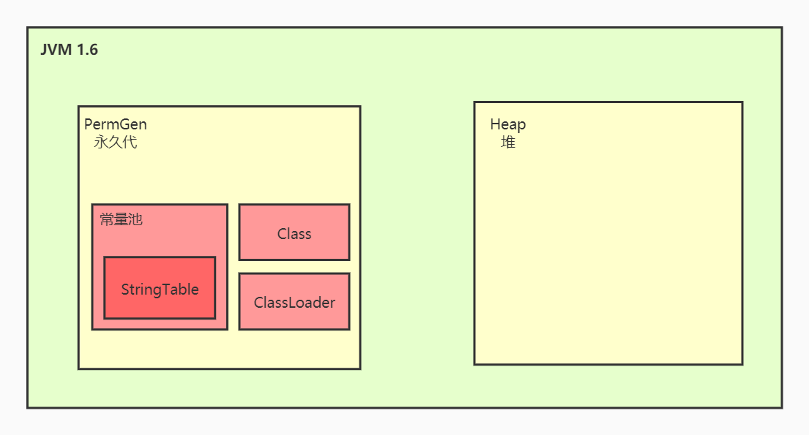
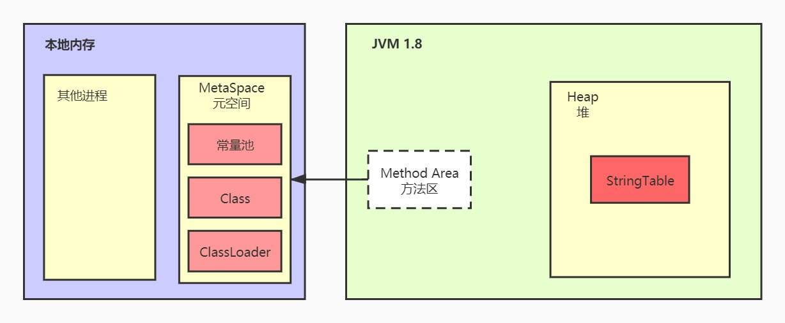

## 方法区的定义

方法区是所有**java线程共享**的区，它存储了跟类结构相关的信息，如**运行时常量池**、**成员变量**、**方法数据**、**成员方法和构造器方法的代码**以及特殊化方法（指类的构造器）

方法区在虚拟机启动时创建，逻辑上方法区是堆的一部分，但并不强制如此实现。如Oracle的Hotspot虚拟机在1.8以前，方法区的实现叫做**永久代**，永久代的实现就是使用了堆的一部分。而在1.8以后，移除了永久代，换了一个实现，这个实现叫做**元空间**，元空间的实现就不是使用堆的内存，而是使用操作系统的内存。

> 注意：方法区是规范，永久代、元空间都是实现
>
> 更详细的方法区定义请参考[JVM规范-方法区定义]( https://docs.oracle.com/javase/specs/jvms/se11/html/jvms-2.html#jvms-2.5.5 )

下面通过图的方式，方便大家的理解

永久代

元空间
