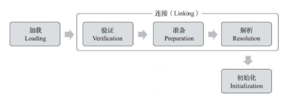

# 虚拟机类加载机制

## 类加载机制的定义

虚拟机把描述类的数据从Class文件 **加载** 到内存，并对数据进行 **校验**、**转换解析** 和 **初始化**，最终形成可以被虚拟机直接使用的Java类型，这就是虚拟机的类加载机制。

> 与那些在编译时需要进行连接工作的语言不同，在Java语言里面，类型的加载、连接和初始化过程都是在程序 **运行期间** 完成的，这种策略虽然会令类加载时稍微增加一些性能开销，但是会为Java应用程序提供高度的灵活性，Java里天生可以动态扩展的语言特性就是依赖运行期动态加载和动态连接这个特点实现的。

## 类加载机制的阶段

在说明类加载机制的阶段之前，让我们先了解一下类的生命周期。类从被加载到虚拟机内存中开始，到卸载出内存为止，它的整个生命周期包括：加载（Loading）、验证（Verification）、准备（Preparation）、解析（Resolution）、初始化（Initialization）、使用（Using）和卸载（Unloading）7个阶段。如下图：


**虚拟机类加载机制** 涉及类的生命周期的前5个阶段。即Java虚拟机中类加载的全过程，主要包含 **加载**、**验证**、**准备**、**解析** 和 **初始化** 这5个阶段。如下图所示：



接下去让我们看一下这5个阶段所执行的具体动作。

### 加载阶段

在加载阶段，虚拟机需要完成以下3件事情：

1. 通过一个类的全限定名来获取定义此类的**二进制字节流** 。常见的**二进制字节流来源**包括：从ZIP包中读取、从网络中获取、动态代理运行时计算生成等。
2. 将这个字节流所代表的静态存储结构转化为**方法区的运行时数据结构 **。
3. 在内存中生成一个代表这个**类的java.lang.Class对象**，作为方法区这个类的各种数据的访问入口。

### 验证阶段

这一阶段的目的是为了确保Class文件的字节流中包含的信息符合当前虚拟机的要求，并且不会危害虚拟机自身的安全。

验证阶段大致上可细化为4个检验动作：

1. **文件格式验证**：对 **二进制字节流** 进行验证，验证点包括：是否以魔数0xCAFEBABE开头； 主次版本号是否在当前虚拟机处理范围之内；常量池的常量中是否有不被支持的常量类型等
2. **元数据验证**：对 **类的元数据信息** 进行验证，验证点包括：这个类是否有父类；这个类的父类是否继承了不允许被继承的类；如果这个类不是抽象类，是否实现了其父类或接口之中要求实现的所有方法；类中的字段、方法是否与父类产生矛盾等
3. **字节码验证**：对 **类的方法体** 进行验证，验证点包括：操作栈放置了一个int类型的数据，使用时不会按long类型来加载入本地变量表中；跳转指令不会跳转到方法体以外的字节码指令上；方法体中的类型转换等
4. **符号引用验证**：对**类自身以外（常量池中的各种符号引用）的信息**进行验证，验证点包括：符号引用中通过字符串描述的全限定名是否能找到对应的类；在指定类中是否存在符合方法的字段描述符以及简单名称所描述的方法和字段；符号引用中的类、字段、方法的访问性（private、protected、public、default）是否可被当前类访问等

### 准备阶段

准备阶段是正式**为类变量分配内存**并**设置类变量初始值**的阶段，需要注意的是：

- 这时候进行内存分配的仅包括类变量（被static修饰的变量），而不包括实例变量。这些类变量所使用的内存都将在方法区中进行分配。

- 这里所说的初始值“通常情况”下是数据类型的**零值**。例如：假设一个类变量的定义为：

  ```java
  public static int value = 123; 
  ```

  变量value在准备阶段过后的初始值为0而不是123

  上面提到，在“通常情况”下初始值是零值，那相对的会有一些“特殊情况”：如果类字段被final修饰，那初始值将不再是零值，而是常量值。例如：假设上面类变量value的定义变为：

  ```java
  public static final int value = 123;
  ```

  变量value在准备阶段过后的值将为123

### 解析阶段

解析阶段是虚拟机将常量池内的**符号引用**替换为**直接引用**的过程。不了解符号引用和直接引用的同学，详见: [附录 - 符号引用和直接引用](#符号引用和直接引用)

常量池内的**符号引用**包括：类或接口、字段、类方法、接口方法、方法类型、方法句柄和调用点限定符7类符号引用，分别对应于常量池的CONSTANT_Class_info、CONSTANT_Fieldref_info、CONSTANT_Methodref_info、CONSTANT_InterfaceMethodref_info、CONSTANT_MethodType_info、CONSTANT_MethodHandle_info和CONSTANT_InvokeDynamic_info 7种常量类型

### 初始化阶段

初始化阶段是执行类构造器<clinit>()方法的过程。<clinit>()方法是由编译器自动收集类中的所有类变量的赋值动作和静态语句块（static{}块）中的语句合并产生的，需要注意的是：

- 编译器收集的顺序是由语句在源文件中出现的顺序所决定的，静态语句块中只能访问到定义在静态语句块之前的变量，定义在它之后的变量，在前面的静态语句块可以赋值，但是不能访问。如：

  ```java
  public class Test {
      static {
          i = 0;                           //给变量赋值可以正常编译通过
          System.out.print(i);             //这句编译器会提示"非法向前引用"
      }
      static int i = 1;
  }
  ```

- <clinit>()方法与类的构造函数（或者说实例构造器<init>()方法）是不同的，注意区分

到此，虚拟机类加载机制简单介绍完毕，若想了解各阶段的更多详细内容，请见各阶段详解。

## 附录

### 符号引用和直接引用

- 符号引用（Symbolic References）：符号引用以一组符号来描述所引用的目标，符号可以是任何形式的字面量，只要使用时能无歧义地定位到目标即可。符号引用与虚拟机实现的内存布局无关，引用的目标并不一定已经加载到内存中。各种虚拟机实现的内存布局可以各不相同，但是它们能接受的符号引用必须都是一致的，因为符号引用的字面量形式明确定义在Java虚拟机规范的Class文件格式中。符号引用在Class文件中它以CONSTANT_Class_info、CONSTANT_Fieldref_info、CONSTANT_Methodref_info等类型的常量出现

- 直接引用（Direct References）：直接引用可以是直接指向目标的指针、相对偏移量或是一个能间接定位到目标的句柄。直接引用是和虚拟机实现的内存布局相关的，同一个符号引用在不同虚拟机实例上翻译出来的直接引用一般不会相同。如果有了直接引用，那引用的目标必定已经在内存中存在。

## 参考文档

- 深入理解Java虚拟机：JVM高级特性与最佳实践（第2版） 