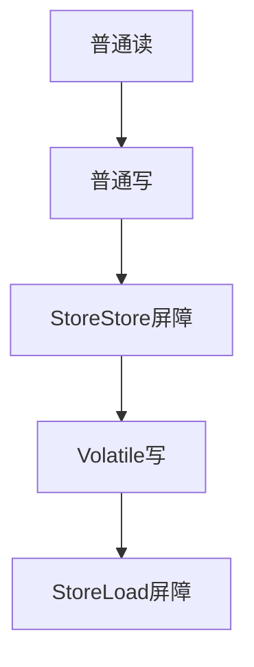
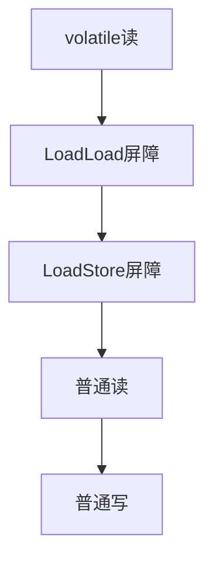

## 导致共享变量在线程中不可见的原因

- 线程交叉执行
- 重排序结合线程交叉执行
- 共享变量更新后的值没有在工作内存和主内存间及时更新


## 保证可见性可通过

- synchronized
- volatile

## Synchronized是如何保证可见性的？

JMM规定，使用synchronized

线程加锁时，将清空工作内存中共享变量的值，从而使用共享变量时需要从共享内存中重新读取最新的值

线程解锁前，必须把共享变量的最新值刷新到主内存

> 注意：加锁和解锁是同一把锁


## volatile是如何保证可见性的

通过加入`内存屏障`和`禁止重排序`优化来实现

对volatile变量写操作时，会在写操作后加入一条store屏障指类，将本地内存中的共享变量值刷新到主内存中

对volatile变量读操作时，会在读操作前加入一条load屏障指令，从主内存中读取共享变量


volatile读写屏障如下：

volatile写



> StoreStore屏障：禁止上面的普通写和下面的volatile写重排序
>
> StoreLoad屏障：防止volatile写与下面可能有的volatile读/写重排序


volatile读



> LoadLoad屏障：禁止下面所有的普通读操作和上面的volatile读写重排序
>
> LoadStore屏障：禁止下面所有的写操作和上面的volatile读重排序

## volatile能保证线程安全么?

volatile只能保证可见性（共享变量是主内存中的最新值），但不能保证原子性，故不能保证线程安全。

可用如下代码实验：

```java
package com.moluo.concurrency.count;

import java.util.concurrent.CountDownLatch;
import java.util.concurrent.ExecutorService;
import java.util.concurrent.Executors;
import java.util.concurrent.Semaphore;

public class VolatileCountExample {
    public static int clientTotal = 5000;
    public static int threadTotal = 200;
    public static volatile int count = 0;

    public static void main(String[] args) throws InterruptedException {
        ExecutorService executorService = Executors.newCachedThreadPool();
        final Semaphore semaphore = new Semaphore(threadTotal);
        final CountDownLatch countDownLatch = new CountDownLatch(clientTotal);
        for (int i = 0; i < clientTotal; i++) {
            executorService.execute(() -> {
                try {
                    semaphore.acquire();
                    add();
                    semaphore.release();
                } catch (InterruptedException e) {
                    e.printStackTrace();
                }
                countDownLatch.countDown();
            });
        }
        countDownLatch.await();
        executorService.shutdown();
        System.out.println("count:" + count);
    }

    private static void add() {
        count++;
    }
}
```

## volatile的使用场景

- 作为状态标记量

```java
volatile boolean isInited=false;

// 线程1：
context =loadContext();
isInited=true;

// 线程2：
while(!isInited){
    sleep();
}
doSomethingWithConfig(context)
```

> 使用volatile标记变量isInited，即标记上下文是否初始化完成。
>
> 线程1负责初始化上下文，初始化成功设置isInited=true。
>
> 线程2根据isInited的值决定睡眠还是向下执行代码。