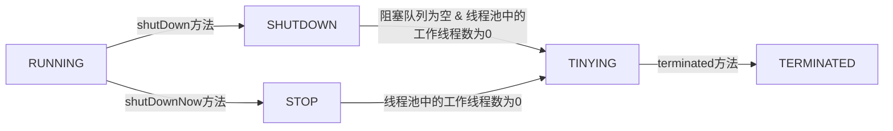

## 为什么要使用线程池?

### new Thread 的弊端

- 性能上，每次new Thread新建对象，性能差

- 管理上，线程缺乏统一管理，可以无限制的新建线程，相互竞争，有可能占用过多系统资源导致死机或OOM

- 功能上，缺少如更多执行，定期执行，线程中断等功能

### 线程池的好处

- 性能上，重用存在的线程，减少对象创建、消亡的开销，性能好
- 管理上，可控制最大线程数，提高系统资源利用率，同时避免过多资源竞争，避免阻塞
- 功能上，提供定时执行，定期执行，单线程，并发数控制等功能

## 线程池生命周期

## 线程池常用的相关类

线程池常用的相关类有ThreadPoolExecutor和Executors

### ThreadPoolExecutor

#### ThreadPoolExecutor初始化参数

- corePoolSize：核心线程数量。若程序中的线程数量小于corePoolSize，直接创建新线程来处理任务，即使其他线程是空闲的
- maximumPoolSize：最大线程数量。当程序中的线程数量大于corePoolSize，workQueue又满了的时候，才增加
- workQueue：阻塞队列，存储等待执行的任务。很重要，会对线程池运行过程产生重大影响

- keepAliveTime：若当前线程数大于>corePoolSize，针对超过corePoolSize的线程，没有任务执行时最多保持多久时间终止。
- unit：keepAliveTime的时间单位
- threadFactory：线程工厂，用来创建线程
- rejectedExecutionHandler：拒绝策略。新任务进来时，若workQueue已满，而线程中的线程数已达到maximumPoolSize，将通过拒绝策略来决定处理新任务的方式，主要包括四种方式：
  - AbortPolicy：直接抛出异常
  - DiscardPolicy：直接丢弃任务
  - CallerRunsPolicy：使用调用者的线程执行任务
  - DiscardOldestPolicy：丢弃队列中最靠前的任务并执行当前任务

#### ThreadPoolExecutor的常见方法

生命周期相关方法

- execute()：提交任务，交给线程池执行
- submit()：提交任务，能够返回执行结果，相当于executor()+Future
- shutdown()：关闭线程池，等待任务都执行完
- shutdownNow()：关闭线程池，不等待任务执行完

监控相关的方法

- getTaskCount()：线程池中的任务总数，包括已执行任务和未执行任务，是一个近似值
- getCompletedTaskCount()：已完成的任务总数，也是一个近似值
- getPoolSize()：线程池中当前的线程数量
- getActiveCount()：线程池中正在执行任务的线程数量

### Executors

为了方便使用，提供了Executors类，常用的Executors方法有

- Executors.newCachedThreadPool：线程数可动态扩展的线程池
- Executors.newFixedThreadPool：固定线程数的线程池
- Executors.newScheduledThreadPool：可定时调度的线程池，支持schedule()、scheduleAtFixedRate()等方法，类似于Timer
- Executors.newSingleThreadScheduledExecutor：线程数为1的线程池，即单线程

> 注意：Executors创建线程池是基于ThreadPoolExecutor来创建的，但由于Executors创建方法的放回值为ExecutorService，相比于ThreadPoolExecutor，ExecutorService中少了很多方法。比如监控相关的方法

## 线程池参数设定原则

若想降低CPU使用率，减小系统开销，可减小maximumPoolSize，加大workQueue

对于高IO性任务，若任务经常阻塞，可增加maximumPoolSize

对于CPU密集型任务，线程数大小可以设定为NCPU+1，仅为参考值，并非最优值，请根据实际情况调整为最优值

对于IO密集型任务，线程数大小可以设置为2*NCPU，仅为参考值，并非最优值，请根据实际情况调整为最优值

