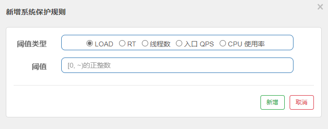

## 服务容错的思路

- 超时
- 限流
- 仓壁模式
- 断路器模式

## 什么是Sentinel?

轻量级的流量控制、熔断降级Java库

## 安装Sentinel Dashboard

1. 拉取镜像

   ```bash
   docker pull bladex/sentinel-dashboard:1.7.0
   ```

2. 创建容器

   ```bash
   docker run --name sentinel -d  -p 8858:8858  bladex/sentinel-dashboard:1.7.0
   ```

3. 访问sentinel DashBoard界面。地址：http://localhost:8858，默认用户名/密码：sentinel/sentinel

   

## SpringBoot集成Sentinel

1. 添加依赖

   ```groovy
   implementation 'org.springframework.cloud:spring-cloud-starter-alibaba-sentinel:0.9.0.RELEASE'
   ```

2. 添加配置

   ```properties
   # 指定sentinel控制台的地址
   spring.cloud.sentinel.transport.dashboard=localhost:8858
   ```

3. 测试运行

   

## Sentinel Dashboard说明

### 流控规则


资源名：唯一标识。通常使用资源路径

针对来源：针对调用者（不同的微服务）设置限流。default代表不区分来源

流控模式

- 直接
- 关联：当关联的资源达到阈值，就限流自己。通常用于保护关联资源
- 链路：只记录指定链路上的流量。api级别的针对来源

流控效果

- 快速失败：直接失败，抛异常
- WarmUp：预热，根据codeFactor(默认3)的值，从阈值/codeFactor，经过预热时长，才到达设置的QPS阈值
- 排队等待：匀速排队，让请求以均匀的速度通过。（阈值类型必须设成QPS，否则无效）

### 降级规则


熔断策略

- 慢调用比例（RT）：平均响应时间(秒级统计)超出阈值 && 在时间窗口内通过的请求 >= 5；触发降级(断路器打开)；时间窗口结束；关闭降级。
- 异常比例：QPS >= 5 && 异常比例(秒级统计)超过阈值；触发降级(断路器打开)；时间窗口结束；关闭降级。
- 异常数：异常数(分钟统计)超过阈值；触发降级(断路器打开)；时间窗口结束；关闭降级。

### 热点规则


参数级别的限流


### 系统规则



- LOAD：当系统load1 (1分钟的load )超过阈值，且并发线程数超过系统容量时触发，建议设置为CPU核心数*2.5。（仅对Linux/Unix-like机器生效)

  系统容量 = maxQps * minRt

  - maxQps：秒级统计出来的最大QPS
  - minRt：秒级统计出来的最小响应时间
  - 相关源码：com.alibaba.csp.sentinel.slots.system.SystemRuleManager#checkBbr

- RT：所有入口流量的平均RT达到阈值触发

- 线程数：所有入口流量的并发线程数达到阈值触发

- 入口OPS：所有入口流量的OPS达到阈值触发

### 授权规则


## 代码配置规则

参考：https://www.imooc.com/article/289345


应用链接控制台的配置项

```yaml
spring.cloud.sentinel.transport:
	#指定控制台的地址
	dashboard: localhost:8080
	#指定和控制台通信的IP
	#如不配置，会自动选择一个IP注册
	client-ip: 127.0.0.1
	#指定和控制台通信的端口，默认值8719
	#如不设置，会自动从8719开始扫描，依次+1，直到找到未被占用的端口
	port: 8719
	#心跳发送周期，默认值null
	#但在simpleHttpHeartbeatsender会用默认值10秒
	heartbeat-interval-ms: 10000
```

控制台配置项

| 配置项                                 | 默认值         | 最小值 | 描述                                                         |
| -------------------------------------- | -------------- | ------ | ------------------------------------------------------------ |
| server.port                            | 8080           | -      | 指定端口                                                     |
| csp.sentinel.dashboard.server          | localhost:8080 | -      | 指定地址                                                     |
| project.name                           | -              | -      | 指定程序的名称                                               |
| sentinel.dashboard.auth.username [1.6] | sentinel       | -      | Dashboard登录账号                                            |
| sentinel.dashboard.auth.password [1.6] | sentinel       | -      | Dashboard登录密码                                            |
| server.servlet.session.timeout [1.6]   | 30分钟         | -      | 登录Session过期时间。配置为7200表示7200秒; 配置为60m表示60分钟 |

使用方式

```bash
java -jar -Dsentinel.dashboard.auth.username=admin -Dsentinel.dashboard.auth.password=admin sentinel-dashboard-1.6.2.jar
```


Sentinel API

- SphU
- Tracer
- ContextUtil


## 更多文档

[Spring Cloud Alibaba（七）——Sentinel流量控制框架](https://juejin.cn/post/7112327516819292191)


