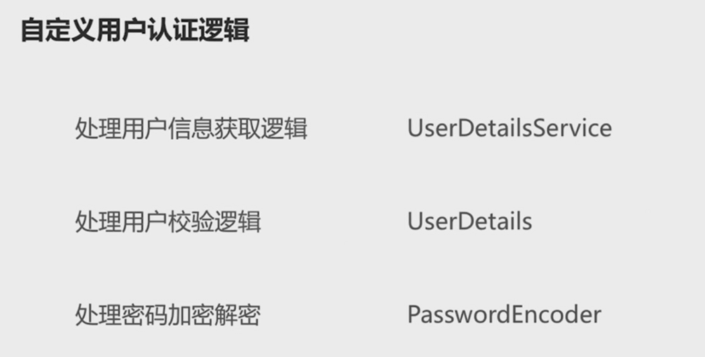

# 自定义用户认证逻辑

spring security默认的登录账号（用户名：`user`，密码：后台自动生成，如`Using generated security password: 4ed4e522-725a-4501-bd68-51060670b849`）。但这不能满足我们的日常需求，本节中我们来介绍spring security如何自定义用户认证逻辑。使用数据库或其他来源的用户进行登录。



## 一、处理用户信息获取逻辑

在spring security中使用`UserDetailsService`接口封装用户信息获取逻辑

 1. 新建`MyUserDetailsService`类，实现`UserDetailsService`接口
 2. 使用`@Component`注解装饰`MyUserDetailsService`类
 3. 实现`loadUserByUsername(String username)`方法
```java
@Override
public UserDetails loadUserByUsername(String username) throws UsernameNotFoundException {
	logger.info("用户名：" + username);
	return new User(username, "123456",AuthorityUtils.commaSeparatedStringToAuthorityList("admin"));
}
```
> User构造方法中：username和password用于认证，authorities用于授权

## 二、处理用户校验逻辑

处理用户校验逻辑是为了判断用户名密码是否有效、账号是否被冻结、密码是否过期等。

在spring security中使用`UserDetails`接口封装用户校验逻辑。步骤一中使用的`User`便是`UserDetails`的接口实现。可根据需要，通过实现UserDetails接口自定义用户校验逻辑。

UserDetails接口解析

- getAuthorities()；//获取认证
- getUsername()；//获取用户名
- getPassword()；//获取密码
- isAccountNonExpired()；//账号是否过期
- isCredentialsNonExpired()；//密码是否过期
- isAccoutNonLocked()；//账号是否被冻结
- isEnabled()；//用户是否可用，是否被删除

以上方法返回true则代表校验通过，否则代表校验不通过。

## 三、处理密码加密解码

在注册时，直接将明文密码存储是不安全的，所以需要对密码进行加密。

在spring security中使用`PasswordEncoder`接口封装密码加密解码逻辑，接口如下：

```java
package org.springframework.security.crypto.password;

public interface PasswordEncoder {
    // 用户注册时，使用该方法对原始密码加密，然会才将加密后的密码存储到数据库中
	String encode(CharSequence rawPassword);

    // 用户登录时，spring会调用该方法验证密码
	boolean matches(CharSequence rawPassword, String encodedPassword);
}
```

用户可根据需要，通过实现PasswordEncoder接口自定义加密解密方式，常见的有MD5加密、BCrypt加密等。

拥有PasswordEncoder的实现类后，还需要添加配置，决定使用的哪种加密方式。

1. 在SecurityConfig类中加入

   ```java
   @Bean
   public  PasswordEncoder passwordEncoder(){
       return new BCryptPasswordEncoder(); // BCryptPasswordEncoder为spring中提供的PasswordEncoder实现类
   }
   ```

   > 注册时使用passwordEncoder.encode()方法对密码进行加密。

## 完整代码

com.moluo.security.browser.MyUserDetailsService

```java
package com.moluo.security.browser;

import org.slf4j.Logger;
import org.slf4j.LoggerFactory;
import org.springframework.beans.factory.annotation.Autowired;
import org.springframework.security.core.authority.AuthorityUtils;
import org.springframework.security.core.userdetails.User;
import org.springframework.security.core.userdetails.UserDetails;
import org.springframework.security.core.userdetails.UserDetailsService;
import org.springframework.security.core.userdetails.UsernameNotFoundException;
import org.springframework.security.crypto.password.PasswordEncoder;
import org.springframework.stereotype.Component;

@Component
public class MyUserDetailsService implements UserDetailsService {

    @Autowired
    private PasswordEncoder passwordEncoder;

    private Logger logger = LoggerFactory.getLogger(getClass());

    @Override
    public UserDetails loadUserByUsername(String username) throws UsernameNotFoundException {
        logger.info("用户名：" + username);
        // 根据用户名查找用户信息
        // 根据查找到的用户信息判断用户是否被冻结
        String password = passwordEncoder.encode("123456");
        logger.info("数据库密码是：" + password);
        return new User(username, password, true, true, true, true, AuthorityUtils.commaSeparatedStringToAuthorityList("admin"));
    }
}
```


com.moluo.security.browser.BrowserSecurityConfig

```java
package com.moluo.security.browser;

import org.springframework.context.annotation.Bean;
import org.springframework.context.annotation.Configuration;
import org.springframework.security.config.annotation.web.builders.HttpSecurity;
import org.springframework.security.config.annotation.web.configuration.WebSecurityConfigurerAdapter;
import org.springframework.security.crypto.bcrypt.BCryptPasswordEncoder;
import org.springframework.security.crypto.password.PasswordEncoder;

@Configuration
public class BrowserSecurityConfig extends WebSecurityConfigurerAdapter {

    @Bean
    public PasswordEncoder passwordEncoder() {
        return new BCryptPasswordEncoder();
    }

    @Override
    protected void configure(HttpSecurity http) throws Exception {
        http.formLogin()
                .and()
                .authorizeRequests()
                .anyRequest()
                .authenticated();
    }
}
```