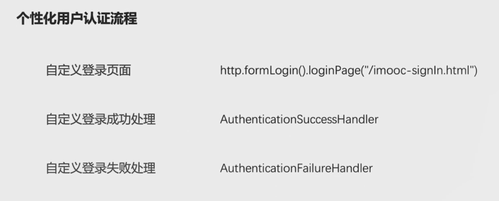
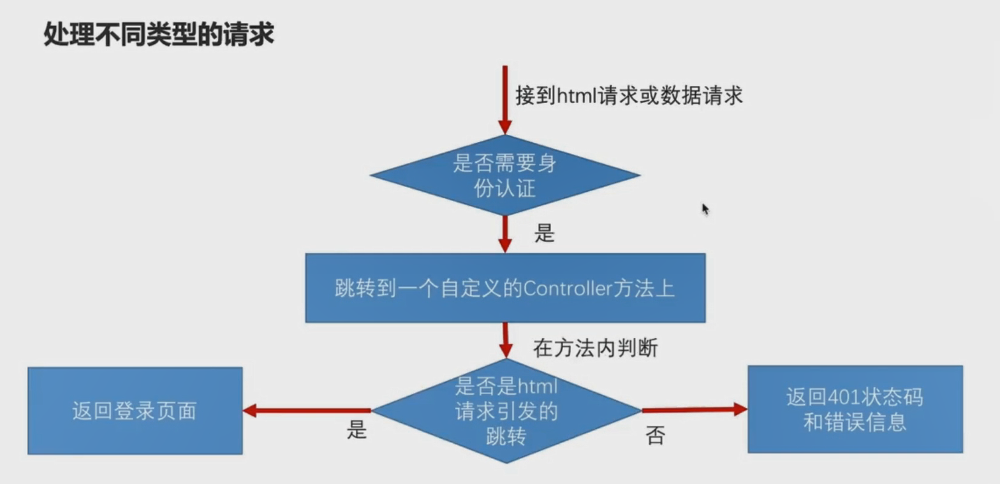

# 个性化用户认证流程

通过上一小节的学习，我们可以实现使用数据库中的用户进行登录。但认证流程仍然不能满足我们的需要。比如：

- 登录页面为spring自动生成的，在实际的项目中我们并不会使用该界面。

- 登录成功后，spring默认的逻辑是跳转之前访问的url，若我们想要在登录成功后添加额外的逻辑（比如记录登录时间），又该怎么做？
- 登录失败后，spring默认的逻辑是打印错误信息，若我们想要在登录失败后记录错误日志或当登录失败次数超过一定次数后不允许登录。又该如何做？

本节中我们来讲解如何自定义登录页面和自定义登录成功/失败的处理逻辑。



## 自定义登录页面

### 基础实现方式

1. 新建resources/resources/SignIn.html

   ```html
   <!DOCTYPE html>
   <html lang="en">
   <head>
       <meta charset="UTF-8">
       <title>登录</title>
   </head>
   <body>
       <h2>标准登录页面</h2>
       <h3>表单登录</h3>
       <form action="/authentication/form" method="post">
           <table>
               <tr>
                   <td>用户名：</td>
                   <td><input type="text" name="username"></td>
               </tr>
               <tr>
                   <td>密码：</td>
                   <td><input type="password" name="password"></td>
               </tr>
               <tr>
                   <td colspan="2"><button type="submit">登录</button></td>
               </tr>
           </table>
       </form>
   </body>
   </html>
   ```

2. 在SecurityConfig类中，配置SignIn.html为登录页面并为其授权

3. 在SecurityConfig类中，配置登录表单提交url

4. 关闭跨站请求伪造
```java
    @Override
    protected void configure(HttpSecurity http) throws Exception {
        http.formLogin()
                .loginPage("/SignIn.html")
                .loginProcessingUrl("/authentication/form")
                .and()
                .authorizeRequests()
                .antMatchers("/SignIn.html").permitAll()
                .anyRequest()
                .authenticated()
                .and()
                .csrf().disable();
    }
```

### 自定义登录页面进阶

在基础实现方式中，当用户认证未通过，自动跳转SignIn.html，但对于非web应用这是不合理的，对于非web应用当认证未通过时，应返回状态码为401的json体。那么如何实现对于web应用自动跳转SignIn.html而非web应用返回状态码为401的json体逻辑呢？请见下图：



## 自定义登录成功处理
1. 新建BlogAuthenticationSuccessHandler类，实现AuthenticationSuccessHandler接口
2. 使用@Component("blogAuthenticationSuccessHandler")注解装饰BlogAuthenticationSuccessHandler类
3. 重写onAuthenticationSuccess()方法并编写登录成功后处理逻辑
```java
 @Override
    public void onAuthenticationSuccess(HttpServletRequest request, HttpServletResponse response,
                                        Authentication authentication) throws IOException, ServletException {
        logger.info("登录成功");
        response.setContentType("application/json;charset=utf-8");
        response.getWriter().write(objectMapper.writeValueAsString(authentication));
    }
```
4. 在SecurityConfig中，配置自定义登录成功处理器
```java
  @Override
    protected void configure(HttpSecurity http) throws Exception {
        http.formLogin()
                .loginPage("/authentication/request")
                .loginProcessingUrl("/authentication/form")
                .successHandler(blogAuthenticationSuccessHandler)
    }
```

Authentication信息解析

```json
{
  "authorities": [ 						// 角色信息
    {
      "authority": "admin"
    }
  ],
  "details": {
    "remoteAddress": "0:0:0:0:0:0:0:1", // 请求端IP地址
    "sessionId": "4DB8EE4D05CF9DC4E54D0C71A894B190"
  },
  "authenticated": true, 				// 是否经过认证
  "principal": { 						// UserDetails中的信息
    "password": null,
    "username": "user",
    "authorities": [
      {
        "authority": "admin"
      }
    ],
    "accountNonExpired": true,
    "accountNonLocked": true,
    "credentialsNonExpired": true,
    "enabled": true
  },
  "credentials": null,					// 用户密码
  "name": "user"						// 用户名
}
```

authenticated：是否经过认证
authority：角色
credentials：密码
remoteAddress：请求端地址
sessionId：
principal：UserDetails中的信息

## 自定义登录失败处理
1. 新建BlogAuthenticationFailureHandler类，实现AuthenticationFailureHandler接口。
2. 使用@Component("blogAuthenticationFailureHandler")注解装饰BlogAuthenticationFailureHandler类。
3. 重写onAuthenticationFailure()方法并编写登录失败处理逻辑。
```java
    @Override
    public void onAuthenticationFailure(HttpServletRequest request, HttpServletResponse response,
                                        AuthenticationException exception) throws IOException, ServletException {
        logger.info("登录失败");
        response.setContentType("application/json;charset=utf-8");
        response.setStatus(HttpStatus.INTERNAL_SERVER_ERROR.value());
        response.getWriter().write(objectMapper.writeValueAsString(exception));
    }
```
4. 在SecurityConfig中，配置自定义登录失败处理器
```java
  @Override
    protected void configure(HttpSecurity http) throws Exception {
        http.formLogin()
                .loginPage("/authentication/request")
                .loginProcessingUrl("/authentication/form")
                .successHandler(blogAuthenticationSuccessHandler)
                .failureHandler(blogAuthenticationFailureHandler)
    }
```


