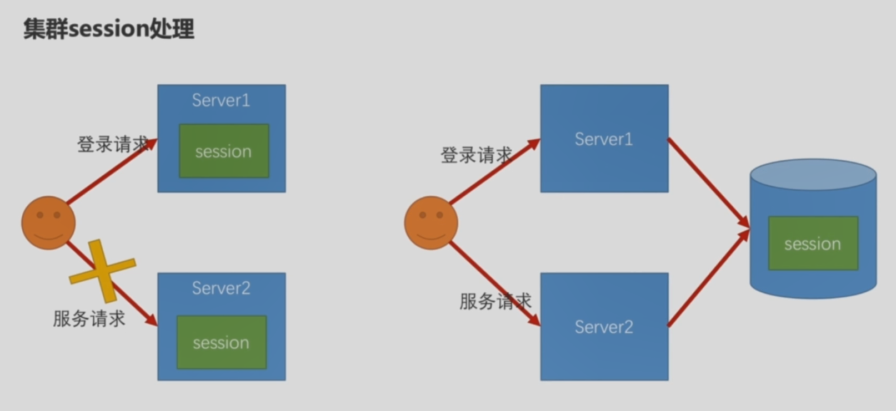

# Session管理

## Session超时处理

server.session.timeout=60

> 注意：springboot最小超时时间为1min，若你设置的值小于1min，超时时间将采用1min

## Session并发控制

```java
package com.moluo.security.browser;

@Configuration
public class BrowserSecurityConfig extends AbstractChannelSecurityConfig {
	...
    @Override
    protected void configure(HttpSecurity http) throws Exception {
        http
            .sessionManagement()
            .invalidSessionUrl("/session/invalid") 	// 无效session将跳转的url
            .maximumSessions(1)						// 允许同时在线的最大session数
            .maxSessionsPreventsLogin(true)			// 为true表示不允许同时在线，后者禁止登录
            .expiredSessionStrategy(new MoluoExpiredSessionStrategy()) // session过期策略
            ...
    }
}
```

## 集群Session管理



通过在`application.properties`中配置`spring.session.store-type=REDIS`指定使用REDIS作为session服务器

支持的存储类型包括：

- REDIS
- MONGODB
- JDBC
- HAZELCAST
- NONE