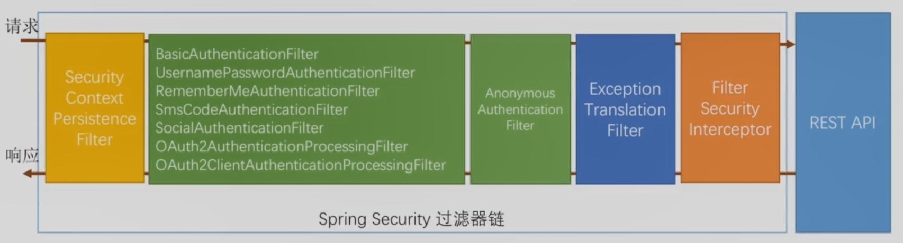
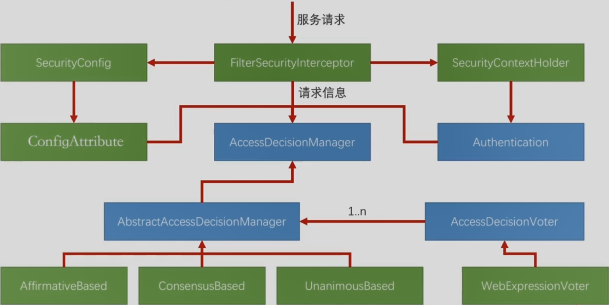

关键的3个类

- FilterSecurityInterceptor
- AccessDecisionManager：访问决定管理者，在AbstractAccessDecisionManager中管理着一组AccessDecisionVoter，综合一组AccessDecisionVoter的投票结果，决定过还是不过
- AccessDecisionVoter：投票人

AbstractAccessDecisionManager的具体实现类

- AffirmativeBased：只要有一人投通过，则过（默认）
- ConsensusBased：比较通过的票和不通过的票数，根据票多者决定过还是不过
- UnanimousBased：只要有一人投不过，则不过

其他类

ConfigAttribute：储存着每一个url需要什么权限

Authentication： 当前用户有什么权限

debug调试：

FilterSecurityInterceptor的doFilter方法

FilterSecurityInterceptor的invoke方法

invoke方法中的beforeInvocation()用于执行整个授权判断的逻辑（其中的Invocation是指调用后台Rest Api），如果beforeInvocation()中出现问题则抛异常时代码不在继续执行

分析beforeInvocation()中干了什么？

进入DefaultFilterInvocation的beforeInvocation()方法

beforeInvocation()方法中获取了ConfigAttribute的集合

ConfigAttribute的集合有getAttributes()方法获取，其值来自配置信息

哪些请求是都可以访问的

哪些请求是认证才能访问的

哪些请求是管理员才能访问的

通过authenticationIfRequired()方法获取到Authentication

将Authentication、ConfigAttribute及FilterSecurityInterceptor传递的对象，一起送到accessDecisionManager.decide（）中来决定是否通过

decide（）方法中主要是voter.vote（）方法

voter.vote（）中逻辑上主要是表达式的解析，若返回-1表示投票不通过

根据投票结果决定是否通过，若不通过，则向上抛异常。

最终ExceptionTranslationFilter或捕获异常，若异常是AccessDeniedException，则将调用accessDeniedHandler进行处理

[hasRole('ROLE_ADMIN')]

