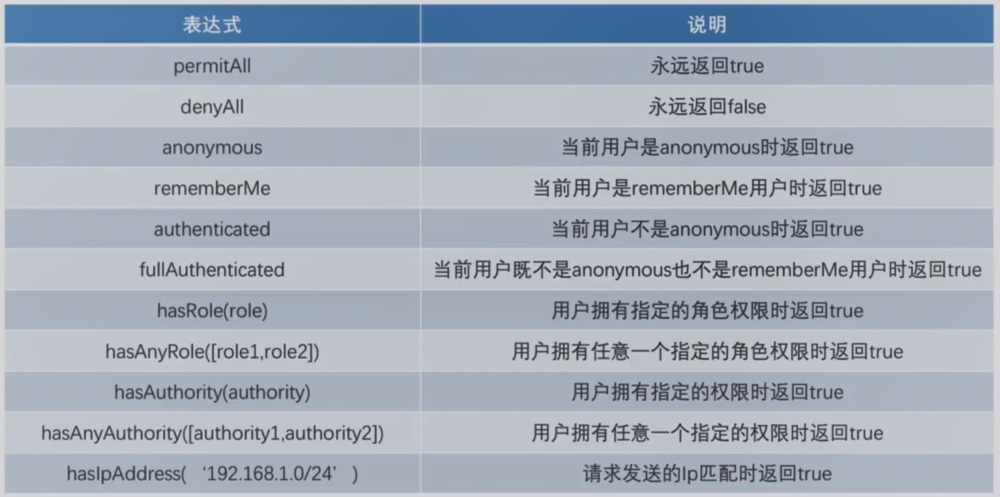
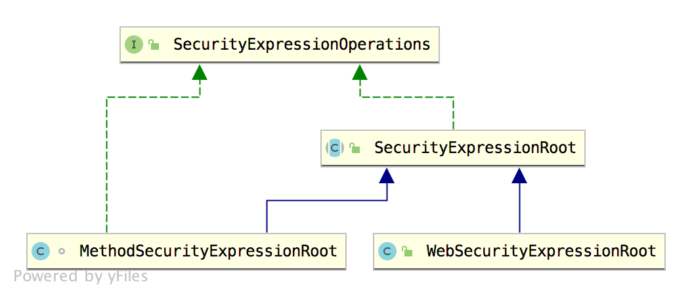
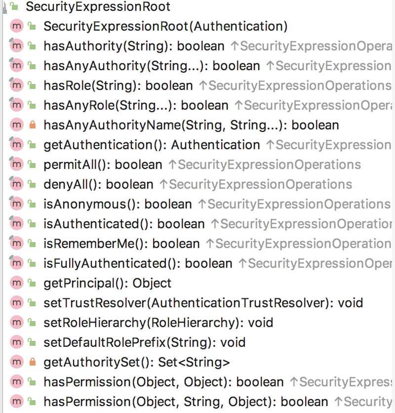

# Spring Security 中的四种权限控制方式

本文转载自：[Spring Security 中的四种权限控制方式](https://www.imooc.com/article/305852)

Spring Security 中对于权限控制默认已经提供了很多了，但是，一个优秀的框架必须具备良好的扩展性，恰好，Spring Security 的扩展性就非常棒，我们既可以使用 Spring Security 提供的方式做授权，也可以自定义授权逻辑。一句话，你想怎么玩都可以！

今天松哥来和大家介绍一下 Spring Security 中四种常见的权限控制方式。

- 表达式控制 URL 路径权限
- 表达式控制方法权限
- 使用过滤注解
- 动态权限

四种方式，我们分别来看。

## 1.表达式控制 URL 路径权限

首先我们来看第一种，就是通过表达式控制 URL 路径权限，这种方式松哥在之前的文章中实际上和大家讲过，这里我们再来稍微复习一下。

Spring Security 支持在 URL 和方法权限控制时使用 SpEL 表达式，如果表达式返回值为 true 则表示需要对应的权限，否则表示不需要对应的权限。提供表达式的类是 SecurityExpressionRoot：



可以看到，SecurityExpressionRoot 有两个实现类，表示在应对 URL 权限控制和应对方法权限控制时，分别对 SpEL 所做的拓展，例如在基于 URL 路径做权限控制时，增加了 hasIpAddress 选项。

我们来看下 SecurityExpressionRoot 类中定义的最基本的 SpEL 有哪些：



可以看到，这些都是该类对应的表达式，这些表达式我来给大家稍微解释下：

| 表达式               | 备注                                     |
| :------------------- | :--------------------------------------- |
| hasRole              | 用户具备某个角色即可访问资源             |
| hasAnyRole           | 用户具备多个角色中的任意一个即可访问资源 |
| hasAuthority         | 类似于 hasRole                           |
| hasAnyAuthority      | 类似于 hasAnyRole                        |
| permitAll            | 统统允许访问                             |
| denyAll              | 统统拒绝访问                             |
| isAnonymous          | 判断是否匿名用户                         |
| isAuthenticated      | 判断是否认证成功                         |
| isRememberMe         | 判断是否通过记住我登录的                 |
| isFullyAuthenticated | 判断是否用户名/密码登录的                |
| principle            | 当前用户                                 |
| authentication       | 从 SecurityContext 中提取出来的用户对象  |

这是最基本的，在它的继承类中，还有做一些拓展，我这个我就不重复介绍了。

如果是通过 URL 进行权限控制，那么我们只需要按照如下方式配置即可：

```java
protected void configure(HttpSecurity http) throws Exception {
    http.authorizeRequests()
            .antMatchers("/admin/**").hasRole("admin")
            .antMatchers("/user/**").hasAnyRole("admin", "user")
            .anyRequest().authenticated()
            .and()
            ...
}
```

这里表示访问 `/admin/**` 格式的路径需要 admin 角色，访问 `/user/**` 格式的路径需要 admin 或者 user 角色。

## 2.表达式控制方法权限

当然，我们也可以通过在方法上添加注解来控制权限。

在方法上添加注解控制权限，需要我们首先开启注解的使用，在 Spring Security 配置类上添加如下内容：

```java
@Configuration
@EnableGlobalMethodSecurity(prePostEnabled = true,securedEnabled = true)
public class SecurityConfig extends WebSecurityConfigurerAdapter {
    ...
    ...
}
```

这个配置开启了三个注解，分别是：

- @PreAuthorize：方法执行前进行权限检查
- @PostAuthorize：方法执行后进行权限检查
- @Secured：类似于 @PreAuthorize

这三个结合 SpEL 之后，用法非常灵活，这里和大家稍微分享几个 Demo。

```java
@Service
public class HelloService {
    @PreAuthorize("principal.username.equals('javaboy')")
    public String hello() {
        return "hello";
    }

    @PreAuthorize("hasRole('admin')")
    public String admin() {
        return "admin";
    }

    @Secured({"ROLE_user"})
    public String user() {
        return "user";
    }

    @PreAuthorize("#age>98")
    public String getAge(Integer age) {
        return String.valueOf(age);
    }
}
```

1. 第一个 hello 方法，注解的约束是，只有当前登录用户名为 javaboy 的用户才可以访问该方法。
2. 第二个 admin 方法，表示访问该方法的用户必须具备 admin 角色。
3. 第三个 user 方法，表示方法该方法的用户必须具备 user 角色，但是注意 user 角色需要加上 `ROLE_` 前缀。
4. 第四个 getAge 方法，表示访问该方法的 age 参数必须大于 98，否则请求不予通过。

可以看到，这里的表达式还是非常丰富，如果想引用方法的参数，前面加上一个 `#` 即可，既可以引用基本类型的参数，也可以引用对象参数。

缺省对象除了 principal ，还有 authentication（参考第一小节）。

## 3.使用过滤注解

Spring Security 中还有两个过滤函数 @PreFilter 和 @PostFilter，可以根据给出的条件，自动移除集合中的元素。

```java
@PostFilter("filterObject.lastIndexOf('2')!=-1")
public List<String> getAllUser() {
    List<String> users = new ArrayList<>();
    for (int i = 0; i < 10; i++) {
        users.add("javaboy:" + i);
    }
    return users;
}
@PreFilter(filterTarget = "ages",value = "filterObject%2==0")
public void getAllAge(List<Integer> ages,List<String> users) {
    System.out.println("ages = " + ages);
    System.out.println("users = " + users);
}
```

- 在 getAllUser 方法中，对集合进行过滤，只返回后缀为 2 的元素，filterObject 表示要过滤的元素对象。
- 在 getAllAge 方法中，由于有两个集合，因此使用 filterTarget 指定过滤对象。

## 4.动态权限

动态权限主要通过重写拦截器和决策器来实现，这个我在 vhr 的文档中有过详细介绍，大家在公众号【江南一点雨】后台回复 888 可以获取文档，我就不再赘述了。

## 5.小结

好啦，今天就喝小伙伴们稍微聊了一下 Spring Security 中的授权问题，当然这里还有很多细节，后面松哥再和大家一一细聊。

如果小伙伴们觉得有收获，记得点个在看鼓励下松哥哦～