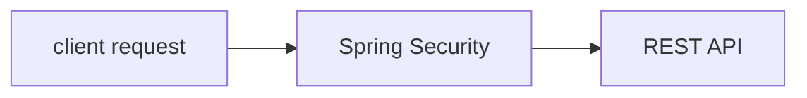
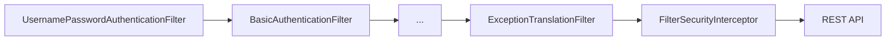
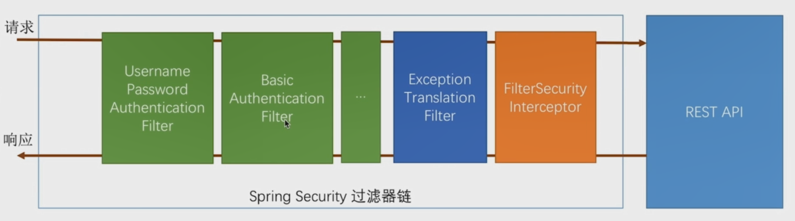

# Spring Security 基本原理

我们以一个问题为引，开始我们今天的主题

> 你开发了`REST API`，为了安全，你集成了`spring Security`。对于来自客户端流量（request）而言，
>
> 你认为`Spring Security`是作为"先锋"将`REST API`保护在后，还是作为“后卫”躲在`REST API`身后？

如下图所示，`Spring Security`是作为"先锋"将`REST API`保护在后



从上图可见，`spring Security`和`REST API`是两个分离的模块，那对于客户端流量而言，到达`spring Security`时，都经历了那些关卡呢？请看下图



上图中我们列出了客户端流量需要经过的关卡，但不够直观，下面我们通过时序图来说明，请求发生时都经历了什么？


```sequence
Title:请求认证过程
client request->UsernamePasswordAuthenticationFilter: 请求访问 GET /hello
UsernamePasswordAuthenticationFilter->UsernamePasswordAuthenticationFilter: 非POST /login \n 不处理
UsernamePasswordAuthenticationFilter->...: 传递给下一个filter 
...->ExceptionTranslationFilter: 传递给下一个filter  
ExceptionTranslationFilter->FilterSecurityInterceptor: 传递给下一个filter 
FilterSecurityInterceptor->FilterSecurityInterceptor:检查是否认证  
FilterSecurityInterceptor->ExceptionTranslationFilter: 未认证，抛出异常
ExceptionTranslationFilter->client request: 未认证，请访问登录页面 POST /login
client request->UsernamePasswordAuthenticationFilter: 访问 POST /login
UsernamePasswordAuthenticationFilter->UsernamePasswordAuthenticationFilter: 校验用户密码
UsernamePasswordAuthenticationFilter->...: 密码正确，允许通过
...->ExceptionTranslationFilter: 传递给下一个filter  
ExceptionTranslationFilter->FilterSecurityInterceptor: 传递给下一个filter
FilterSecurityInterceptor -> REST API: 认证通过，允许访问
```



> 解析：上图我们可以简称为Spring Security 过滤器链。
>
> 1. UsernamePasswordAuthenticationFilter（Form表单验证）
>
> 2. BasicAuthenticationFilter（Http basic 验证）
>
> 3. ...（其他的filter，详见[security filters](https://docs.spring.io/spring-security/site/docs/5.3.1.RELEASE/reference/html5/#servlet-security-filters))
>
> 4. ExceptionTranslationFilter（当第5步认证不通过时，捕获原因并引导用户重新认证）
>
> 5. FilterSecurityInterceptor（通过认证，核对权限）
>
> 6. REST API
>
> 
>注意：第1、2、3步允许开发者定义，第4、5步为spring security 内部指定。

## 编排过滤器链

Spring Boot支持配置过滤器链，步骤如下：

1. 新建SecurityConfig类继承自WebSecurityConfigurerAdapter
2. 使用@Configuration注解装饰SecurityConfig类
3. 重写configure(HttpSecurity http)方法
```java
    @Override
    protected void configure(HttpSecurity http) throws Exception {
        http.formLogin()
                .and()
                .authorizeRequests()
                .anyRequest()
                .authenticated();
    }
```
> http.httpBasic()使用弹框验证

