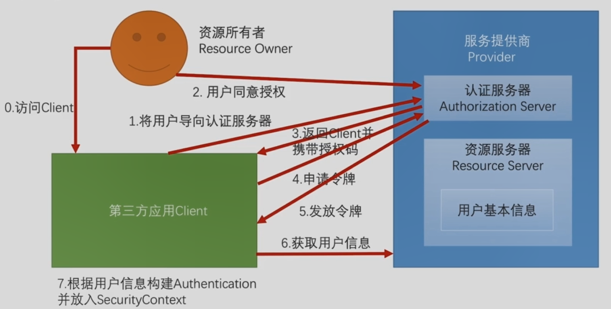
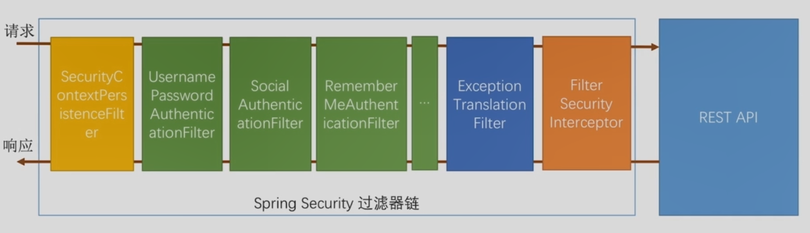
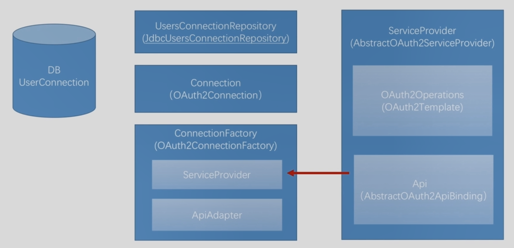
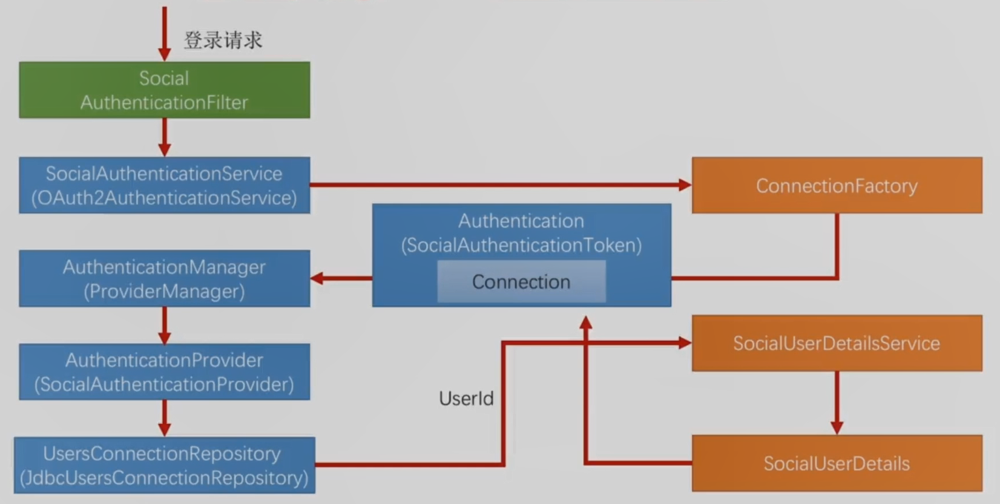

# Spring Social开发第三方登录

## Spring Social基本原理

Spring Social封装以上逻辑，并暴露一个SocialAuthenticationFilter于Spring Security过滤器中，所处位置如下：

## 具体实现

### 与服务提供商相关的实现

- ServiceProvider(AbstracOAuth2ServiceProvider)：服务提供商的抽象，针对每一个服务提供商（比如QQ、微博）都需要一个ServiceProvider的实现
  - OAuth2Operations（OAuth2Template）：封装了Spring Social基本原理中的1-5步
  - Api（AbstractOAuth2ApiBing）：封装了Spring Social基本原理中的第6步

### 与Spring Social基本原理中的第7步相关的实现

- Connection（OAuth2Connection）：用于封装Spring Social基本原理中的前6步完成后获取到的服务提供商用户信息

- ConnectionFactory（OAuth2ConnectionFactiry）：用于创建Connection
  - ServiceProvider：ConnectionFactory所需，完成Spring Social基本原理中的前6步
  - ApiAdapter：ConnectionFactory所需，用于将服务提供商返回的数据转化为标准的Connection数据结构
  
- UserConnectionRepository（JdbcUsersConnectionRepository）：用于操作DB UserConnection表

### 数据库相关

- UserConnection：数据表，用于维护业务用户和服务提供商用户的对应关系

spring  social进行第三方登录时涉及的接口及主要实现类

