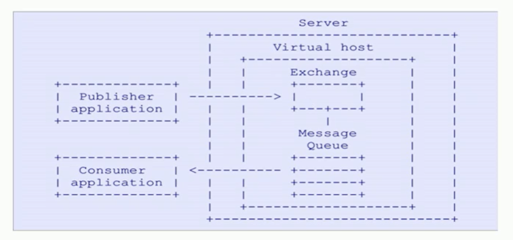

## AMQP协议模型

## AMQP核心概念

- Server：又称Broker，用于接受客户端的连接，实现AMQP实例服务

- Connection：连接，应用程序与Broker的网络连接

- Channel：网络信道，几乎所有的操作都在Channel中进行，Channel是进行消息读写的通道。客户端可建立多个Channel，每个Channel代表一个会话任务。

- Message：消息，服务器和应用程序之间传送的数据，由Properties和Body组成。**Properties**可以对消息进行修饰，比如**消息的优先级**、**延迟**等高级特性；**Body**则就是**消息体内容**。

- Virtual host：虚拟地址，用于进行逻辑隔离，最上层的消息路由。一个Virtual Host里面可以有若干个Exchange和Queue，同一个Virtual Host里面不能有相同名称的Exchange或Queue
- Exchange：交换机，**接受消息**，**根据路由键转发消息到绑定的队列**
- Binding：Exchange和Queue之间的虚拟连接，binding中包含routing key
- Routing key：一个路由规则，虚拟机可用它来确定如何路由一个特定信息
- Queue：也称为Message Queue，消息队列，**保存消息**并将它们**转发给消费者**