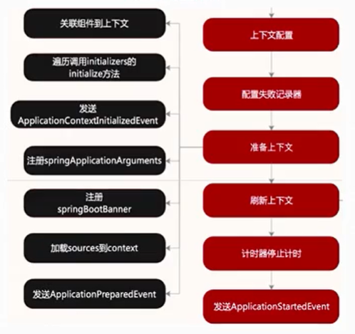
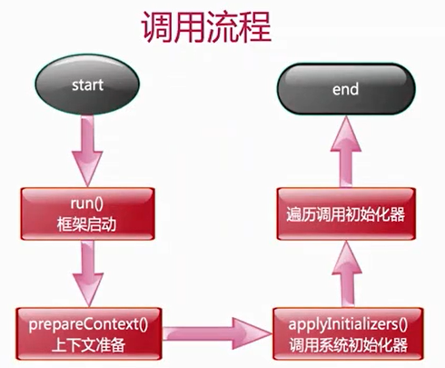
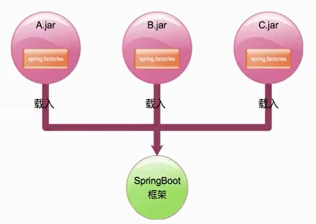
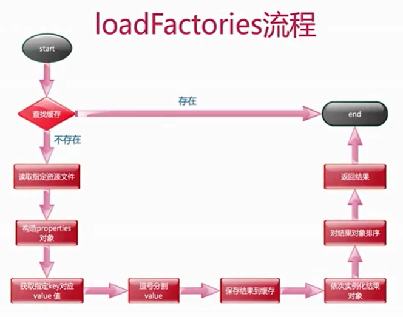

初始化器是什么？

为什么要有初始化器？

何时调用初始化器？

谁调用初始化器？

在哪调用初始化器？

初始化器是如何实现的？

## 系统初始化器介绍

一:类名:ApplicationContextInitializer

二:介绍:Spring容器刷新之前执行的一个回调函数

三:作用:向SpringBoot容器中**注册属性**

四:使用:继承接口自定义实现

## 初始化器的使用方式

### 实现方式一

- 实现ApplicationContextInitializer接口

- spring.factories内填写接口实现

  key值为org.springframework.context.ApplicationContextInitializer

### 实现方式二

—:实现ApplicationContextInitializer接口

二:SpringApplication类初始后设置进去

### 实现方式三

一:实现ApplicationContextInitializer接口

二:application.properties内填写接口实现

三:key值为context.initializer.classes

TIPS

- 都要实现ApplicationContextInitializer接口
- Order值越小越先执行
- application.properties中定义的优先于其它方式

## 作用

- 上下文刷新即refresh方法前调用
- 用来编码设置一些属性变量通常用在web环境中
- 可以通过order接口进行排序

## 初始化器的调用流程

## 实现原理

- 定义在spring.factories文件中被SpringFactoriesLoader发现注册
- SpringApplication初始化完毕后手动添加
- 定义成环境变量被DelegatingApplicationContextInitializer发现注册

## SpringFactoriesLoader介绍

一:框架内部使用的通用工厂加载机制

二:从classpath下多个jar包特定的位置读取文件并初始化类

三:文件内容必须是kv形式，即properties类型

四:key是全限定名(抽象类|接口)、value是实现，多个实现用,分隔

### SpringFactoriesLoader作用

SpringBoot框架中从类路径jar包中读取特定文件实现扩展类的载入

### SpringFactoriesLoader核心逻辑

## 课后问题

- 介绍下SpringFactoriesLoader ?
- SpringFactoriesLoader如何加载工厂类?
- 系统初始化器的作用?
- 系统初始化器调用时机?
- 如何自定义实现系统初始化器?
- 自定义实现系统初始化器有哪些注意事项?