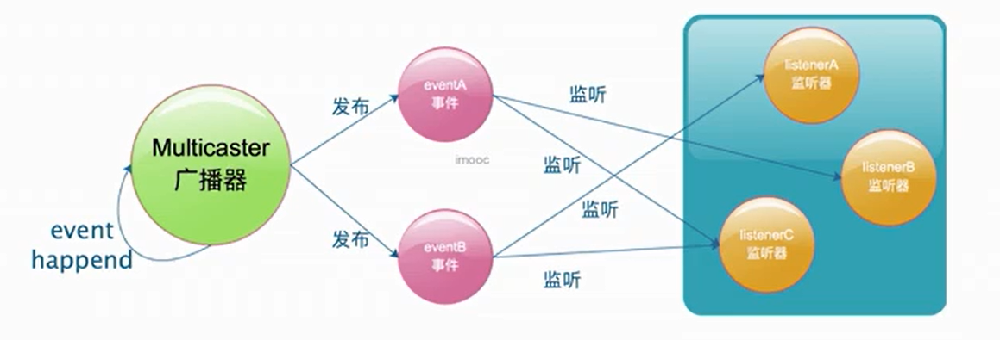
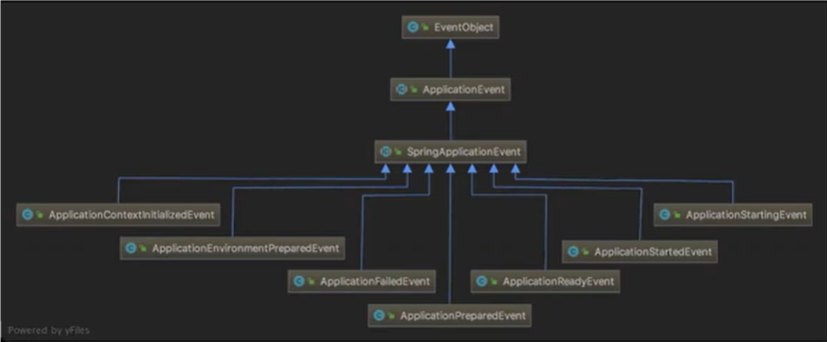
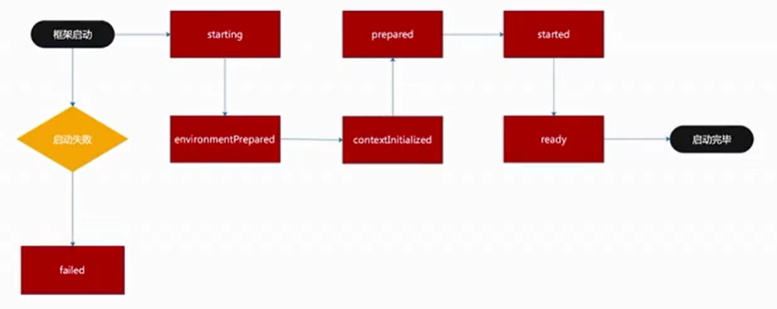
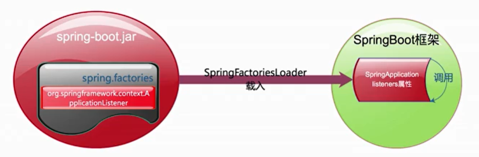
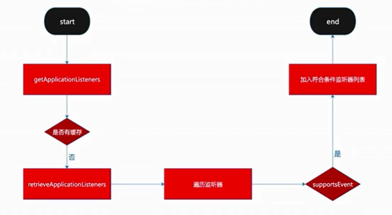
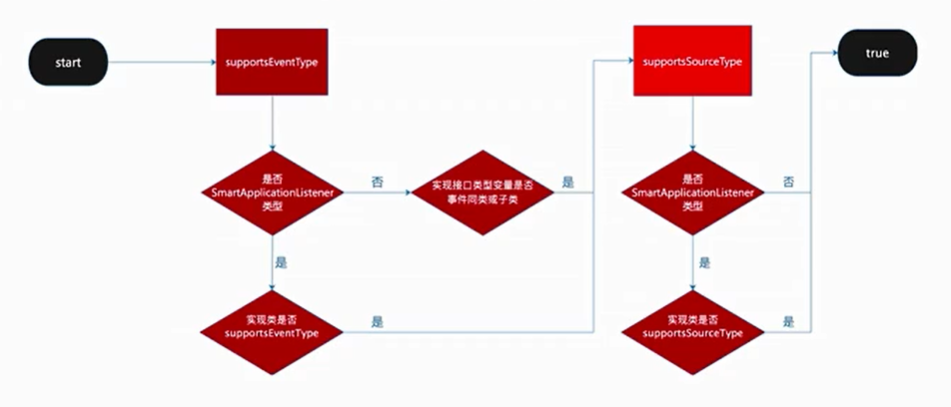

监听器是什么？

为什么要有监听器？

何时调用监听器？

谁调用监听器？

在哪调用监听器？

监听器是如何实现的？

## 监听器模式介绍

## 监听器模式要素

- 事件
- 监听器
- 广播器
- 触发机制

## SpringBoot中监听器的实现

### 监听器

请查看源码：ApplicationListener

###  广播器

请查看源码：ApplicationEventMulticaster

### 事件

#### 系统事件介绍

#### 事件发送顺序

推荐查看`org.springframework.boot.SpringApplicationRunListener`，通过`SpringApplicationRunListener`做到逻辑的对外隔离

### 监听事件触发机制

#### 监听器注册

#### 获取监听器列表

#### 通用触发条件

## 自定义监听器

### 实现方式一

一:实现ApplicationListener接口

二:spring.factories内填写接口实现

三:key值为org.springframework.context.ApplicationListener

### 实现方式二

一:实现ApplicationListener接口

二:SpringApplication类初始后设置进去

### 实现方式三

一:实现ApplicationListener接口

二:application.properties内填写接口实现

三:key值为context.listener.classes

### 实现方式四

一:实现SmartApplicationListener接口

二:重写supportsEventType方法

三:同前三种注入方式注入框架

### TIPS

实现ApplicationListener接口针对单一事件监听

实现SmartApplicationListener接口针对多种事件监听

Order值越小越先执行

application.properties中定义的优于其它方式

## 课后问题

- 介绍下监听器模式?
- SpringBoot关于监听器相关的实现类有哪些?
- SpringBoot框架有哪些框架事件以及它们的顺序?

- 介绍下监听事件触发机制?
- 如何自定义实现系统监听器及注意事项?
- 实现ApplicationListener接口与SmartApplicationListener接口区别?