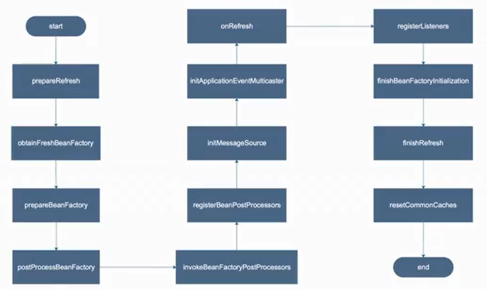
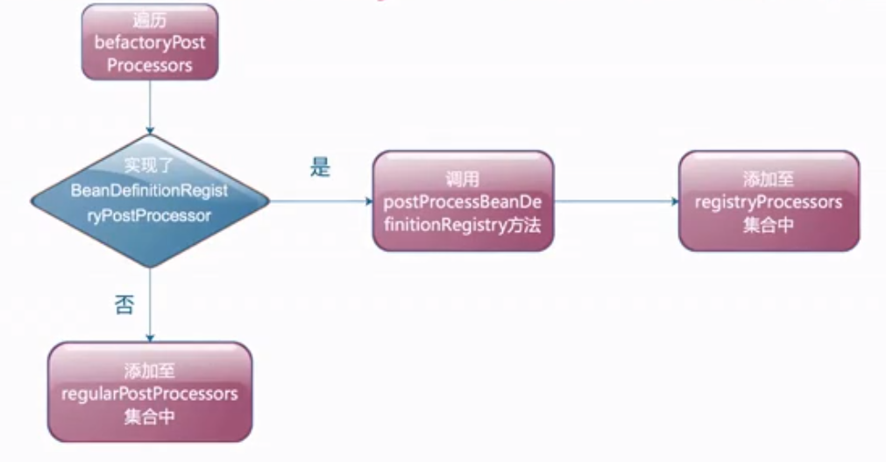
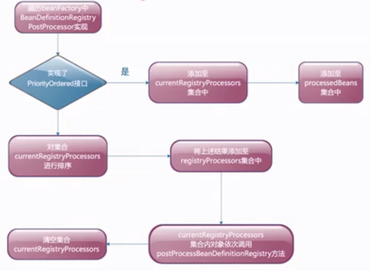
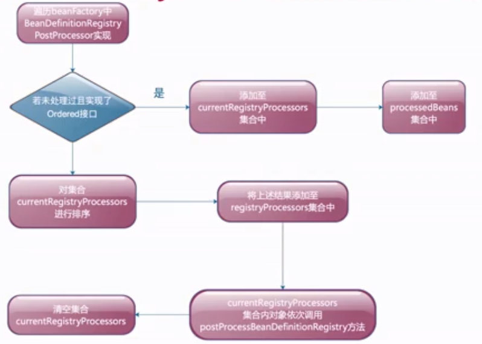
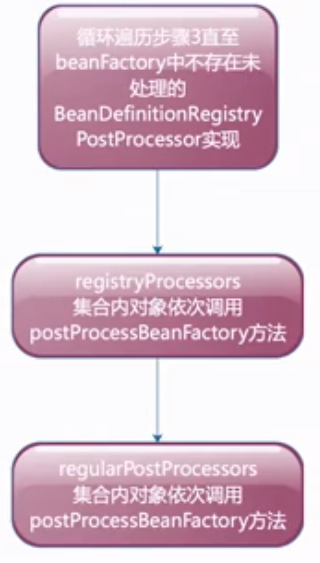
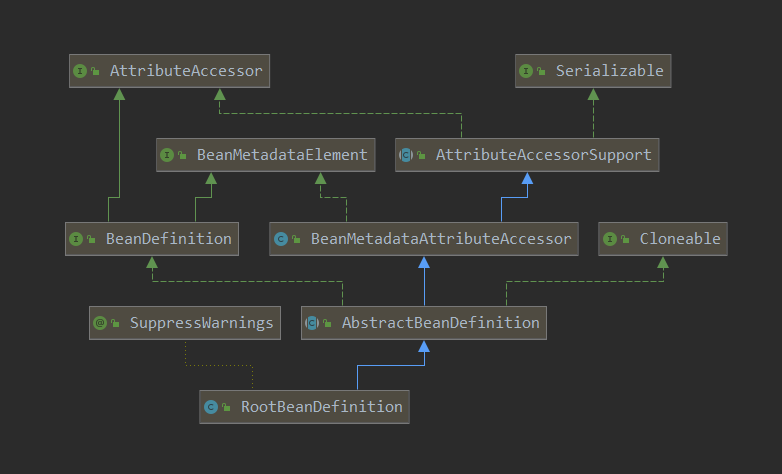
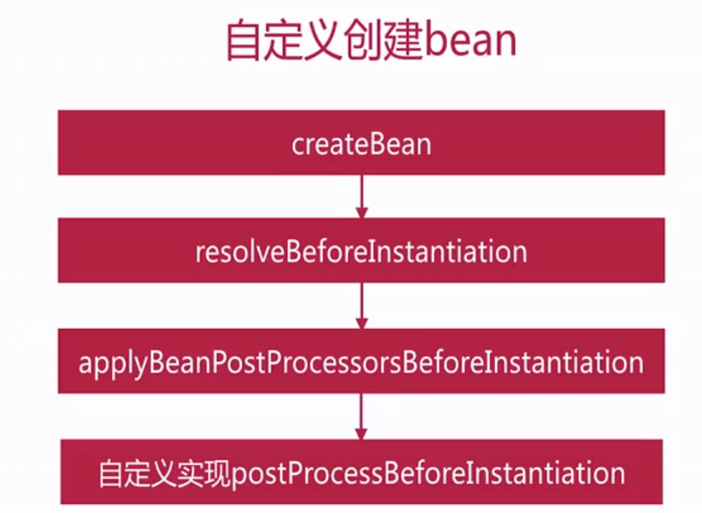
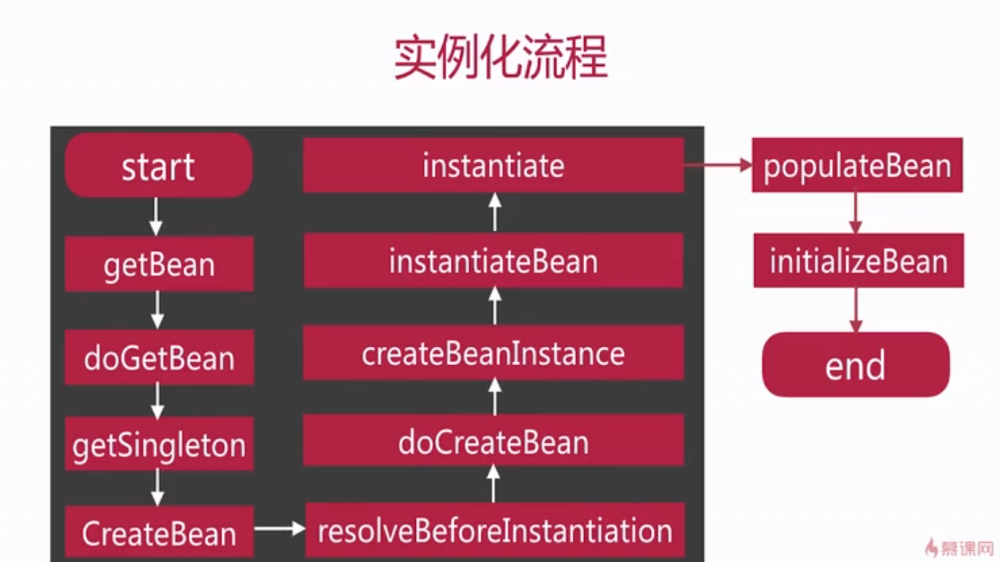

## Bean的配置方式

### xml方式配置bean介绍

配置方式

- 一:无参构造
- 二:有参构造
- 三:静态工厂方法
- 四:实例工厂方法

> 请自行编码验证以上配置方式

### 注解方式配置bean

配置方式

- 一:@Component声明

- 二:**配置类**中使用**@Bean**
- 三:实现FactoryBean

- 四:实现BeanDefinitionRegistryPostProcessor

- 五:实现ImportBeanDefinitionRegistrar

> 请自行编码验证以上配置方式

## refresh方法解析

### 方法简介
—:bean配置读取加载入口
二:spring框架启动流程
三:面试重点

### 方法步骤

### prepareRefresh

- 容器状态设置
- 初始化属性设置
- 检查**必备**属性是否存在

### obtainFreshBeanFactory

- 设置beanFactory序列化id
- 获取beanFactory

### prepareBeanFactory

- 设置beanFactory一些属性
- 添加后置处理器
- 设置忽略的自动装配接口
- 注册一些组件

### postProcessBeanFactory

子类重写以在BeanFactory完成创建后做进一步设置

### invokeBeanFactoryPostProcessors

- 调用BeanDefinitionRegistryPostProcessor实现向容器内**添加bean的定义**
- 调用BeanFactoryPostProcessor实现向容器**内bean的定义的添加属性**

步骤1

步骤2

步骤3

步骤4

### registerBeanPostProcessors

- 找到BeanPostProcessor的实现
- 排序后注册进容器内

### initMessageSource

- 初始化**国际化**相关属性

### initApplicationEventMulticaster

- 初始化事件广播器

### onRefresh

- 创建web容器

### registerListeners

- 添加容器内事件监听器至事件广播器中
- 派发早期事件

### finishBeanFactoryInitialization

- 初始化所有剩下的单实例bean

### finishRefresh

- 初始化生命周期处理器
- 调用生命周期处理器onRefresh方法
- 发布ContextRefreshedEvent事件
- JMX相关处理

## Bean实例化解析

BeanDefinition介绍

- 一个对象在Spring中描述，RootBeanDefinition是其常见实现

- 通过操作BeanDefinition来完成bean实例化和属性注入

## 课后问题

- 介绍一下ioc思想?
- springboot中bean有哪几种配置方式分别介绍下?
- bean的配置你喜欢哪种方式?
- 介绍下refresh方法流程?
- 请介绍一个refresh中你比较熟悉的方法说出其作用?
- 介绍下bean实例化的流程?
-  说几个bean实例化的扩展点及其作用?

 