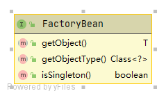

# FactoryBean

FactoryBean是一个接口，要求其实现类提供用于生成Bean的逻辑。一般用于生成复杂Bean，生成简单Bean使用FactoryBean有点“杀鸡用牛刀”之感。

BeanFactory类图如下：



- getObject() ：获取Bean的实例。
- getObjectType() ：获取生成的Bean类型。
- isSingleton()：指定生成的bean是否单例。默认单例。 

> 扩展知识：
>
> 尽管FactoryBean实例用于生成Bean，但FactoryBean实例本身在Spring容器中同样以Bean的形式存在。
>
> 通过“BeanName”可以获取到生成的Bean实例，而通过“&BeanName”的形式可以获取FactoryBean实例。这部分将在演示中为你说明。

## 演示-FactoryBean使用

假设：待将如下用户类交给Spring容器管理（自嘲：杀鸡用牛刀）

com.moluo.demo.entity.User

```java
/**
 * 用户类
 */
public class User {
}
```

按照如下步骤即可。

### 实现步骤

1. 实现FactoryBean接口

   com.moluo.demo.entity.UserFactoryBean

   ```java
   import org.springframework.beans.factory.FactoryBean;
   
   /**
    * 用户FactoryBean
    */
   public class UserFactoryBean implements FactoryBean<User> {
   
   	@Override
   	public User getObject() throws Exception {
           // 一般是复制对象的构建逻辑
   		return new User();
   	}
   
   	@Override
   	public Class<?> getObjectType() {
   		return User.class;
   	}
   
   }
   ```

2. 添加配置。（你可使用xml或注解配置，这里使用xml配置）

   resources\spring-config.xml

   ```xml
   <?xml version="1.0" encoding="UTF-8"?>
   <beans xmlns="http://www.springframework.org/schema/beans"
          xmlns:xsi="http://www.w3.org/2001/XMLSchema-instance"
          xsi:schemaLocation="http://www.springframework.org/schema/beans http://www.springframework.org/schema/beans/spring-beans.xsd">
   
       <!--  使用FactoryBean创建Bean  -->
   	<bean id="user" class="com.moluo.demo.entity.UserFactoryBean" />
   
   </beans>
   ```

3. 获取生成的Bean实例和FactoryBean实例

   com.moluo.demo.DemoApplication

   ```java
   public class DemoApplication {
   
   	public static void main(String[] args) {
   		ApplicationContext applicationContext = new FileSystemXmlApplicationContext("spring-config.xml的地址");
           // 获取通过FactoryBean创建的Bean实例
   		System.out.println("Bean实例: " + applicationContext.getBean("user"));
           // 获取FactoryBean实例，在Bean名称前加"&"
   		System.out.println("FactoryBean实例: " + applicationContext.getBean(BeanFactory.FACTORY_BEAN_PREFIX + "user"));
   	}
   }
   ```

   运行结果如下：

   ```java
   Bean实例: com.moluo.demo.entity.User@3c0ecd4b
   FactoryBean实例: com.moluo.demo.entity.UserFactoryBean@14bf9759
   ```

