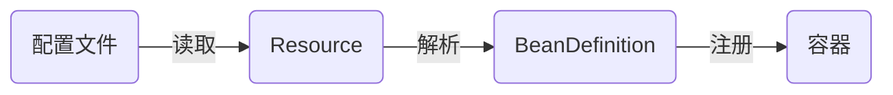
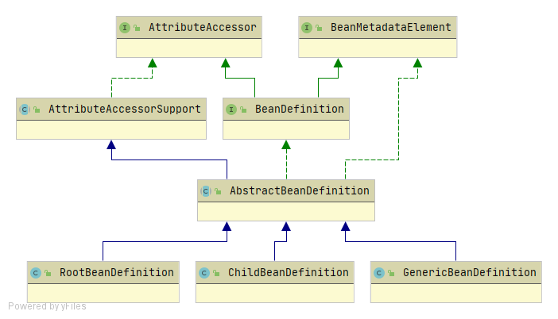
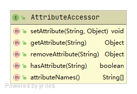
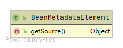

# BeanDefinition

## 简要介绍 

BeanDefinition用于描述bean实例，其中包含bean的属性值信息、构造函数参数信息和Bean相关的其他信息

spring容器初始下流程图如下：



spring容器管理Bean的生命周期，不需要在原来的Java类上添加任何额外的限制，对Java对象的控制方式体现在 `配置`（可能是xml配置或注解配置）上。

根据 `配置` ，生成用来描述Bean的BeanDefinition。

## BeanDefinition架构成员



### AttributeAccessor



一个提供Attribute的增删查功能的接口

何为Attribute？在AttributeAccessor中的实现类org.springframework.core.AttributeAccessorSupport中发现，Attribute本质只是一个键值对

```java
public abstract class AttributeAccessorSupport implements AttributeAccessor, Serializable {

	/** Map with String keys and Object values. */
	private final Map<String, Object> attributes = new LinkedHashMap<>();
    
    ...

}
```

用于存放BeanDefinition的一些属性，类似扩展字段。常见的使用地方如下：

org.springframework.beans.factory.annotation.RequiredAnnotationBeanPostProcessor#shouldSkip

```java
	/**
	 * Check whether the given bean definition is not subject to the annotation-based
	 * required property check as performed by this post-processor.
	 * <p>The default implementations check for the presence of the
	 * {@link #SKIP_REQUIRED_CHECK_ATTRIBUTE} attribute in the bean definition, if any.
	 * It also suggests skipping in case of a bean definition with a "factory-bean"
	 * reference set, assuming that instance-based factories pre-populate the bean.
	 * @param beanFactory the BeanFactory to check against
	 * @param beanName the name of the bean to check against
	 * @return {@code true} to skip the bean; {@code false} to process it
	 */
	protected boolean shouldSkip(@Nullable ConfigurableListableBeanFactory beanFactory, String beanName) {
		if (beanFactory == null || !beanFactory.containsBeanDefinition(beanName)) {
			return false;
		}
		BeanDefinition beanDefinition = beanFactory.getBeanDefinition(beanName);
		if (beanDefinition.getFactoryBeanName() != null) {
			return true;
		}
		Object value = beanDefinition.getAttribute(SKIP_REQUIRED_CHECK_ATTRIBUTE);
		return (value != null && (Boolean.TRUE.equals(value) || Boolean.parseBoolean(value.toString())));
	}
```

org.springframework.aop.framework.autoproxy.AutoProxyUtils#shouldProxyTargetClass

```java
	/**
	 * Determine whether the given bean should be proxied with its target
	 * class rather than its interfaces. Checks the
	 * {@link #PRESERVE_TARGET_CLASS_ATTRIBUTE "preserveTargetClass" attribute}
	 * of the corresponding bean definition.
	 * @param beanFactory the containing ConfigurableListableBeanFactory
	 * @param beanName the name of the bean
	 * @return whether the given bean should be proxied with its target class
	 */
	public static boolean shouldProxyTargetClass(
			ConfigurableListableBeanFactory beanFactory, @Nullable String beanName) {

		if (beanName != null && beanFactory.containsBeanDefinition(beanName)) {
			BeanDefinition bd = beanFactory.getBeanDefinition(beanName);
			return Boolean.TRUE.equals(bd.getAttribute(PRESERVE_TARGET_CLASS_ATTRIBUTE));
		}
		return false;
	}
```


### BeanMetadataElement



该接口，仅有一个getSource()方法，用于返回Bean的源

何为源？经测试发现，源即Bean的.class文件。详情如下：

```java
@Configuration
@ComponentScan("com.moluo")
public class DemoApplication {
	public static void main(String[] args) {
		AnnotationConfigApplicationContext  applicationContext = new AnnotationConfigApplicationContext (DemoApplication.class);
		BeanDefinition beanDefinition = applicationContext.getBeanDefinition("welcomeService");
        // 打印beanDefinition Source
		System.out.println("beanDefinitionSource:" + beanDefinition.getSource());
	}
}
```

```bash
beanDefinitionSource:file [D:\user\project\java\spring-framework\spring-demo\build\classes\java\main\com\moluo\demo\service\impl\WelcomeServiceImpl.class]
```


### BeanDefinition

BeanDefinition中包含了生成bean的信息。除了Bean的名称、Bean的属性等信息外，常用的属性有：

- 作用范围scope(@Scope)。可选择值：singleton、prototype、request、session、globalsession
- 懒加载lazy-init(@lazy)：决定Bean实例是否延迟加载
- 首选primary（@Primary）：设置为true的bean会是优先的实现类
- factory-bean和factory-method（@Configuration和@Bean）

### RootBeanDefinition

BeanDefinition之间可以存在父子关系。RootBeanDefinition可以作为普通的BeanDefinition或父BeanDefinition，但不能作为子BeanDefinition，否则会报错，源码如下：

org.springframework.beans.factory.support.RootBeanDefinition#setParentName

```java
	@Override
	public void setParentName(@Nullable String parentName) {
		if (parentName != null) {
			throw new IllegalArgumentException("Root bean cannot be changed into a child bean with parent reference");
		}
	}
```

在生成Bean之前，需要合并多个BeanDefinition，而RootBeanDefinition用于承载合并后的BeanDefinition

```java
	private String[] doGetBeanNamesForType(ResolvableType type, boolean includeNonSingletons, boolean allowEagerInit) {
		List<String> result = new ArrayList<>();

		// Check all bean definitions.
		for (String beanName : this.beanDefinitionNames) {
			// Only consider bean as eligible if the bean name is not defined as alias for some other bean.
			if (!isAlias(beanName)) {
				try {
                    // 注意点：RootBeanDefinition用于承载合并后的BeanDefinition
					RootBeanDefinition mbd = getMergedLocalBeanDefinition(beanName); 
                    ...
    }}}}
```

> 提示：spring2.5后Spring推荐使用新的GenericBeanDefinition，代替RootBeanDefinition及ChildBeanDefinition

### ChildBeanDefinition
已完全被GenericBeanDefinitio取代。无需了解

### GenericBeanDefinitio

spring2.5后，注册bean首选的是GenericBeanDefinition，作为RootBeanDefinition与ChildBeanDefinition的替代品。