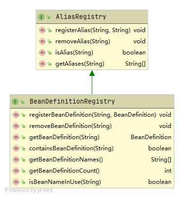

# BeanDefinitionRegistry

BeanDefinitionRegistry接口的类图如下：



​	BeanDefinitionRegistry接口要求其实现类提供以下能力：

1. 别名相关操作。别名的增删查操作
2. BeanDefinition相关操作。BeanDefinition的增删查操作

## BeanDefinitionRegistry架构体系


### DefaultListableBeanFactory

DefaultListableBeanFactory是第一个可以独立运行的IOC容器。同时实现了BeanFactory接口和BeanDefinitionRegistry接口，实现了其接口要求的能力。

与BeanDefinitionRegistry相关的核心方法为registerBeanDefinition()

```java
	@Override
	public void registerBeanDefinition(String beanName, BeanDefinition beanDefinition)
			throws BeanDefinitionStoreException {

		Assert.hasText(beanName, "Bean name must not be empty");
		Assert.notNull(beanDefinition, "BeanDefinition must not be null");

		if (beanDefinition instanceof AbstractBeanDefinition) {
			try {
				((AbstractBeanDefinition) beanDefinition).validate();
			}
			catch (BeanDefinitionValidationException ex) {
				throw new BeanDefinitionStoreException(beanDefinition.getResourceDescription(), beanName,
						"Validation of bean definition failed", ex);
			}
		}

		BeanDefinition existingDefinition = this.beanDefinitionMap.get(beanName);
		if (existingDefinition != null) {
			if (!isAllowBeanDefinitionOverriding()) {
				throw new BeanDefinitionOverrideException(beanName, beanDefinition, existingDefinition);
			}
			...
			this.beanDefinitionMap.put(beanName, beanDefinition);
		}
		else {
			if (hasBeanCreationStarted()) {
				// Cannot modify startup-time collection elements anymore (for stable iteration)
				synchronized (this.beanDefinitionMap) {
					this.beanDefinitionMap.put(beanName, beanDefinition);
					List<String> updatedDefinitions = new ArrayList<>(this.beanDefinitionNames.size() + 1);
					updatedDefinitions.addAll(this.beanDefinitionNames);
					updatedDefinitions.add(beanName);
					this.beanDefinitionNames = updatedDefinitions;
					removeManualSingletonName(beanName);
				}
			}
			else {
				// Still in startup registration phase
				this.beanDefinitionMap.put(beanName, beanDefinition);
				this.beanDefinitionNames.add(beanName);
				removeManualSingletonName(beanName);
			}
			this.frozenBeanDefinitionNames = null;
		}

		if (existingDefinition != null || containsSingleton(beanName)) {
			resetBeanDefinition(beanName);
		}
		else if (isConfigurationFrozen()) {
			clearByTypeCache();
		}
	}
```

### GenericApplicationContext

GenericApplicationContext可以采用混合方式处理bean的定义，可分别通过xml、properties等方式来创建bean。官方示例代码如下：

```java
GenericApplicationContext ctx = new GenericApplicationContext();

XmlBeanDefinitionReader xmlReader = new XmlBeanDefinitionReader(ctx);
xmlReader.loadBeanDefinitions(new ClassPathResource("applicationContext.xml"));

PropertiesBeanDefinitionReader propReader = new PropertiesBeanDefinitionReader(ctx);
propReader.loadBeanDefinitions(new ClassPathResource("otherBeans.properties"));

// refresh 只能调用一次
ctx.refresh();
  
MyBean myBean = (MyBean) ctx.getBean("myBean");
```

不过这并不是本章的重点，让我们回到BeanDefinitionRegistry上。GenericApplicationContext并未自行实现BeanDefinitionRegistry的相关能力，而是引用了DefaultListableBeanFactory的能力，相关源码如下：

```java
public class GenericApplicationContext extends AbstractApplicationContext implements BeanDefinitionRegistry {

	private final DefaultListableBeanFactory beanFactory;
    
    ...
    
    @Override
	public void registerBeanDefinition(String beanName, BeanDefinition beanDefinition)
			throws BeanDefinitionStoreException {

		this.beanFactory.registerBeanDefinition(beanName, beanDefinition);
	}

	@Override
	public void removeBeanDefinition(String beanName) throws NoSuchBeanDefinitionException {
		this.beanFactory.removeBeanDefinition(beanName);
	}

	@Override
	public BeanDefinition getBeanDefinition(String beanName) throws NoSuchBeanDefinitionException {
		return this.beanFactory.getBeanDefinition(beanName);
	}
    
    ...
}
```

### AnnotationConfigApplicationContext

AnnotationConfigApplicationContext目前比较流行的基于注解的容器，与传统的基于XML配置的经典容器（如：FileSystemXmlApplicationContext）一样名声在外。其BeanDefinitionRegistry的能力继承自GenericApplicationContext，本身并未自定义。

AnnotationConfigApplicationContext类图如下：

