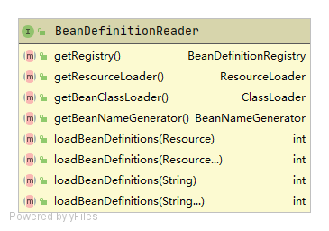
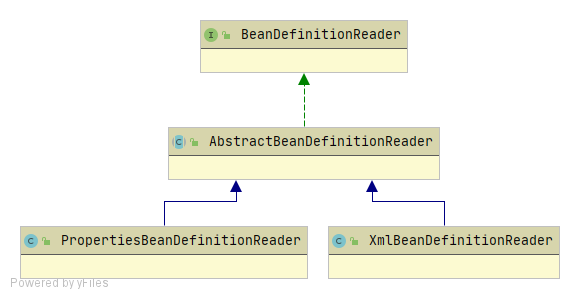
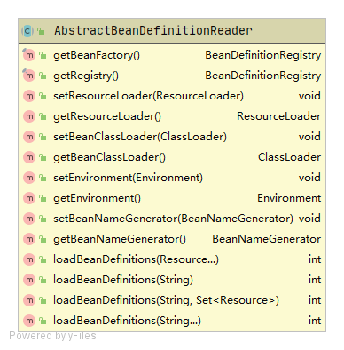
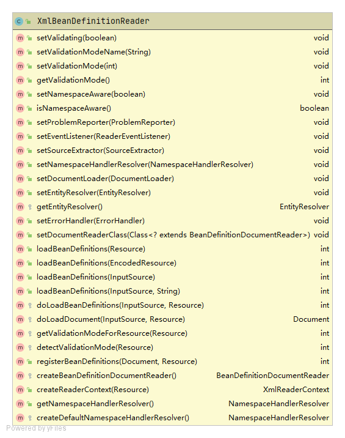

# BeanDefinitionReader

BeanDefinitionReader用于从资源中加载BeanDefinition并将BeanDefinition注册到BeanDefinitionRegistry中

BeanDefinitionReader的接口的类图如下：



​	BeanDefinitionReader接口要求其实现类提供以下能力：

1. 加载BeanDefinition
2. 获取BeanDefinitionRegistry、资源加载器、Bean类加载器、Bean名称生成器

## BeanDefinitionReader的体系结构



### AbstractBeanDefinitionReader

AbstractBeanDefinitionReader包含各BeanDefinitionReader实现类的公共逻辑

AbstractBeanDefinitionReader的类图如下：



核心方法为loadBeanDefinitions()。源码如下：

```java
	/**
	 * Load bean definitions from the specified resource location.
	 * <p>The location can also be a location pattern, provided that the
	 * ResourceLoader of this bean definition reader is a ResourcePatternResolver.
	 * @param location the resource location, to be loaded with the ResourceLoader
	 * (or ResourcePatternResolver) of this bean definition reader
	 * @param actualResources a Set to be filled with the actual Resource objects
	 * that have been resolved during the loading process. May be {@code null}
	 * to indicate that the caller is not interested in those Resource objects.
	 * @return the number of bean definitions found
	 * @throws BeanDefinitionStoreException in case of loading or parsing errors
	 * @see #getResourceLoader()
	 * @see #loadBeanDefinitions(org.springframework.core.io.Resource)
	 * @see #loadBeanDefinitions(org.springframework.core.io.Resource[])
	 */
	public int loadBeanDefinitions(String location, @Nullable Set<Resource> actualResources) throws BeanDefinitionStoreException {
		ResourceLoader resourceLoader = getResourceLoader();
		if (resourceLoader == null) {
			throw new BeanDefinitionStoreException(
					"Cannot load bean definitions from location [" + location + "]: no ResourceLoader available");
		}

		if (resourceLoader instanceof ResourcePatternResolver) {
			// Resource pattern matching available.
			try {
				Resource[] resources = ((ResourcePatternResolver) resourceLoader).getResources(location);
				int count = loadBeanDefinitions(resources);  // 注意点：由子类实现
				if (actualResources != null) {
					Collections.addAll(actualResources, resources);
				}
				if (logger.isTraceEnabled()) {
					logger.trace("Loaded " + count + " bean definitions from location pattern [" + location + "]");
				}
				return count;
			}
			catch (IOException ex) {
				throw new BeanDefinitionStoreException(
						"Could not resolve bean definition resource pattern [" + location + "]", ex);
			}
		}
		else {
			// Can only load single resources by absolute URL.
			Resource resource = resourceLoader.getResource(location);
			int count = loadBeanDefinitions(resource); // 注意点：由子类实现
			if (actualResources != null) {
				actualResources.add(resource);
			}
			if (logger.isTraceEnabled()) {
				logger.trace("Loaded " + count + " bean definitions from location [" + location + "]");
			}
			return count;
		}
	}
```

AbstractBeanDefinitionReader的loadBeanDefinitions()方法主要是加载BeanDefinitions的公共逻辑，包括：

- 通过location获取Resource。

真正加载BeanDefinition的动作是由其子类（如XmlBeanDefinitionReader）实现。

### XmlBeanDefinitionReader

XmlBeanDefinitionReader用于从xml格式的资源中解析并加载BeanDefinition。

XmlBeanDefinitionReader的类图如下：



其中核心方式是doLoadBeanDefinitions()。定义了使用xml格式定义的BeanDefinition加载过程。流程如下：


流程相关源码图下：

```java
	/**
	 * Actually load bean definitions from the specified XML file.
	 * @param inputSource the SAX InputSource to read from
	 * @param resource the resource descriptor for the XML file
	 * @return the number of bean definitions found
	 * @throws BeanDefinitionStoreException in case of loading or parsing errors
	 * @see #doLoadDocument
	 * @see #registerBeanDefinitions
	 */
	protected int doLoadBeanDefinitions(InputSource inputSource, Resource resource)
			throws BeanDefinitionStoreException {

		try {
			Document doc = doLoadDocument(inputSource, resource); // 先从resource加载Document。说明：解析xml格式一般都会使用到Document，Document由第三方库提供支持
			int count = registerBeanDefinitions(doc, resource); // 注册BeanDefinition
			if (logger.isDebugEnabled()) {
				logger.debug("Loaded " + count + " bean definitions from " + resource);
			}
			return count;
		}
		catch (BeanDefinitionStoreException ex) {
			throw ex;
		}
		catch (SAXParseException ex) {
			throw new XmlBeanDefinitionStoreException(resource.getDescription(),
					"Line " + ex.getLineNumber() + " in XML document from " + resource + " is invalid", ex);
		}
		catch (SAXException ex) {
			throw new XmlBeanDefinitionStoreException(resource.getDescription(),
					"XML document from " + resource + " is invalid", ex);
		}
		catch (ParserConfigurationException ex) {
			throw new BeanDefinitionStoreException(resource.getDescription(),
					"Parser configuration exception parsing XML from " + resource, ex);
		}
		catch (IOException ex) {
			throw new BeanDefinitionStoreException(resource.getDescription(),
					"IOException parsing XML document from " + resource, ex);
		}
		catch (Throwable ex) {
			throw new BeanDefinitionStoreException(resource.getDescription(),
					"Unexpected exception parsing XML document from " + resource, ex);
		}
	}
```

registerBeanDefinitions()源码：

```java
	/**
	 * Register the bean definitions contained in the given DOM document.
	 * Called by {@code loadBeanDefinitions}.
	 * <p>Creates a new instance of the parser class and invokes
	 * {@code registerBeanDefinitions} on it.
	 * @param doc the DOM document
	 * @param resource the resource descriptor (for context information)
	 * @return the number of bean definitions found
	 * @throws BeanDefinitionStoreException in case of parsing errors
	 * @see #loadBeanDefinitions
	 * @see #setDocumentReaderClass
	 * @see BeanDefinitionDocumentReader#registerBeanDefinitions
	 */
	public int registerBeanDefinitions(Document doc, Resource resource) throws BeanDefinitionStoreException {
		BeanDefinitionDocumentReader documentReader = createBeanDefinitionDocumentReader();
		int countBefore = getRegistry().getBeanDefinitionCount();
		documentReader.registerBeanDefinitions(doc, createReaderContext(resource));
		return getRegistry().getBeanDefinitionCount() - countBefore;
	}
```