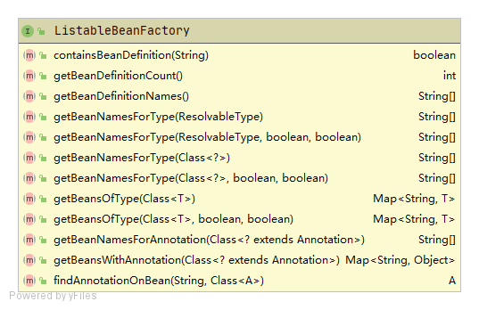

# BeanFactory

Spring IOC容器是一个管理Bean的容器，在Spring的定义中，它要求所有的IOC容器都需要实现接口BeanFactory

BeanFactory是Spring IOC容器的根接口，其定义了Bean工厂所需的最基本功能特性。Spring中生成的Bean都是BeanFactory的实现类来管理的。

如BeanFactory的类图所示：


BeanFactory要求容器具备以下能力：

1. 通过Bean的名称、类型获取bean实例
2. 获取Bean的基本信息。包括bean的类型、bean的别名、是否单例、Bean的提供器等
3. 提供基本的工具方法。如：判断容器中是否包含bean、判断bean的类型是否匹配等

## BeanFactory架构体系


### ListableBeanFactory

该接口要求子类提供获取Bean相关列表的信息

ListableBeanFactory的类图如下：



ListableBeanFactory要求容器具备以下能力：

1. 获取BeanDefinition相关信息。包括BeanDefinition数量、BeanDefinition名称列表、是否包括指定Bean的BeanDefinition
2. 获取Bean列表。通过类型或注解获取Bean列表
3. 获取Bean名称列表。通过类型或注解获取Bean名称列表
4. 获取Bean上的注解列表。

### HierarchicalBeanFactory

通过该接口可实现BeanFactory之间的父子关系

HierarchicalBeanFactory类图如下：


### AutowireCapableBeanFactory

在深入了解AutowireCapableBeanFactory之前，让我们先看一段AutowireCapableBeanFactory上的注释

> ```
> Note that this interface is not implemented by {@link org.springframework.context.ApplicationContext} facades, as it is hardly ever used by application code.
> ```

注释中写道：AutowireCapableBeanFactory接口并未被ApplicationContext实现，在应用代码中我们也几乎不会使用到它。

为什么“在应用代码中我们也几乎不会使用到它”？因为AutowireCapableBeanFactory的服务对象并不是已受到Spring框架的管理的对象，而是未受Spring管理的对象。一般用于**为第三方框架赋能**。

AutowireCapableBeanFactory类图如下：


使用方式演示：

假设存在未受到spring管理的第三方User类，想使用Spring的自动装配功能。

```java
public class User {

   private WelcomeService welcomeService;

   public WelcomeService getWelcomeService() {
      return welcomeService;
   }

   public void setWelcomeService(WelcomeService welcomeService) {
      this.welcomeService = welcomeService;
   }
}
```

我们可以尝试这样做

```java
public class DemoApplication {

	public static void main(String[] args) {

		ApplicationContext applicationContext = new FileSystemXmlApplicationContext("spring-config.xml");

        // 通过AutowireCapableBeanFactory创建Bean，注意该Bean并不受spring管理哦，之后我们会证明
		AutowireCapableBeanFactory autowireCapableBeanFactory = applicationContext.getAutowireCapableBeanFactory();
		User user = (User) autowireCapableBeanFactory.createBean(User.class, AutowireCapableBeanFactory.AUTOWIRE_BY_TYPE, false);
        // 调用WelcomeService，能正常打印，说明自动装配WelcomeService成功
		WelcomeService welcomeService = user.getWelcomeService();
		welcomeService.say("hello world");

		// 从ApplicationContext获取Bean抛出异常NoSuchBeanDefinitionException
		// 能佐证：我们的Bean并没交给Spring容器管理，它只是帮我们创建好了，并把对应属性注入进去了
		User bean = applicationContext.getBean(User.class);
		System.out.println(bean);
	}
}
```

```java
say: hello world
Exception in thread "main" org.springframework.beans.factory.NoSuchBeanDefinitionException: No qualifying bean of type 'com.moluo.demo.entity.User' available
	at org.springframework.beans.factory.support.DefaultListableBeanFactory.getBean(DefaultListableBeanFactory.java:351)
	at org.springframework.beans.factory.support.DefaultListableBeanFactory.getBean(DefaultListableBeanFactory.java:342)
	at org.springframework.context.support.AbstractApplicationContext.getBean(AbstractApplicationContext.java:1127)
	at com.moluo.demo.DemoApplication.main(DemoApplication.java:40)
```

更多细节可参考：[借助AutowireCapableBeanFactory赋能](https://blog.csdn.net/f641385712/article/details/88651128)

### ConfigurableBeanFactory

ConfigurableBeanFactory类图如下：


ConfigurableBeanFactory要求容器具备以下能力：

1. 设置父BeanFactory
2. 设置和获取生成Bean所需的组件。如类加载器、属性编辑器、类型转换器、表达式解析器、值解析器等
3. 设置Bean的相关信息。如范围、别名、是否单例等
4. 设置Bean生命周期的扩展逻辑。如后置处理器、销毁阶段逻辑、是否在创建中的状态等


### ConfigurableListableBeanFactory

ConfigurableListableBeanFactory整合了BeanFactory体系的所有二级接口，包含BeanFactory的所有方法，同时加入了以下额外方法：


### AbstractAutowireCapableBeanFactory

该抽象类主要是对AutowireCapableBeanFactory接口的实现，由于AutowireCapableBeanFactory很少使用到，感兴趣的同学可自行研究，此处不再扩展

### DefaultListableBeanFactory

DefaultListableBeanFactory是第一个可以独立运行的IOC容器。其实现了BeanFactory的所有能力，同时其还实现了BeanDefinitionRegistry接口，意味着该类可以实现BeanDefinition的注册、销毁等操作

BeanDefinitionRegistry的类图如下：


DefaultListableBeanFactory实现了BeanDefinitionRegistry接口，意味着除BeanFactory的能力外，其还具有以下能力

1. 别名相关操作。别名的增删查操作

2. BeanDefinition相关操作。BeanDefinition的增删查操作

   > 提示：BeanDefinition是通过ConcurrentHashMap进行承载的
   >
   > org.springframework.beans.factory.support.DefaultListableBeanFactory
   >
   > ```java
   > /** 存储容器里所有已经注册了的BeanDefinition实例 */	
   > /** Map of bean definition objects, keyed by bean name. */
   > private final Map<String, BeanDefinition> beanDefinitionMap = new ConcurrentHashMap<>(256);
   > ```

