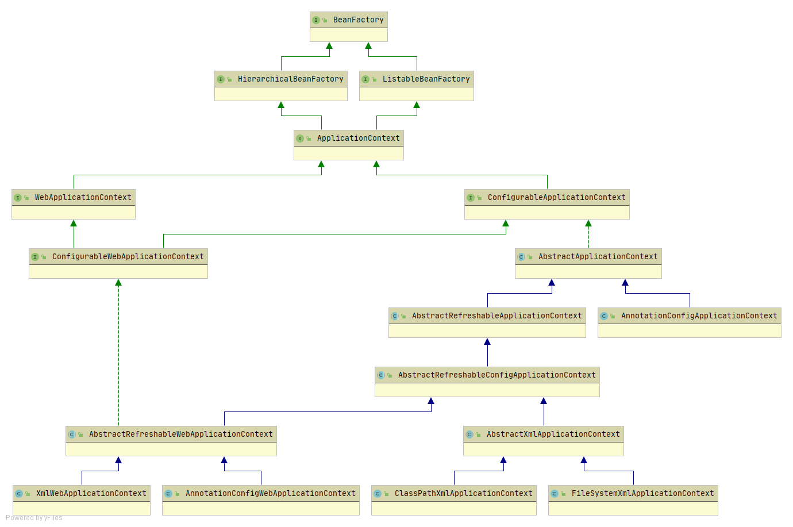
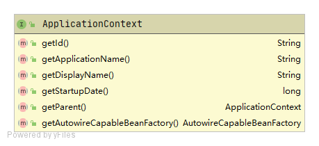
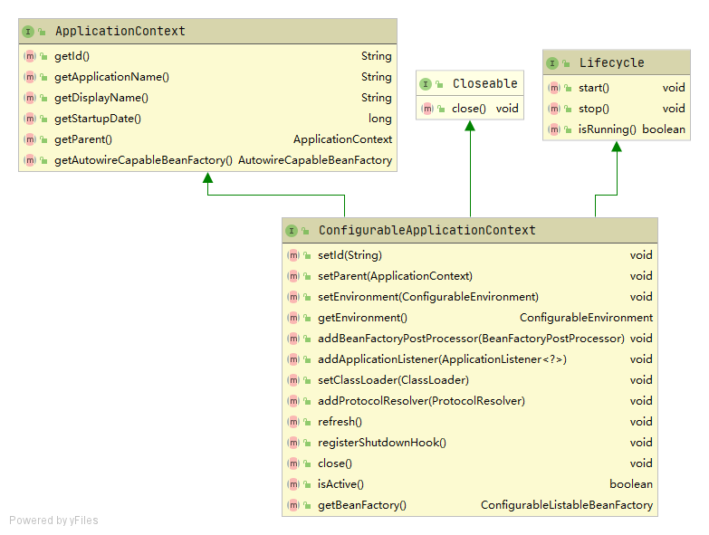
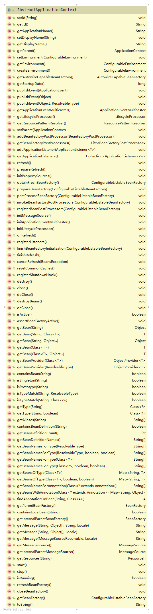

# ApplicationContext

高级容器均实现了ApplicationContext接口，为了区别简单容器，高级容器通常被称为Context（上下文）。故当大家听到上下文，也是容器的意思，只是除了创建Bean的功能外，还有更多额外功能

## ApplicationContext架构体系

### ApplicationContext

ApplicationContext的类图如下：

ApplicationContext接口要求其实现类提供如下能力

1. 应用相关的读取操作。如应用上下文的唯一ID、应用名、上下文名称、应用启动时间、父上下文、BeanFactory

### ConfigurableApplicationContext

ApplicationContext只提供了读取的能力，ConfigurableApplicationContext则提供了配置的能力

ConfigurableApplicationContext的类图如下：

ConfigurableApplicationContext接口要求其实现类提供如下能力

1. 设置ApplicationContext的能力。如设置应用上下文的唯一ID、设置父上下文、设置Environment、设置BeanFactory后置处理器、设置类加载器
2. 管理应用生命周期的能力。包括启动、刷新、运行、停止、关闭等生命周期

### AbstractApplicationContext

ConfigurableApplicationContext接口的主要实现，该类是Spring高级容器中最重要的一个类，掌握该类就等于掌握了容器的命脉

AbstractApplicationContext的类图如下：

AbstractApplicationContext实现实现了以下能力

1. ApplicationContext的操作能力。如应用上下文的唯一ID、父上下文、Environment、BeanFactory后置处理器、类加载器等操作能力
2. Bean相关能力。
3. 管理应用生命周期的能力。包括启动、刷新、运行、停止、关闭等生命周期
4. 事件发布能力。
5. 国际化能力。
6. 用于扩展能力的钩子方法

### 其他架构组件

传统的基于XML配置的经典容器

FileSystemXmlApplicationContext：从文件系统加载配置

ClassPathXmlApplicationContext：从classpath加载配置

XmlWebApplicationContext：用于Web应用程序的容器

目前比较流行的基于注解的容器

AnnotationConfigServletWebServerApplicationContext

AnnotationConfiReactiveWebServerApplicationContext

AnnotationConfigApplicationContext

## BeanFactory和ApplicationContext的关系

BeanFactory面向的是spring自身，ApplicationContext面向的是使用spring框架的开发者

基于XML配置的容器和基于注解的容器，尽管部分实现不同，但共性同样很多

refresh()大致功能

- 容器初始化、配置解析
- BeanFactoryPostProcessor和BeanPostProcessor的注册和激活
- 国际化配置
- ...

