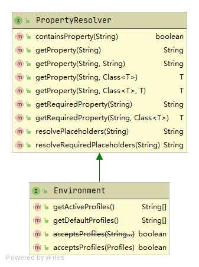

# Environment

在 Environment 中可以获得系统参数，命令行参数，文件配置等信息

Spring 中的 Environment 是什么呢？

了解 Environment 之前，不得不提到 Property 和 Profile。

我们在写项目的时候，经常会抽取一些配置项，在 Java 中通常叫做属性，也就是 Property，本质是一组键值对配置信息。使用配置项的好处在于修改起来很容易，只需修改下配置文件或命令行参数，然后重启一下就可以了。

开发过程中，大多数项目都有多套配置对应多个环境，一般来说有开发环境、测试环境和生产环境。这里的“环境”就叫做 Profile。程序可以读取到 Profile 的值，根据 Profile 的不同展示不同的特性。其实从本质上讲，“环境”也是一个“配置”，只是这个配置太重要了，也比较特殊，所以作为一个单独的概念来处理。

**Environment = Property + Profile**

Environment类图如下：

Environment接口要求实现类具备以下能力：

1. 操作Property的能力
2. 操作Profiles的能力

> 提示：因发现一篇写的很不错的Environment博文，本节便不展开讲解了。需深入了解者请参考：[Spring Boot 核心接口之 Envirnoment](https://zhuanlan.zhihu.com/p/357050965)

