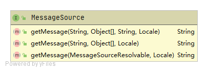

# MessageSource

用于解析消息的策略接口，支持此类消息的参数化和国际化。

MessageSource类图如下：

MessageSource接口要求实现类具备以下能力：

1. 消息参数化
2. 消息国际化

> 提示：因发现一篇写的很不错的MessageSource博文，本节便不展开讲解了。需深入了解者请参考：[Spring核心——MessageSource实现国际化](https://cloud.tencent.com/developer/article/1185740)

## 使用方法

请参考：[SpringBoot 快速支持国际化i18n ](https://www.jianshu.com/p/e2eae08f3255)

