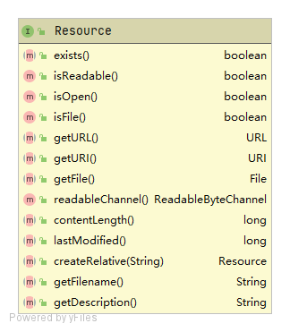
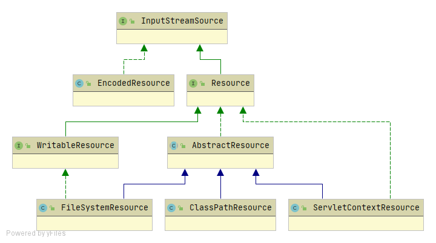
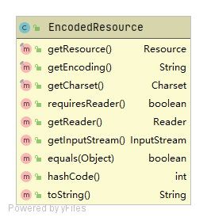
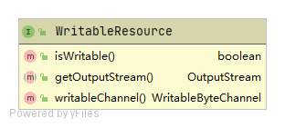
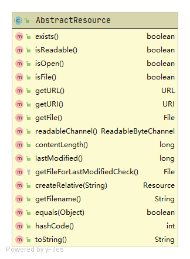

# Resource

在Java中，资源会被抽象为URL，我们可以通过解析URL中的protocol（协议），来处理不同资源的操作逻辑

在Spring中，资源被抽象为Resource

Resource接口的类图如下：



Resource接口要求其实现类提供如下能力

1. 获取资源的能力。如资源URL、URI、或直接获取File

2. 获取资源的相关信息。如文件名、更新时间、内容长度

3. 相关的工具方法。如是否可读、是否打开、是否为文件、是否存在

   

## Resource架构体系




### EncodedResource

EncodedResource类主要实现对资源的编码处理



核心方法为getReader()，可根据不同编码方式和字符集读取资源。源码如下：

```java
	public Reader getReader() throws IOException {
		if (this.charset != null) {
			return new InputStreamReader(this.resource.getInputStream(), this.charset);
		}
		else if (this.encoding != null) {
			return new InputStreamReader(this.resource.getInputStream(), this.encoding);
		}
		else {
			return new InputStreamReader(this.resource.getInputStream());
		}
	}
```

### WritableResource

WritableResource接口要求实现类提供写资源的能力

WritableResource的类图如下：



### AbstractResource

AbstractResource提供了对Resource接口大部分方法的默认公共实现。



> 提示：若需要自定义资源，不推荐直接实现Resource接口，而建议继承AbstractResource


### ServletContextResource

ServletContextResource提供访问Web容器资源的能力


### ClassPathResource

ClassPathResource提供访问类加载路径下资源的能力


### FileSystemResource

FileSystemResource提供访问文件系统资源的能力。该类并没有太大的优势，Java提供的File类同样可以访问文件系统资源

