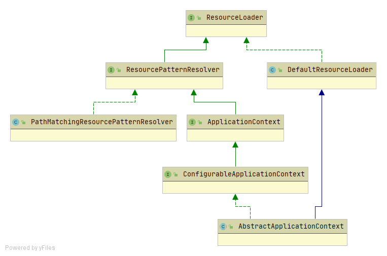
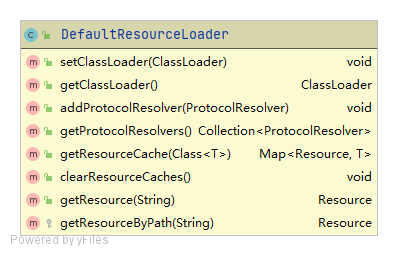

# ResourceLoader

在Resource小节中，我们介绍到，为了访问不同类型的资源，需要使用不同类型资源的实现类。如：

- 访问Web容器资源要使用ServletContextResourc

- 访问类加载路径下资源要使用ClassPathResource

- 访问文件系统资源要使用FileSystemResource

那么能否一步到位，仅通过一个类访问各种类型的资源？答案是有的，便是ResourceLoader

ResourceLoader在不显式使用各Resource实现类的情况下，通过资源地址的特殊标识符（如：“classpath:”、“file:”等地址前缀）访问不同类型的资源；

同时，ResourceLoader还支持自动解析Ant风格的资源地址，可谓功能强大。


ResourceLoader的类图如下：


ResourceLoader接口要求其实现类提供以下能力：

- getResouce()：根据不同的资源地址返回不同的Resource实例（如：ClassPathResource、FileSystemResource等	）
- getClassLoader()：获取ResourceLoader内部使用的类加载器

## ResourceLoader架构体系



### DefaultResourceLoader

DefaultResourceLoader实现了ResourceLoader接口要求提供的能力

DefaultResourceLoader的类图如下：



其中关键方法为：getResource()，源码如下：

```java
	@Override
	public Resource getResource(String location) {
		Assert.notNull(location, "Location must not be null");
		// ProtocolResolver, 用户自定义协议资源解决策略
		for (ProtocolResolver protocolResolver : getProtocolResolvers()) {
			Resource resource = protocolResolver.resolve(location, this);
			if (resource != null) {
				return resource;
			}
		}
		// 如果以/开头，则构造ClassPathContextResource返回
		if (location.startsWith("/")) {
			return getResourceByPath(location);
		}
		// 如果以classpath:开头，则构造ClassPathResource类型资源返回，在构造该资源时，通过getClassLoader()获取当前的ClassLoader
		else if (location.startsWith(CLASSPATH_URL_PREFIX)) {
			return new ClassPathResource(location.substring(CLASSPATH_URL_PREFIX.length()), getClassLoader());
		}
		else {
			// 构造URL，尝试通过它进行资源定位
			try {
				// Try to parse the location as a URL...
				URL url = new URL(location);
				return (ResourceUtils.isFileURL(url) ? new FileUrlResource(url) : new UrlResource(url));
			}
			catch (MalformedURLException ex) {
				// No URL -> resolve as resource path.
				return getResourceByPath(location);
			}
		}
	}
```

### ResourcePatternResolver

ResourcePatternResolver要求其实现类提供根据路径匹配模式返回资源列表

ResourcePatternResolver的类图如下：


### PathMatchingResourcePatternResolver

PathMatchingResourcePatternResolver实现了ResourcePatternResolver要求提供的根据路径匹配返回资源的能力。包括返回：Ant风格路径资源、classpath*:路径资源