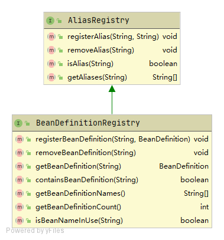
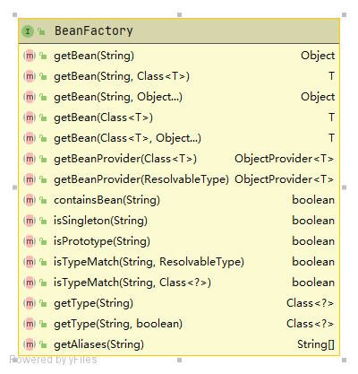
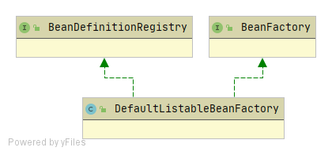

## BeanDefinitionRegistry

BeanDefinitionRegistry接口要求实现类提供操作BeanDefinition的能力

BeanDefinitionRegistry要求实现类具备以下能力：

1. 别名相关操作。别名的增删查操作

2. BeanDefinition相关操作。BeanDefinition的增删查操作

## BeanFactory

BeanFactory接口要求实现类提供操作Bean的能力

如BeanFactory的类图所示：

BeanFactory要求容器具备以下能力：

1. 通过Bean的名称、类型获取bean实例
2. 获取Bean的基本信息。包括bean的类型、bean的别名、是否单例、Bean的提供器等
3. 提供基本的工具方法。如：判断容器中是否包含bean、判断bean的类型是否匹配等

## BeanDefinitionRegistry和BeanFactory的关系

BeanDefinitionRegistry和BeanFactory因操作的对象不同，本无任何直接关系。但DefaultListableBeanFactory的出现打破了这一现状，DefaultListableBeanFactory同时实现了BeanDefinitionRegistry和BeanFactory接口，导致该类及其子类具备同时操作Bean和BeanDefinition的能力

所以虽然DefaultListableBeanFactory名字上看，似乎是BeanFactory，但其实也是BeanDefinitionRegistry。具备同时操作Bean和BeanDefinition的能力。