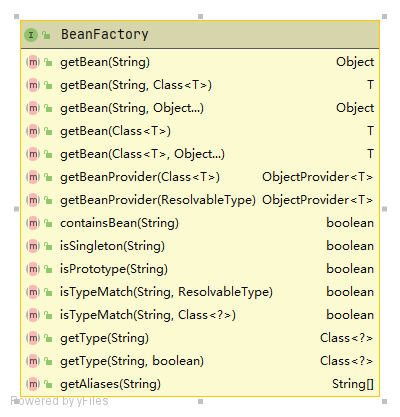
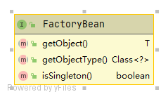
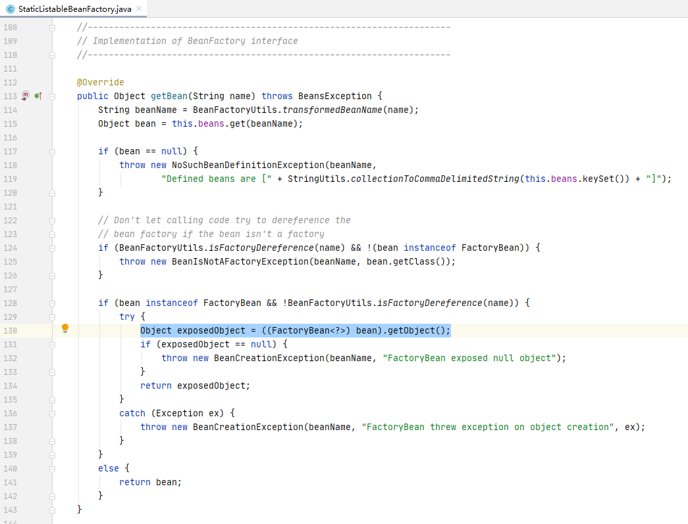
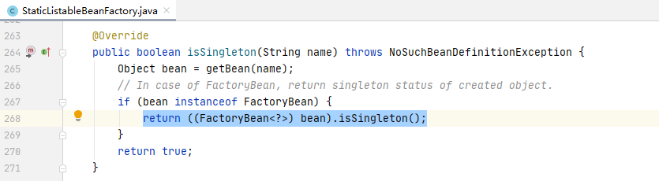
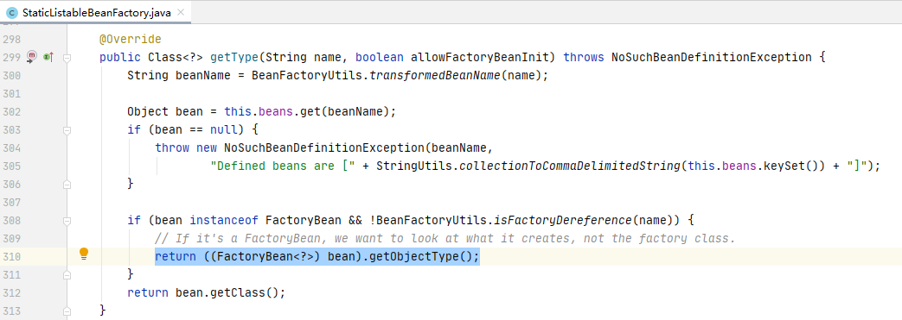

# BeanFactory和FactoryBean的区别

本小节中将围绕以下问题，探究源码。

问：BeanFactory和FactoryBean的区别

## BeanFactory

BeanFactory是一个工厂接口，定义了与spring Bean容器交互的规范。

在阅读源码之前，小编大胆猜测：BeanFactory中，**Factory**设计模式意味着或许会包含获取（Get）某对象的方法，而**Bean**大概便是要获取的对象。

若小编是spring的开发者，那小编会在BeanFactory中至少定义以下接口

1. 从容器中获取bean

那事实如何呢？请看BeanFactory的类图

BeanFactory定义了以下接口：

1. 获取bean或判断容器中是否包含bean（ 小编猜想正确:laughing:）
2. 判断bean是否单例
3. 获取bean的类型或判断bean的类型是否匹配
4. 获取bean的别名

## FactoryBean

FactoryBean是一个接口，定义了Bean的规范。请看BeanFactory的类图

FactoryBean定义了以下接口：

1. 获取bean的具体实现
2. bean的类型
3. bean是否单例

## BeanFactory和FactoryBean的联系

为进一步探究两者的联系，小编在BeanFactory的一个实现类StaticListableBeanFactory中发现：

1. BeanFactory的GetBean( )方法中，调用了FactoryBean的GetObject( )方法，请见下图蓝色部分

2. BeanFactory的isSingleton( )方法中，调用了FactoryBean的isSingleton( )方法，请见下图蓝色部分

3. BeanFactory的getType( )方法中，调用了FactoryBean的getObjectType( )方法，请见下图蓝色部分

## 总结

问：BeanFactory和FactoryBean的区别

答：

FactoryBean是面向Bean的；BeanFactory是面向spring Bean 容器的。

FactoryBean是Bean的规范接口，关注Bean的具体实现细节，如：如何生成Bean、Bean的类型、Bean是否单例

BeanFactory定义外界与spring Bean 容器的交互接口，主要关注于：如何从容器中获取Bean，容器中是否包含某Bean等。

> 说明：尽管BeanFactory中同样包含：判断bean是否单例及获取Bean的类型等接口，但相比从容器中获取Bean接口而言，只是附属接口

