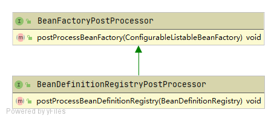
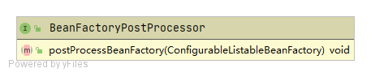
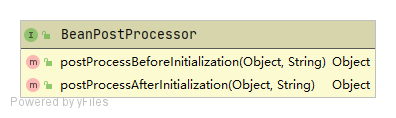

# PostProcessor

本身也是一种需要注册到容器中的Bean

- 里面的方法会在特定的时机被容器调用
- 可在不改变容器或Bean核心逻辑的情况下对Bean进行扩展
- 可对Bean进行包装，影响其行为，修改Bean的内容等

## PostProcessor的种类

大类分为容器级别的后置处理器和Bean级别的后置处理器

- BeanDefinitionRegistryPostProcessor

- BeanFactoryPostProcessor

- BeanPostProcessor

### BeanDefinitionRegistryPostProcessor

BeanDefinitionRegistryPostProcessor是一种特殊的BeanFactoryPostProcessor，允许在正常的BeanFacrotyPostProcessor检测开始之前注册更多的自定义BeanDefinition

BeanDefinitionRegistryPostProcessor的类图以下



主要被调用点位于org.springframework.context.support.AbstractApplicationContext#refresh()方法内，注意其中的invokeBeanFactoryPostProcessors()

```java
	@Override
	public void refresh() throws BeansException, IllegalStateException {
		synchronized (this.startupShutdownMonitor) {
			// Prepare this context for refreshing.
			prepareRefresh();

			// Tell the subclass to refresh the internal bean factory.
			ConfigurableListableBeanFactory beanFactory = obtainFreshBeanFactory();

			// Prepare the bean factory for use in this context.
			prepareBeanFactory(beanFactory);

			try {
				// Allows post-processing of the bean factory in context subclasses.
				postProcessBeanFactory(beanFactory);

				// Invoke factory processors registered as beans in the context.
				invokeBeanFactoryPostProcessors(beanFactory);

				// Register bean processors that intercept bean creation.
				registerBeanPostProcessors(beanFactory);

				// Initialize message source for this context.
				initMessageSource();

				// Initialize event multicaster for this context.
				initApplicationEventMulticaster();

				// Initialize other special beans in specific context subclasses.
				onRefresh();

				// Check for listener beans and register them.
				registerListeners();

				// Instantiate all remaining (non-lazy-init) singletons.
				finishBeanFactoryInitialization(beanFactory);

				// Last step: publish corresponding event.
				finishRefresh();
			}

			catch (BeansException ex) {
				if (logger.isWarnEnabled()) {
					logger.warn("Exception encountered during context initialization - " +
							"cancelling refresh attempt: " + ex);
				}

				// Destroy already created singletons to avoid dangling resources.
				destroyBeans();

				// Reset 'active' flag.
				cancelRefresh(ex);

				// Propagate exception to caller.
				throw ex;
			}

			finally {
				// Reset common introspection caches in Spring's core, since we
				// might not ever need metadata for singleton beans anymore...
				resetCommonCaches();
			}
		}
	}
```


使用示例：

1. 实现BeanDefinitionRegistryPostProcessor接口

2. 在postProcessBeanDefinitionRegistry()中生成BeanDefinition并注册到BeanDefinitionRegistry中。

3. 并将CustomizedBeanDefinitionRegistryPostProcessor声明为Bean（这里使用的是@Configuration注解）

```java
@Configuration
public class CustomizedBeanDefinitionRegistryPostProcessor implements BeanDefinitionRegistryPostProcessor {
	@Override
	public void postProcessBeanDefinitionRegistry(BeanDefinitionRegistry registry) throws BeansException {
		Class<?> clazz = User.class;
		BeanDefinitionBuilder builder = BeanDefinitionBuilder.genericBeanDefinition(clazz);
		GenericBeanDefinition definition = (GenericBeanDefinition) builder.getRawBeanDefinition();
		registry.registerBeanDefinition("customUser",definition);
	}

	@Override
	public void postProcessBeanFactory(ConfigurableListableBeanFactory beanFactory) throws BeansException {

	}
}

```

尝试获取名为”customUser“的Bean

```java
@Configuration
@ComponentScan("com.moluo")
public class DemoApplication {

	public static void main(String[] args) {

		ApplicationContext applicationContext = new AnnotationConfigApplicationContext(DemoApplication.class);
		User user = (User) applicationContext.getBean("customUser");
		System.out.println("CustomizedBeanDefinitionRegistryPostProcessor创建的对象： "+ user);
	}

}

```

```bash
CustomizedBeanDefinitionRegistryPostProcessor创建的对象： com.moluo.demo.entity.User@c540f5a
```

> 提示：基于BeanDefinitionRegistryPostProcessor的特性，常用于搜索第3方包的class，将其注册到spring容器里，以此复用第3方包的能力。如MyBatis便是如此做的

### BeanFactoryPostProcessor

BeanFactoryPostProcessor将在beanDefinition加载完后，但在bean实例化之前进行回调。通常用于对BeanDefinition进行修改。

BeanFactoryPostProcessor的类图如下：



使用示例：

1. 实现BeanFactoryPostProcessor接口

2. 在postProcessBeanFactory()中修改BeanDefinition。（示例：增加日志打印功能）

3. 并将PrintBeanFactoryPostProcessor声明为Bean（这里使用的是@Configuration注解）

```java
@Configuration
public class PrintBeanFactoryPostProcessor implements BeanFactoryPostProcessor {

	@Override
	public void postProcessBeanFactory(ConfigurableListableBeanFactory beanFactory) throws BeansException {
		String[] beanNames = beanFactory.getBeanDefinitionNames();
		for (String beanName : beanNames) {
			BeanDefinition beanDefinition = beanFactory.getBeanDefinition(beanName);
			// 自定义BeanDefinition行为，打印beanDefinition
			this.printBeanDefinition(beanDefinition);
		}
	}

	private void printBeanDefinition(BeanDefinition beanDefinition) {
		System.out.println("beanDefinition: " + beanDefinition.toString());
	}

}
```

```java
@Configuration
@ComponentScan("com.moluo")
public class DemoApplication {

	public static void main(String[] args) {
		ApplicationContext applicationContext = new AnnotationConfigApplicationContext(DemoApplication.class);
	}
}
```

打印了beanDefinition的信息

```java
beanDefinition: Root bean: class [org.springframework.context.annotation.ConfigurationClassPostProcessor]; ...
beanDefinition: Root bean: class [org.springframework.beans.factory.annotation.AutowiredAnnotationBeanPostProcessor]; ...
beanDefinition: Root bean: class [org.springframework.context.annotation.CommonAnnotationBeanPostProcessor]; ...
beanDefinition: Root bean: class [org.springframework.context.event.EventListenerMethodProcessor]; scope=; ...
beanDefinition: Root bean: class [org.springframework.context.event.DefaultEventListenerFactory]; scope=; ...
beanDefinition: Generic bean: class [com.moluo.demo.DemoApplication$$EnhancerBySpringCGLIB$$fb6306fb]; ...
beanDefinition: Generic bean: class [com.moluo.demo.postprocessor.PrintBeanFactoryPostProcessor$$EnhancerBySpringCGLIB$$2455da97]; scope=singleton; ...
```

> 注意：在BeanFactoryPostProcessor中仅做BeanDefinition的相关操作，请勿在其中做Bean的初始化操作，否则会造成意料之外的后果。如果需要 与bean 实例交互，请考虑 BeanPostProcessor。

### BeanPostProcessor

在开始聊BeanPostProcessor之前，让我们先了解一下Bean的实例化(Instantiate)和初始化（Initialization）

- 实例化：是对象创建的过程。比如使用构造方法new对象，为对象在内存中分配空间。

- 初始化：是为对象中的属性赋值的过程。

在Spring中，AbstractAutowireCapableBeanFactory类的doCreateBean()方法描述了这个过程。

```java
	protected Object doCreateBean(String beanName, RootBeanDefinition mbd, @Nullable Object[] args)
			throws BeanCreationException {

		// Instantiate the bean.实例化Bean
		BeanWrapper instanceWrapper = null;
		if (mbd.isSingleton()) {
			instanceWrapper = this.factoryBeanInstanceCache.remove(beanName);
		}
		if (instanceWrapper == null) {
			instanceWrapper = createBeanInstance(beanName, mbd, args);
		}
		Object bean = instanceWrapper.getWrappedInstance();
		Class<?> beanType = instanceWrapper.getWrappedClass();
		if (beanType != NullBean.class) {
			mbd.resolvedTargetType = beanType;
		}

		// Allow post-processors to modify the merged bean definition.
		synchronized (mbd.postProcessingLock) {
			if (!mbd.postProcessed) {
				try {
					applyMergedBeanDefinitionPostProcessors(mbd, beanType, beanName);
				}
				catch (Throwable ex) {
					throw new BeanCreationException(mbd.getResourceDescription(), beanName,
							"Post-processing of merged bean definition failed", ex);
				}
				mbd.postProcessed = true;
			}
		}

		// Eagerly cache singletons to be able to resolve circular references
		// even when triggered by lifecycle interfaces like BeanFactoryAware.
		boolean earlySingletonExposure = (mbd.isSingleton() && this.allowCircularReferences &&
				isSingletonCurrentlyInCreation(beanName));
		if (earlySingletonExposure) {
			if (logger.isTraceEnabled()) {
				logger.trace("Eagerly caching bean '" + beanName +
						"' to allow for resolving potential circular references");
			}
			addSingletonFactory(beanName, () -> getEarlyBeanReference(beanName, mbd, bean));
		}

		// Initialize the bean instance.初始化Bean
		Object exposedObject = bean;
		try {
			populateBean(beanName, mbd, instanceWrapper);
			exposedObject = initializeBean(beanName, exposedObject, mbd);
		}
		catch (Throwable ex) {
			if (ex instanceof BeanCreationException && beanName.equals(((BeanCreationException) ex).getBeanName())) {
				throw (BeanCreationException) ex;
			}
			else {
				throw new BeanCreationException(
						mbd.getResourceDescription(), beanName, "Initialization of bean failed", ex);
			}
		}

		if (earlySingletonExposure) {
			Object earlySingletonReference = getSingleton(beanName, false);
			if (earlySingletonReference != null) {
				if (exposedObject == bean) {
					exposedObject = earlySingletonReference;
				}
				else if (!this.allowRawInjectionDespiteWrapping && hasDependentBean(beanName)) {
					String[] dependentBeans = getDependentBeans(beanName);
					Set<String> actualDependentBeans = new LinkedHashSet<>(dependentBeans.length);
					for (String dependentBean : dependentBeans) {
						if (!removeSingletonIfCreatedForTypeCheckOnly(dependentBean)) {
							actualDependentBeans.add(dependentBean);
						}
					}
					if (!actualDependentBeans.isEmpty()) {
						throw new BeanCurrentlyInCreationException(beanName,
								"Bean with name '" + beanName + "' has been injected into other beans [" +
								StringUtils.collectionToCommaDelimitedString(actualDependentBeans) +
								"] in its raw version as part of a circular reference, but has eventually been " +
								"wrapped. This means that said other beans do not use the final version of the " +
								"bean. This is often the result of over-eager type matching - consider using " +
								"'getBeanNamesForType' with the 'allowEagerInit' flag turned off, for example.");
					}
				}
			}
		}

		// Register bean as disposable.
		try {
			registerDisposableBeanIfNecessary(beanName, bean, mbd);
		}
		catch (BeanDefinitionValidationException ex) {
			throw new BeanCreationException(
					mbd.getResourceDescription(), beanName, "Invalid destruction signature", ex);
		}

		return exposedObject;
	}
```

说完Bean的实例化(Instantiate)和初始化（Initialization），让我们回到BeanPostProcessor。


BeanPostProcessor中的2个方法分别在Bean的初始化（Initialization）之前和之后进行调用，常用于对Bean能力的增强

BeanPostProcessor的类图如下：



使用示例：

```java
@Configuration
public class CustomizedBeanPostProcessor implements BeanPostProcessor {

	@Override
	public Object postProcessBeforeInitialization(Object bean, String beanName) throws BeansException {
		System.out.println(beanName + "调用了postProcessBeforeInitialization()");
		return bean;
	}

	@Override
	public Object postProcessAfterInitialization(Object bean, String beanName) throws BeansException {
		System.out.println(beanName + "调用了postProcessAfterInitialization()");
		return bean;
	}
}
```

```java
@Configuration
@ComponentScan("com.moluo")
public class DemoApplication {

	public static void main(String[] args) {
		ApplicationContext applicationContext = new AnnotationConfigApplicationContext(DemoApplication.class);
	}
}
```

```java
> Task :spring-demo:DemoApplication.main()
demoApplication调用了postProcessBeforeInitialization()
demoApplication调用了postProcessAfterInitialization()
welcomeService调用了postProcessBeforeInitialization()
welcomeService调用了postProcessAfterInitialization()
```

> 提示：AOP便是基于BeanPostProcessor实现的