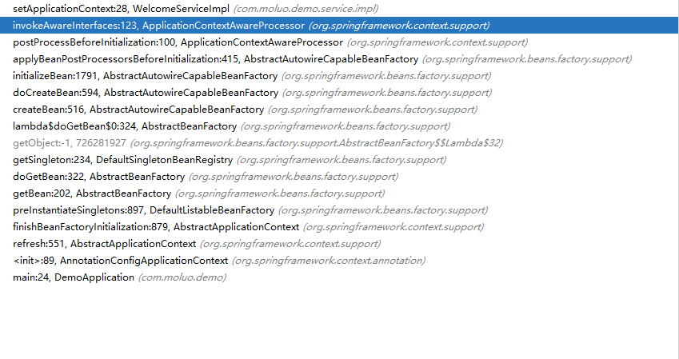

# Aware

一般来说，容器对Bean的逻辑是无侵入的，Bean通常不需要了解容器的状态或操作容器，毕竟在Bean中操作容器，意味着Bean与容器强耦合，不是一种优雅的行为。

但万事无绝对，某些情况下，Bean需要感知到容器的某些信息并对其进行操作，这就需要用到Aware


Aware是一个标记接口，用于指明一个bean有资格被spring容器以方法回调的方式通知一个特定的框架对象。Aware接口中不包含任何方法，实际的方法签名由各个子接口决定。方法签名通常应仅有1个入参、返回值为 void。


## Aware的架构体系


### BeanNameAware

BeanNameAware接口要求其实现类具有接受BeanName的能力，有资格被spring容器以方法回调的方式通知BeanName

BeanNameAware接口类图如下：


BeanNameAware接口要求其实现类具有以下能力：

1. 接受BeanName的能力


#### 使用示例

WelcomeServiceImpl类实现BeanNameAware接口，具有接受BeanName的能力

```java
@Service("welcomeService")
public class WelcomeServiceImpl implements WelcomeService, BeanNameAware {

	private String beanName;

	@Override
	public String welcome(String name) {
		System.out.println("welcome: " + name + ", i am " + beanName);
		return "welcome: " + name + ", i am " + beanName;
	}

	@Override
	public void setBeanName(String name) {
		this.beanName = name;
	}
}
```

```java
@Configuration
@ComponentScan("com.moluo")
public class DemoApplication {
	public static void main(String[] args) {
		ApplicationContext applicationContext = new AnnotationConfigApplicationContext(DemoApplication.class);
		WelcomeService welcomeService = (WelcomeService) applicationContext.getBean("welcomeService");
		welcomeService.welcome("jojo");
	}
}
```

输出了beanName：welcomeService

```java
welcome: jojo, i am welcomeService
```


#### BeanName注入时机

实现BeanNameAware接口，意味着具有接受BeanName的能力。spring容器何时向Bean注入BeanName的呢？

请看以下调用堆栈信息


spring容器在创建Bean的时候，会向有接受BeanName能力的Bean中注入BeanName。注意：doCreateBean > initializeBean > invokeAwareMethods

其中invokeAwareMethods的源码如下：

```java
	private void invokeAwareMethods(String beanName, Object bean) {
		if (bean instanceof Aware) {
			if (bean instanceof BeanNameAware) {
				((BeanNameAware) bean).setBeanName(beanName);
			}
			if (bean instanceof BeanClassLoaderAware) {
				ClassLoader bcl = getBeanClassLoader();
				if (bcl != null) {
					((BeanClassLoaderAware) bean).setBeanClassLoader(bcl);
				}
			}
			if (bean instanceof BeanFactoryAware) {
				((BeanFactoryAware) bean).setBeanFactory(AbstractAutowireCapableBeanFactory.this);
			}
		}
	}
```


### ApplicationContextAware

ApplicationContextAware接口要求其实现类具有接受ApplicationContext的能力，有资格被spring容器以方法回调的方式通知ApplicationContext

ApplicationContextAware接口类图如下：


ApplicationContextAware接口要求其实现类具有以下能力：

1. 接受ApplicationContext的能力


#### 使用示例

WelcomeServiceImpl类实现ApplicationContextAware接口，具有接受ApplicationContext的能力

```java
@Service("welcomeService")
public class WelcomeServiceImpl implements WelcomeService, ApplicationContextAware {

	private ApplicationContext applicationContext;

	@Override
	public String welcome(String name) {
		System.out.println("DisplayName: " + applicationContext.getDisplayName());
		return "welcome: " + name;
	}

	@Override
	public void setApplicationContext(ApplicationContext applicationContext) throws BeansException {
		this.applicationContext = applicationContext;
	}
}

```

```java
@Configuration
@ComponentScan("com.moluo")
public class DemoApplication {
	public static void main(String[] args) {
		ApplicationContext applicationContext = new AnnotationConfigApplicationContext(DemoApplication.class);
		WelcomeService welcomeService = (WelcomeService) applicationContext.getBean("welcomeService");
		welcomeService.welcome("jojo");
	}
}
```

输出了DisplayName

```java
DisplayName: org.springframework.context.annotation.AnnotationConfigApplicationContext@47f37ef1
```


#### ApplicationContext注入时机

实现ApplicationContextAware接口，意味着具有接受ApplicationContext的能力。spring容器何时向Bean注入ApplicationContext的呢？

请看以下调用堆栈信息



spring容器在创建Bean的时候，会在Bean的后置处理器中，向有接受ApplicationContext能力的Bean中注入ApplicationContext。注意：doCreateBean > initializeBean > applyBeanPostProcessorsBeforeInitialization > postProcessBeforeInitialization > invokeAwareInterfaces

其中invokeAwareInterfaces的源码如下：

```java
	private void invokeAwareInterfaces(Object bean) {
		if (bean instanceof EnvironmentAware) {
			((EnvironmentAware) bean).setEnvironment(this.applicationContext.getEnvironment());
		}
		if (bean instanceof EmbeddedValueResolverAware) {
			((EmbeddedValueResolverAware) bean).setEmbeddedValueResolver(this.embeddedValueResolver);
		}
		if (bean instanceof ResourceLoaderAware) {
			((ResourceLoaderAware) bean).setResourceLoader(this.applicationContext);
		}
		if (bean instanceof ApplicationEventPublisherAware) {
			((ApplicationEventPublisherAware) bean).setApplicationEventPublisher(this.applicationContext);
		}
		if (bean instanceof MessageSourceAware) {
			((MessageSourceAware) bean).setMessageSource(this.applicationContext);
		}
		if (bean instanceof ApplicationContextAware) {
			((ApplicationContextAware) bean).setApplicationContext(this.applicationContext);
		}
	}
```

### 其他Aware子接口

以下Aware子接口特性和用法与上述接口大同小异，不再逐一展开讲解

- BeanFactoryAware

- ApplicationEventPublisherAware

- MessageSourceAware

- ResourceLoaderAware

